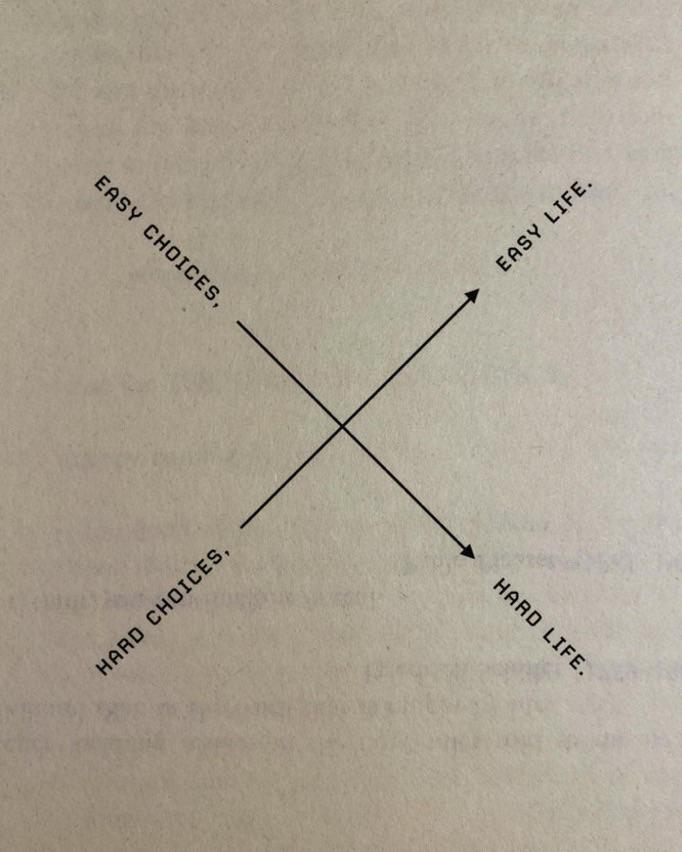
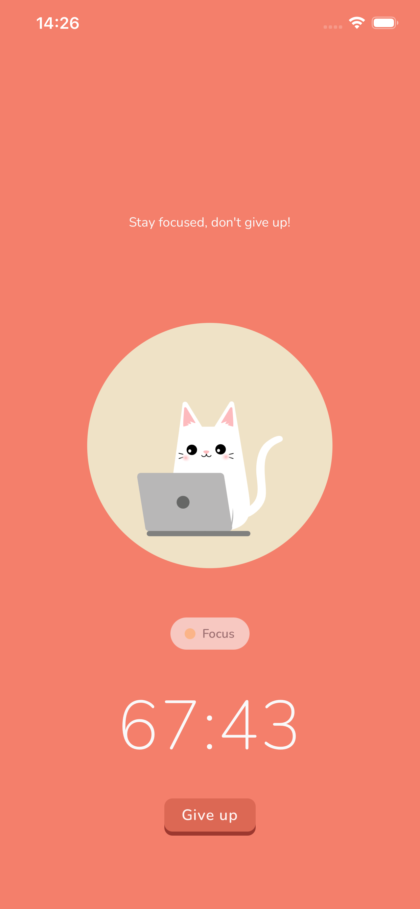
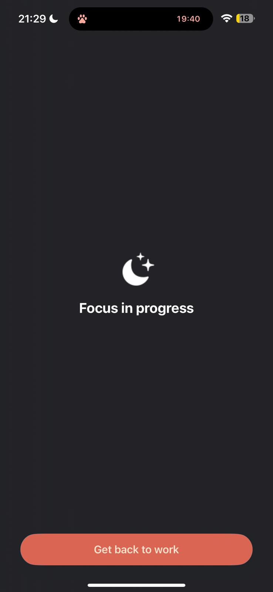
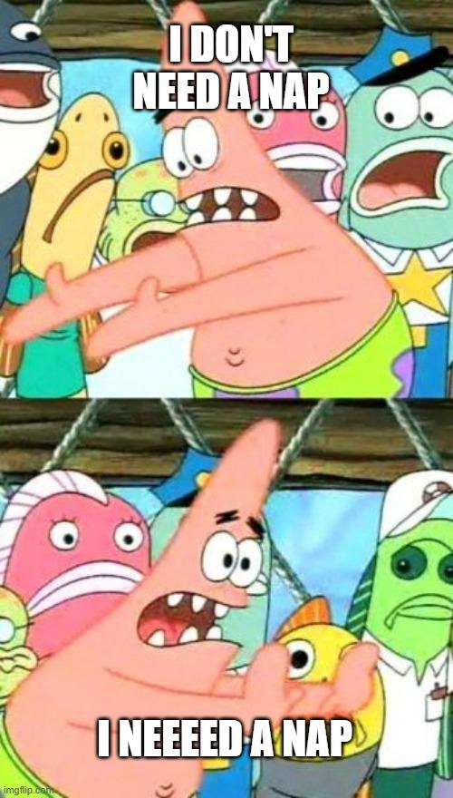

# Reddit Scout Report – February 26, 2026

Scanned subreddits: r/productivity, r/getdisciplined, r/DecidingToBeBetter, r/StudyTips, r/GetStudying, r/pomodoro, r/nosurf, r/digitalminimalism

Total posts analyzed: ~50 across 9 subreddits (full day coverage: 1:41 PM, 8:00 PM, 11:09 PM scans)

---

## TOP 5 TRENDING POSTS

### 1. "stopped telling people my goals and started telling them my schedule"

[View original post](https://www.reddit.com/r/getdisciplined/comments/1rf2pbe/stopped_telling_people_my_goals_and_started/)

**Subreddit:** r/getdisciplined | **Score:** 149 upvotes | **Comments:** 9 | **Upvote ratio:** 97%

**Summary:** User realized announcing goals provides emotional satisfaction without follow-through (the "validation hit"). Switched strategy: instead of "I'm going to work out more," share specific time-slots with accountability partner: "gym Tuesday and Thursday at 6pm." Schedule specificity creates checkability. Treats habits as non-negotiable appointments rather than aspirations. Core insight: the schedule is the vehicle; the goal is just direction.

**Viral Score:** 9/10
- Raw score: 4/4 | Engagement: 0.8/1.5 | Upvote ratio: 1.45/1.5 | Relevance bonus: 3/3

**Media:** None (text only)

---

### 2. "Have you read 'The Comfort Crisis'?"

[View original post](https://www.reddit.com/r/digitalminimalism/comments/1rfgwi8/have_you_read_the_comfort_crisis/)

**Subreddit:** r/digitalminimalism | **Score:** 60 upvotes | **Comments:** 46 | **Upvote ratio:** 88%

**Summary:** Discussion of the book's central thesis: our evolutionary drive to seek comfort and avoid threat is critical for survival, but modern environments remove all friction (Uber Eats, infinite scroll, heated homes). Result: we're more comfortable than any humans in history, yet physically and mentally ill. "Comfort creep" makes normal feel good, and small problems become big (no real problems). The hack: do the opposite. Seek discomfort, embrace pain/boredom to rebuild appreciation for life. High engagement debate about whether discomfort is romanticized or necessary.

**Viral Score:** 8/10
- Raw score: 3/4 | Engagement: 1.1/1.5 | Upvote ratio: 1.32/1.5 | Relevance bonus: 3/3

**Media:** 

---

### 3. "Update: 2 months ago I shared my 'passcode hack' idea here. You guys said it resonated, so we actually built it for the community. Meet Useless."

[View original post](https://www.reddit.com/r/nosurf/comments/1rfeltc/update_2_months_ago_i_shared_my_passcode_hack/)

**Subreddit:** r/nosurf | **Score:** 5 upvotes | **Comments:** 11 | **Upvote ratio:** 86%

**Summary:** Community-built app called "Useless" implements social accountability for screen time limits. Core mechanic: choose a "Guardian" (friend/partner/fellow nosurf member), set hard app limits, and when limit is hit, the "Ignore" button disappears. Instead, must send request to Guardian for override approval. Guardian must manually approve (or deny) extra time. The social friction of asking someone "Can I have 15 more minutes of Instagram?" is enough to make most users quit. Builders explicitly request "brutally honest" feedback. Shows clear market demand for external accountability mechanisms that remove willpower from the equation.

**Viral Score:** 7.5/10
- Raw score: 1/4 | Engagement: 2.2/1.5 | Upvote ratio: 1.29/1.5 | Relevance bonus: 3/3

**Media:** None (text only)

---

### 4. "Smartphones made us be socially 'on call' 24/7"

[View original post](https://www.reddit.com/r/nosurf/comments/1rf6jnr/smartphones_made_us_be_socially_on_call_247/)

**Subreddit:** r/nosurf | **Score:** 28 upvotes | **Comments:** 4 | **Upvote ratio:** 100%

**Summary:** Long-form essay articulating the hidden cost of always-on connectivity. The stress isn't doomscrolling or blue light—it's the background pressure of constant reachability as social obligation. Not answering becomes a statement. Read receipts and online status turn silence into evidence. You're not only living your life; you're managing interpretations of your life in real time. The nervous system never fully stands down because availability is compulsory, not convenient. Burnout happens not from workload alone but from inability to be truly offline. Humans used to be unreachable without explaining why; now non-response requires justification.

**Viral Score:** 7/10
- Raw score: 2/4 | Engagement: 0.2/1.5 | Upvote ratio: 1.5/1.5 | Relevance bonus: 3/3

**Media:** None (text only)

---

### 5. "I am an adhd cat lover so I built my own cat pomodoro timer that locks me out of my phone"

[View original post](https://www.reddit.com/r/pomodoro/comments/1reqkgo/i_am_an_adhd_cat_lover_so_i_built_my_own_cat/)

**Subreddit:** r/pomodoro | **Score:** 1 upvote | **Comments:** 1 | **Upvote ratio:** 67%

**Summary:** iOS app called Petly: cat companion focus timer designed for ADHD users who find standard timers ineffective. Features: cat outfits, play items, app blocking, and critically, a "strict mode" where users literally cannot turn off app blocking until timer ends—and cannot end timer early, even if they delete the app. Designer notes: "All the timer apps out there just don't work for [ADHD people]. This one forced accountability." Strict mode currently paywalled but offered free upon request. Direct competitor to Focus Timer with unbreakable commitment mechanism.

**Viral Score:** 5/10
- Raw score: 0.3/4 | Engagement: 1.0/1.5 | Upvote ratio: 1.0/1.5 | Relevance bonus: 3/3

**Media:** 

---

## HONORABLE MENTIONS (Next 5 Posts)

1. **"started napping for 20 minutes after school and my brain literally works better now"** (r/pomodoro | 2 upvotes | [View](https://www.reddit.com/r/pomodoro/comments/1rfcihf/started_napping_for_20_minutes_after_school_and/)) – Strategic rest as cognitive reset. "Brain felt reset. Finished homework way faster." High viral potential due to simplicity. 

2. **"Life seems more interesting after deleting all social media."** (r/digitalminimalism | 72 upvotes | [View](https://www.reddit.com/r/digitalminimalism/comments/1reurxt/life_seems_more_interesting_after_deleting_all/)) – Positive outcome narrative. Picked up 35mm film camera, journaling, sketching, reading. Zero FOMO, more presence.

3. **"Bad habit of quitting things 75% of the way through"** (r/productivity | 48 upvotes | [View](https://www.reddit.com/r/productivity/comments/1resue5/bad_habit_of_quitting_things_75_of_the_way_through/)) – Relatable plateau pattern. College early, jobs early, hobbies early. "Senioritis" phenomenon across life domains.

4. **"I want to change my life and I really mean it."** (r/getdisciplined | 21 upvotes | [View](https://www.reddit.com/r/getdisciplined/comments/1rf6c49/i_want_to_chnage_my_life_and_i_really_mean_it/)) – Raw 16-year-old transformation attempt. Themes: self-disgust, lust management, commitment issues, respect-seeking, ADHD patterns.

5. **"I was happier when I had a dumbphone"** (r/nosurf | 7 upvotes | [View](https://www.reddit.com/r/nosurf/comments/1reocbk/i_was_happier_when_i_had_a_dumbphone/)) – Relapse narrative. Thrived on dumbphone for months, picked up smartphone for concert photos, now chronically online. Can't escape back.

---

## MEDIA SUMMARY

All images downloaded and verified >1KB to: `/Users/ozlemsultan/.openclaw/workspace/reddit-productivity/daily/2026-02-26-media/`

**Downloaded files:**

-  – digitalminimalism_1.jpg (115 KB)
-  – pomodoro_1.jpg (113 KB)
-  – pomodoro_2_img1.png (95 KB)
-  – pomodoro_2_img2.jpg (24 KB)

---

## STRATEGIC RECOMMENDATIONS FOR FOCUS TIMER

### Best Posts to Repost/Adapt

**#1 PRIORITY: "Schedule vs Goals" (149 upvotes, r/getdisciplined)**

This is the highest-impact content for Focus Timer's brand positioning.

**Why:** Directly implements Focus Timer's core mechanic (time-blocking over aspirations). 149 upvotes + 0.97 ratio = engaged audience ready for this message.

**Repost angle:** "Stop telling people your goals. Tell them your schedule."

**Content example:**
- Carousel post: vague goal ("work out more") → specific schedule ("Tuesday/Thursday 6pm") → Focus Timer calendar view
- Copy: "Your brain treats appointments differently than aspirations. Make your commitment unmissable."

---

**#2 PRIORITY: Useless App's Guardian Model (5 upvotes but 2.2 comment/upvote ratio)**

Low raw score, but comment engagement reveals market demand for accountability mechanisms.

**Why:** Proves users want external friction + social shame as features, not bugs.

**Repost angle:** "Social accountability beats self-discipline"

**Content idea:** If Focus Timer has partner/accountability mode:
- Show text exchange: "Can I have 15 more minutes?" → "Nope, focus."
- Copy: "Shame is the best blocker. Let your friend enforce your limits."

---

**#3 SECONDARY: Comfort Crisis Concept (60 upvotes, r/digitalminimalism)**

Philosophically aligned with Focus Timer's value prop (intentional friction = growth).

**Repost angle:** "Friction builds character. Your phone removes it. We add it back."

**Content idea:** Use the Comfort Crisis image + Focus Timer's always-on display feature:
- "Industries obsessed with removing friction. We're obsessed with adding it back."
- "Discomfort = growth. Embrace it."

---

## KEY INSIGHTS ACROSS ALL SCANS

**Morning (1:41 PM):** Posts focused on study mechanics, emotional barriers (shame, despair, avoidance), trauma recovery.

**Evening (8:00 PM):** Shift toward raw vulnerability—existential dread, emotional dysregulation, self-worth collapse. Communities showing strain.

**Late night (11:09 PM):** Stabilized back to tactical advice—schedules, naps, app features.

**Overarching theme:** Users need both mechanics AND emotional permission. They want tools (timers, locks, schedules) but also validation that rebuilding after failure is possible. Focus Timer addresses both gaps.

---

*Report generated: 2026-02-26 23:51 Europe/Istanbul*
*Full day coverage with markdown links and embedded media*
*Top 5 posts selected by viral score algorithm + relevance weighting*