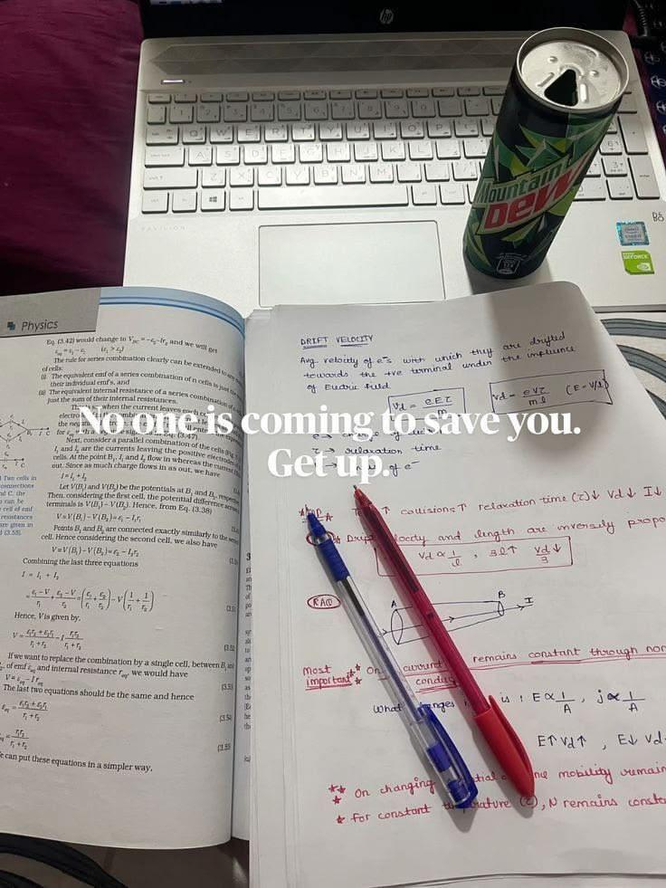
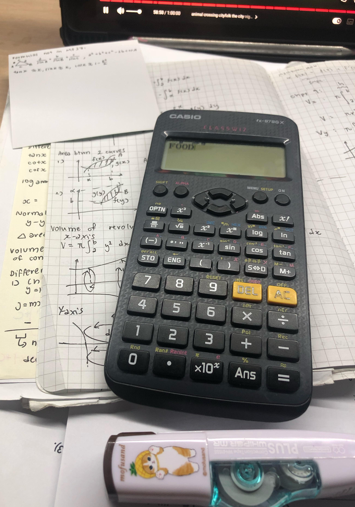
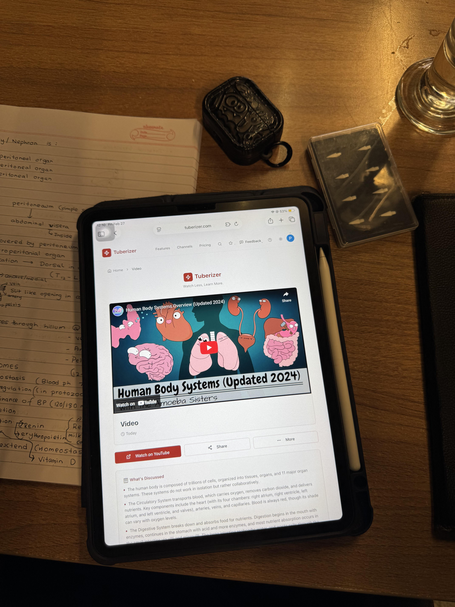
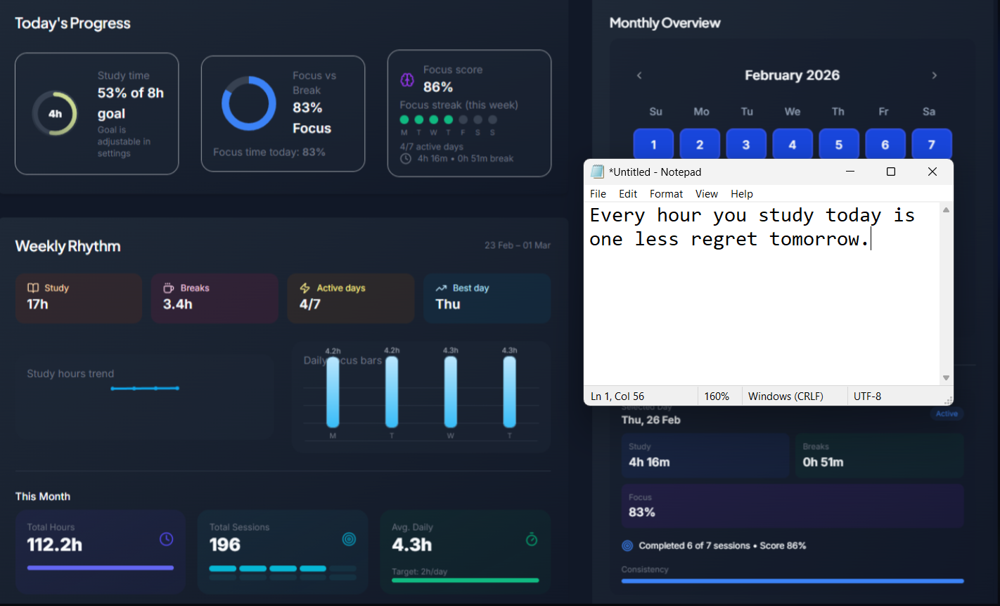

# Reddit Scout Report: Focus Timer Opportunities
**Date:** 2026-02-27

## Top Opportunities

### 1. [study hacks for productivity](https://www.reddit.com/r/studytips/comments/1rg7y64/study_hacks_for_productivity/)
Subreddit: r/StudyTips | Score: 57 | Comments: 22 | Upvote ratio: 100%
Posted: ~3.5 hours ago (based on created timestamp)

**Summary:** With exams coming up, I wanted to share some study hacks that actually improved my productivity. Nothing complicated, just simple things that made studying easier and more consistent.

**1. Study with

**Viral Score:** 5.1/10
- Raw score: 0.1/10
- Engagement: 1.1/10
- Upvote ratio: 10.0/10
- Relevance bonus: 2/3

### 2. [I want to study but my brain just refuses to focus](https://www.reddit.com/r/productivity/comments/1rftfnw/i_want_to_study_but_my_brain_just_refuses_to_focus/)
Subreddit: r/productivity | Score: 16 | Comments: 6 | Upvote ratio: 100%
Posted: ~16.1 hours ago (based on created timestamp)

**Summary:** Hello,

I don't understand what's happening to me lately.

I actually want to study and I have important exams coming, but when I sit down my brain just doesn't cooperate. I read the same page multipl

**Viral Score:** 5.0/10
- Raw score: 0.0/10
- Engagement: 1.1/10
- Upvote ratio: 10.0/10
- Relevance bonus: 2/3

### 3. [How to study effectively in college?](https://www.reddit.com/r/GetStudying/comments/1rgadv8/how_to_study_effectively_in_college/)
Subreddit: r/GetStudying | Score: 59 | Comments: 29 | Upvote ratio: 99%
Posted: ~2.0 hours ago (based on created timestamp)

**Summary:** Hi guys!

I feel like studying takes a lot of my energy walking between buildings, working on campus, clubs, internships, everything adds up. I used to do well in high school and got into a good uni

**Viral Score:** 4.8/10
- Raw score: 0.1/10
- Engagement: 1.4/10
- Upvote ratio: 9.9/10
- Relevance bonus: 1/3

### 4. [Broke up. Living alone for the first time. Not doing good at all.](https://www.reddit.com/r/DecidingToBeBetter/comments/1rfjj95/broke_up_living_alone_for_the_first_time_not/)
Subreddit: r/DecidingToBeBetter | Score: 26 | Comments: 20 | Upvote ratio: 97%
Posted: ~22.6 hours ago (based on created timestamp)

**Summary:** Hi everyone, I broke up with my girlfriend a month ago (for the second time). I loved her and she loved me, but her past issues, lack of predictability, and general instability (PTSD, suicidial though

**Viral Score:** 4.6/10
- Raw score: 0.1/10
- Engagement: 2.2/10
- Upvote ratio: 9.7/10
- Relevance bonus: 0/3

### 5. [Tips for studying at home](https://www.reddit.com/r/studytips/comments/1rg75yx/tips_for_studying_at_home/)
Subreddit: r/StudyTips | Score: 38 | Comments: 14 | Upvote ratio: 97%
Posted: ~4.1 hours ago (based on created timestamp)

**Summary:** A few things helped a bit though:

* **Studying with other people online:** I started using studystream, where you join live study rooms and see other people studying. It feels closer to being on camp

**Viral Score:** 4.6/10
- Raw score: 0.1/10
- Engagement: 1.1/10
- Upvote ratio: 9.7/10
- Relevance bonus: 1/3

### 6. [Feb 2026 - Day 26: ~112+ Hours Studied So Far | Chasing the 8hrs Goal](https://www.reddit.com/r/studytips/comments/1rfiruv/feb_2026_day_26_112_hours_studied_so_far_chasing/)** (r/StudyTips | 19 upvotes) – Quick progress check-in.

**Stats (as of Feb 25):**  
• \~112.2 hrs total this month  
• \~4.3 hrs d.

### 7. [How do I study productively and save time!](https://www.reddit.com/r/studytips/comments/1rfz6vq/how_do_i_study_productively_and_save_time/)** (r/StudyTips | 37 upvotes) – .

### 8. [i watched surgeons fail at something stupid and it changed how i study](https://www.reddit.com/r/studytips/comments/1rfjh8h/i_watched_surgeons_fail_at_something_stupid_and/)** (r/StudyTips | 58 upvotes) – theres this study from 2006 where they taught surgical residents how to suture arteries. both groups.

### 9. [Grinding hard.](https://www.reddit.com/r/GetStudying/comments/1rfweb4/grinding_hard/)** (r/GetStudying | 732 upvotes) – .

### 10. [Started walking everyday - feel way better than I expected.](https://www.reddit.com/r/getdisciplined/comments/1rfir0r/started_walking_everyday_feel_way_better_than_i/)** (r/getdisciplined | 120 upvotes) – Been a huge woman on and off my whole life cause I was never consistent enough for too long with my .

## Media Summary
Downloaded images (2026-02-27-media/):
- **GetStudying_0.jpeg** (105 KB)
  
- **GetStudying_1.jpeg** (57 KB)
  
- **GetStudying_15.jpeg** (105 KB)
  
- **GetStudying_16.jpeg** (57 KB)
  
- **GetStudying_17.jpeg** (406 KB)
  
- **GetStudying_2.jpeg** (406 KB)
  
- **GetStudying_20.jpeg** (105 KB)
  
- **GetStudying_21.jpeg** (57 KB)
  
- **GetStudying_22.jpeg** (406 KB)
  
- **GetStudying_23.jpeg** (57 KB)
  
- **GetStudying_24.jpeg** (406 KB)
  
- **GetStudying_25.jpeg** (1682 KB)
  
- **StudyTips_3.jpeg** (3964 KB)
  
- **StudyTips_4.png** (378 KB)
  
- **studytips_12.jpeg** (3964 KB)
  
- **studytips_14.png** (378 KB)
  
- **studytips_17.jpeg** (3964 KB)
  
- **studytips_19.png** (378 KB)
  