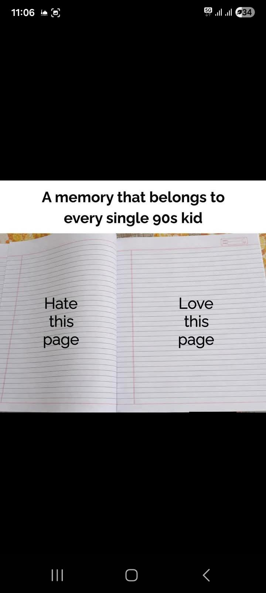
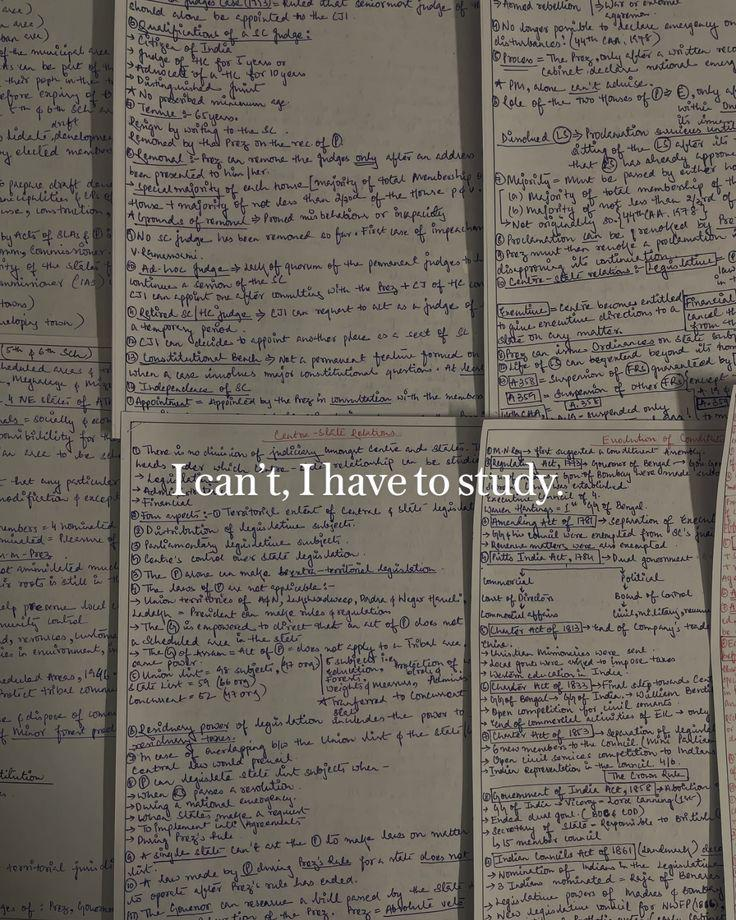
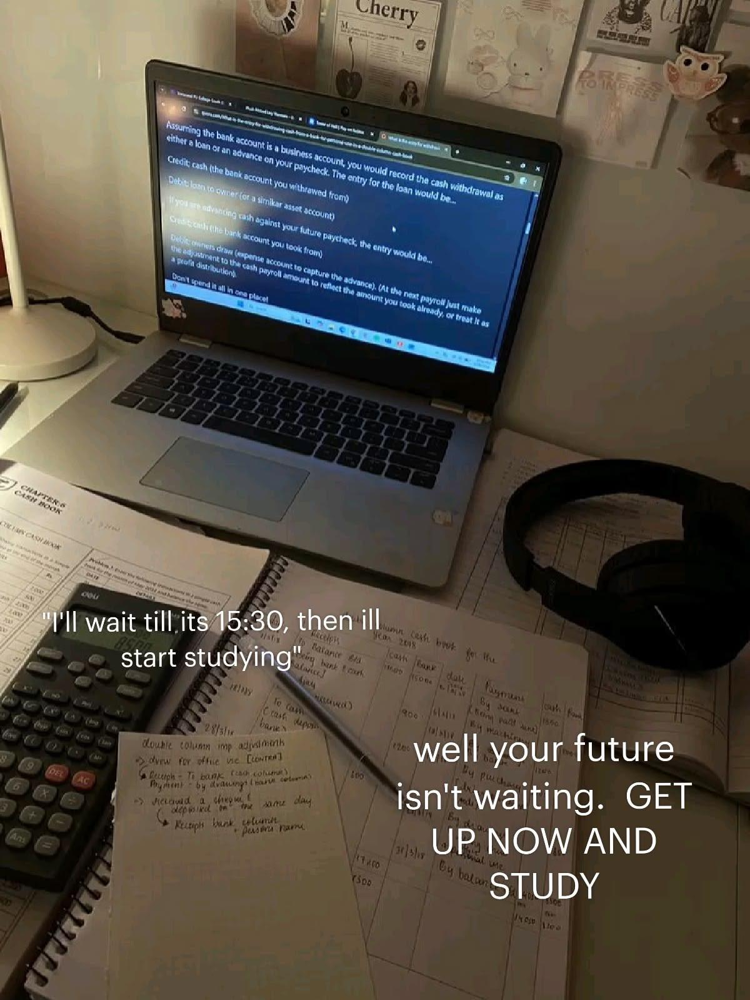
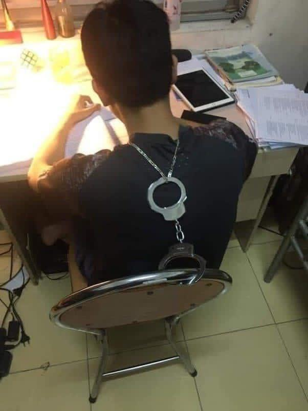

# Reddit Scout Report: Focus Timer Opportunities
**Date:** 2026-02-28

## Top Opportunities

### 1. [I am totally hopeless😭😭](https://www.reddit.com/r/studytips/comments/1rh303i/i_am_totally_hopeless/)
Subreddit: r/studytips | Score: 5 | Comments: 5 | Upvote ratio: 100%
Posted: ~3 hours ago

**Summary:**
I just can't focus and study. Rather than studying I will do everything else. It's literally destroying my future. If I sit and try to study after sometime I am again on my phone. I wasted two years n...

**Viral Score:** 5.6/10
- Raw score: 0.0/10
- Engagement: 2.5/10
- Upvote ratio: 10.0/10
- Relevance bonus: 2/3

### 2. [What’s helped you remain focused while studying?](https://www.reddit.com/r/GetStudying/comments/1rh1g3z/whats_helped_you_remain_focused_while_studying/)
Subreddit: r/GetStudying | Score: 54 | Comments: 30 | Upvote ratio: 99%
Posted: ~4 hours ago

**Summary:**
I seriously can’t stay focused on writing my final paper. I’ve been trying all week to sit down and make progress, but every time I end up scrolling on my phone or finding random things to do instead....

**Viral Score:** 5.2/10
- Raw score: 0.1/10
- Engagement: 1.6/10
- Upvote ratio: 9.9/10
- Relevance bonus: 2/3

### 3. [do you take notes on paper or digitally?](https://www.reddit.com/r/studytips/comments/1rgyerw/do_you_take_notes_on_paper_or_digitally/)
Subreddit: r/studytips | Score: 10 | Comments: 19 | Upvote ratio: 100%
Posted: ~7 hours ago

**Summary:**
I'll be starting college this fall and I'm wondering if it's better to take notes on a tablet or on paper. I've never taken notes using a tablet before and I also don't own a tablet, but I'm thinking ...

**Viral Score:** 5.0/10
- Raw score: 0.0/10
- Engagement: 3.0/10
- Upvote ratio: 10.0/10
- Relevance bonus: 0/3

### 4. [the thing that finally got me to the gym consistently wasn't motivation or discipline. It was removing every decision from the process.](https://www.reddit.com/r/getdisciplined/comments/1rgzkrh/the_thing_that_finally_got_me_to_the_gym/)
Subreddit: r/getdisciplined | Score: 64 | Comments: 8 | Upvote ratio: 91%
Posted: ~6 hours ago

**Summary:**
I tried for years. Motivation videos, accountability partners, new programs every month, gym selfies for Instagram. None of it lasted more than a few weeks.

What finally worked is so boring I'm almos...

**Viral Score:** 4.8/10
- Raw score: 0.1/10
- Engagement: 0.4/10
- Upvote ratio: 9.1/10
- Relevance bonus: 3/3

### 5. [Give me a reason to stay](https://www.reddit.com/r/DecidingToBeBetter/comments/1rgq9we/give_me_a_reason_to_stay/)
Subreddit: r/DecidingToBeBetter | Score: 17 | Comments: 17 | Upvote ratio: 95%
Posted: ~14 hours ago

**Summary:**
I try my best to do right by ppl but no one ever does right by me. I give my all and beyond even when I have absolutely nun I still give everything.. I tried to make friends, I tried relationships. I’...

**Viral Score:** 4.8/10
- Raw score: 0.0/10
- Engagement: 2.8/10
- Upvote ratio: 9.5/10
- Relevance bonus: 0/3

## Honorable Mentions

### 6. [What actually happens in your head right before you drop a routine?](https://www.reddit.com/r/getdisciplined/comments/1rgfsoz/what_actually_happens_in_your_head_right_before/) (r/getdisciplined | 13 upvotes) – Serious question for you guys.

First let me introduce the scenario. You have been consistent in gym....

### 7. [How do you create real time for yourself without running away from responsibilities?](https://www.reddit.com/r/productivity/comments/1rgohrq/how_do_you_create_real_time_for_yourself_without/) (r/productivity | 14 upvotes) – Lately I have been feeling mentally exhausted, even though I consider myself a responsible person. I....

### 8. [Why do screen time blockers feel like being grounded](https://www.reddit.com/r/productivity/comments/1rh3odt/why_do_screen_time_blockers_feel_like_being/) (r/productivity | 5 upvotes) – I tried using multiple screen time blockers. Either they are too easy to bypass or too difficult tha....

### 9. [How do master a new topic at physics in a few hours🥹🥹](https://www.reddit.com/r/studytips/comments/1rglw4m/how_do_master_a_new_topic_at_physics_in_a_few/) (r/studytips | 8 upvotes) – I have to learn impulse, work, power, kinetic and potential energy, variation of those, non/conserva....

### 10. [Does anyone else's brain replay embarrassing moments for hours after they happen?](https://www.reddit.com/r/productivity/comments/1rgi00k/does_anyone_elses_brain_replay_embarrassing/) (r/productivity | 85 upvotes) – It's not even big things. Someone mildly corrects me at work and I'm fine in the moment.

Then 3 hou....

## Media Summary
Downloaded images (2026-02-28-media/):

- **GetStudying_9lzjyowj77mg1.jpeg** (162 KB)
  

- **GetStudying_bkxq0ata84mg1.jpeg** (168 KB)
  

- **GetStudying_ouu56fe7c7mg1.jpeg** (295 KB)
  

- **GetStudying_uer4m6w387mg1.jpeg** (47 KB)
  

---
**View on GitHub:** https://github.com/ozlemsultan90-cmyk/reddit-scout-reports/blob/main/reports/2026-02-28.md