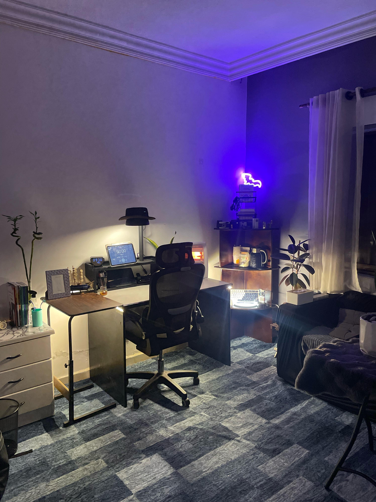
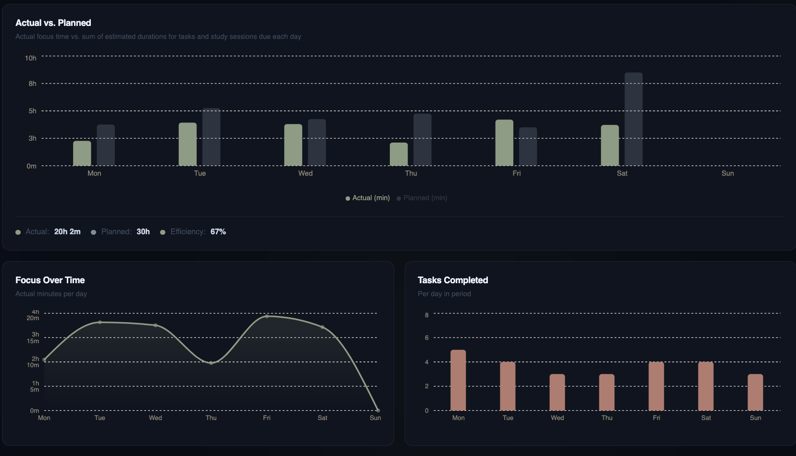
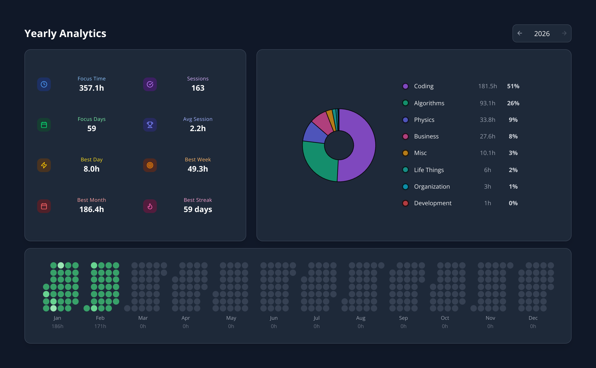

# Reddit Scout Report: Focus Timer Opportunities
**Date:** 2026-03-01

## Top Opportunities

### 1. [Do you prefer silence or ambient sound when studying?](https://www.reddit.com/r/studytips/comments/1rhk9o9/do_you_prefer_silence_or_ambient_sound_when/)
Subreddit: r/StudyTips | Score: 8 | Comments: 11 | Upvote ratio: 91%
Posted: ~15 hours ago

**Summary:** No text content.

**Viral Score:** 5.0/10
- Raw score: 0.0/10
- Engagement: 3.0/10
- Upvote ratio: 9.1/10
- Relevance bonus: 1/3

**Media:** No images

### 2. [I cannot work at all, but I need to](https://www.reddit.com/r/productivity/comments/1rhijqq/i_cannot_work_at_all_but_i_need_to/)
Subreddit: r/productivity | Score: 38 | Comments: 18 | Upvote ratio: 93%
Posted: ~17 hours ago

**Summary:** So I (19F) never had to study before, and had the highest grades at the end of highschool without even opening one book. Those grades I gathered allowed me to be accepted in a very exigeant course, an...

**Viral Score:** 4.9/10
- Raw score: 0.1/10
- Engagement: 1.4/10
- Upvote ratio: 9.3/10
- Relevance bonus: 2/3

**Media:** No images

### 3. [I stopped planning 12 tasks a day I started choosing ONE](https://www.reddit.com/r/productivity/comments/1rhalym/i_stopped_planning_12_tasks_a_day_i_started/)
Subreddit: r/productivity | Score: 30 | Comments: 20 | Upvote ratio: 98%
Posted: ~22 hours ago

**Summary:** I stopped planning 12 tasks a day  
I started choosing ONE

Productivity improved immediately

**Viral Score:** 4.9/10
- Raw score: 0.1/10
- Engagement: 1.9/10
- Upvote ratio: 9.8/10
- Relevance bonus: 1/3

**Media:** No images

### 4. [What are some things I can start doing immediately or soon to increase productivity?](https://www.reddit.com/r/productivity/comments/1rhwjos/what_are_some_things_i_can_start_doing/)
Subreddit: r/productivity | Score: 10 | Comments: 6 | Upvote ratio: 100%
Posted: ~4 hours ago

**Summary:** One thing ive been able to do was not use my phone for the first 30 minutes of the day. And not clicking videos that interest me immediately and just putting them in watch later to watch it later. I t...

**Viral Score:** 4.9/10
- Raw score: 0.0/10
- Engagement: 1.6/10
- Upvote ratio: 10.0/10
- Relevance bonus: 1/3

**Media:** No images

### 5. [Burned out after a productive month, help!](https://www.reddit.com/r/GetStudying/comments/1rhazd9/burned_out_after_a_productive_month_help/)
Subreddit: r/GetStudying | Score: 158 | Comments: 25 | Upvote ratio: 99%
Posted: ~22 hours ago

**Summary:** About a month ago, I was averaging 5 hours of studying per day. My lowest day was around 3h 40m, and my best was 8h (did that multiple times)

I used to study at the library. Now school started, so I ...

**Viral Score:** 4.9/10
- Raw score: 0.3/10
- Engagement: 0.5/10
- Upvote ratio: 9.9/10
- Relevance bonus: 2/3

**Media:**

## Honorable Mentions

### 6. [What's the hardest subject for you?](https://www.reddit.com/r/GetStudying/comments/1rhu3sm/whats_the_hardest_subject_for_you/) (r/GetStudying | 66 upvotes) – Let others give at some advice for that subject .
### 7. [59 Day Study Streak, Averaging 6 Hours a Day](https://www.reddit.com/r/GetStudying/comments/1rhqhb8/59_day_study_streak_averaging_6_hours_a_day/) (r/GetStudying | 18 upvotes) – No text..
### 8. [I deleted social media but my phone screen time barely dropped. Here's what actually helped](https://www.reddit.com/r/getdisciplined/comments/1rhj3gh/i_deleted_social_media_but_my_phone_screen_time/) (r/getdisciplined | 27 upvotes) – Classic trap: you delete Instagram and Twitter, feel proud for a day, then realize you're now spendi....
### 9. [ADHD student looking for accountability coach](https://www.reddit.com/r/studytips/comments/1rhnhpv/adhd_student_looking_for_accountability_coach/) (r/StudyTips | 3 upvotes) – Ive ADHD and I'm super lazy so I need a strict study buddy.
You'll: pressure, discipline, and struct....
### 10. [I WORKED FOR AS LONG AS I PLANNED!!! (disregard Saturday)](https://www.reddit.com/r/studytips/comments/1rhzyh4/i_worked_for_as_long_as_i_planned_disregard/) (r/StudyTips | 2 upvotes) – Last week I worked about as long as I planned to work, some things took a bit shorter, others a bit ....

## Media Summary
Downloaded images (2026-03-01-media/):
- **vzqkw7alxemg1.jpeg** (47 KB)
  
- **vbxtkymuvemg1.jpeg** (110 KB)
  
- **xtuos0g7aamg1.jpeg** (2452 KB)
  
- **hsmvisxobgmg1.png** (120 KB)
  
- **7qllwtwtsdmg1.png** (171 KB)
  
- **f530gjhdjemg1.jpeg** (140 KB)
  

---
**View on GitHub:** https://github.com/ozlemsultan90-cmyk/reddit-scout-reports/blob/main/reports/2026-03-01.md