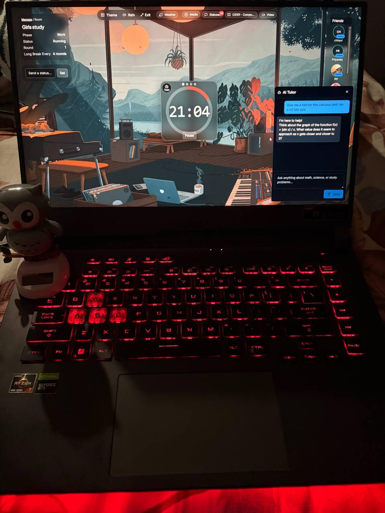
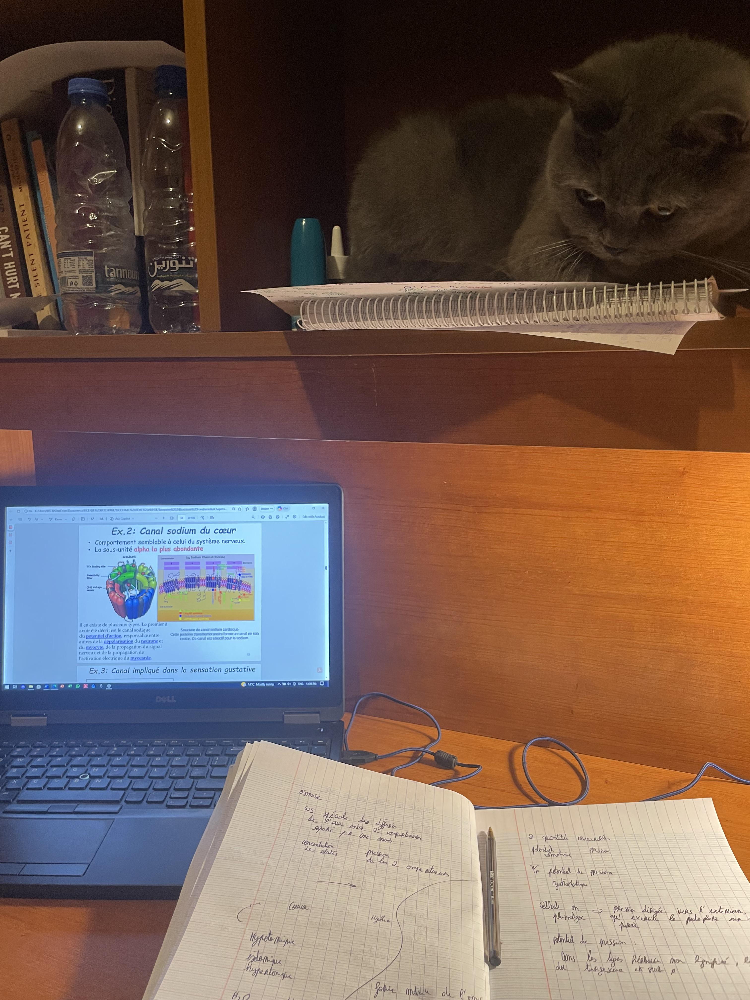
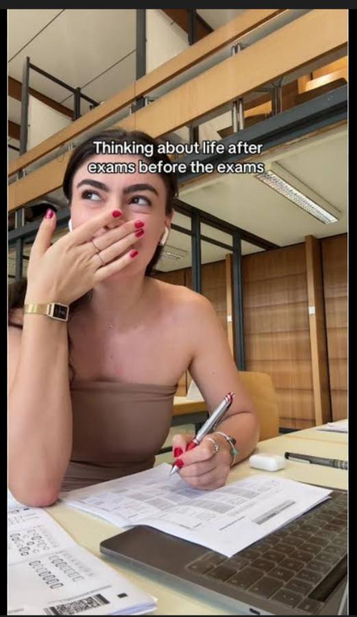
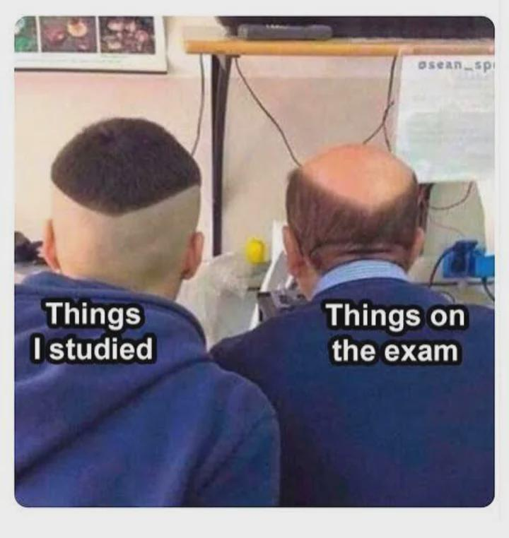
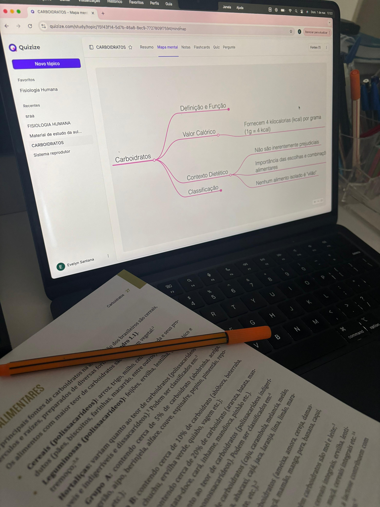
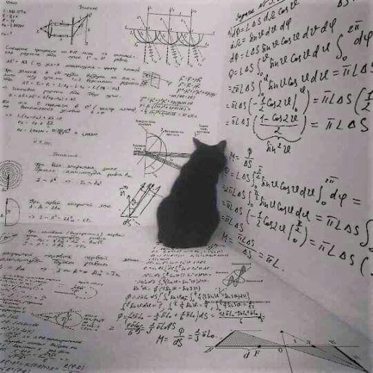

# Reddit Scout Report: Focus Timer Opportunities
**Date:** 2026-03-02

## Top Opportunities

### 1. [It’s 1AM, Anyone up for a late night study session?](https://www.reddit.com/r/GetStudying/comments/1ri6ck9/its_1am_anyone_up_for_a_late_night_study_session/)
Subreddit: r/GetStudying | Score: 78 | Comments: 36 | Upvote ratio: 98%
Posted: ~21.7 hours ago

**Summary:** It’s late.  
The house is quiet.  
My motivation is hanging by a thread.

I’m starting a 2-hour deep focus session RIGHT NOW.  
No phone. No tabs. Just study.

Comment:

1. What you’re studying
2. How

**Viral Score:** 5.5/10
- Raw score: 0.2/10
- Engagement: 1.4/10
- Upvote ratio: 9.8/10
- Relevance bonus: 3/3
n**Media:**

### 2. [Anyone else feel music kinda distracting when trying to focus?](https://www.reddit.com/r/productivity/comments/1ri99n8/anyone_else_feel_music_kinda_distracting_when/)
Subreddit: r/productivity | Score: 33 | Comments: 41 | Upvote ratio: 91%
Posted: ~19.8 hours ago

**Summary:** Alright so i've tried playing music in the background while I do work a million times, but i've noticed that i'm never really focused-focused. My brain will pay attention to the song or melody so im n

**Viral Score:** 5.1/10
- Raw score: 0.1/10
- Engagement: 3.0/10
- Upvote ratio: 9.1/10
- Relevance bonus: 1/3
n**Media:**
(No media)

### 3. [How to study for 3 hours plus in a day](https://www.reddit.com/r/studytips/comments/1ri3zo3/how_to_study_for_3_hours_plus_in_a_day/)
Subreddit: r/studytips | Score: 31 | Comments: 17 | Upvote ratio: 97%
Posted: ~23.1 hours ago

**Summary:** How do people study for more than 30 mins a day I seem to loose focus and energy after about 30 mins, I think something to do with it is what I’m listening while studying I use a random playlist I fou

**Viral Score:** 5.1/10
- Raw score: 0.1/10
- Engagement: 1.6/10
- Upvote ratio: 9.7/10
- Relevance bonus: 2/3
n**Media:**
(No media)

### 4. [How do you get the best grades within a semester?](https://www.reddit.com/r/productivity/comments/1riqia6/how_do_you_get_the_best_grades_within_a_semester/)
Subreddit: r/productivity | Score: 9 | Comments: 15 | Upvote ratio: 100%
Posted: ~5.4 hours ago

**Summary:** I know its a tough kind of question but how do you guys get the best of your grades and ace them?

**Viral Score:** 5.0/10
- Raw score: 0.0/10
- Engagement: 3.0/10
- Upvote ratio: 10.0/10
- Relevance bonus: 0/3
n**Media:**
(No media)

### 5. [The best app for hourly recurring tasks and calendar](https://www.reddit.com/r/productivity/comments/1ric9h3/the_best_app_for_hourly_recurring_tasks_and/)
Subreddit: r/productivity | Score: 8 | Comments: 8 | Upvote ratio: 100%
Posted: ~17.9 hours ago

**Summary:** Hello, I've been using Ticktick for a very long time and was satisfied with it. That is, until I needed to change the repeat interval of a task from daily to hourly. Ticktick doesn't have this settin

**Viral Score:** 4.9/10
- Raw score: 0.0/10
- Engagement: 2.7/10
- Upvote ratio: 10.0/10
- Relevance bonus: 0/3
n**Media:**
(No media)

## Honorable Mentions

### 6. [Is exhaustion really about too much work?](https://www.reddit.com/r/productivity/comments/1ri5cxx/is_exhaustion_really_about_too_much_work/) (r/productivity | 5 upvotes) – What if it’s not about effort…  
but about too many priorities?

Maybe the problem isn’t working har.
### 7. [How I study alone](https://www.reddit.com/r/studytips/comments/1ri6kdm/how_i_study_alone/) (r/studytips | 82 upvotes) – I didn't become a perfect and super disciplined person overnight. I just started. A little bit at a .
### 8. [[Confession Thread] Tell me your dirtiest study habit](https://www.reddit.com/r/studytips/comments/1rinj21/confession_thread_tell_me_your_dirtiest_study/) (r/studytips | 84 upvotes) – Okay, I’ll go first. One of the wildest things I’ve ever done was getting out of bed in the middle o.
### 9. [that's it. i'm locking in](https://www.reddit.com/r/GetStudying/comments/1ric0fq/thats_it_im_locking_in/) (r/GetStudying | 994 upvotes) – that's it. i'm going to lock in now. no more doomscrolling. no more netflix. no more 5 hour naps. i .
### 10. [Unpopular opinion: Reading textbooks is the worst way to study. Change my mind](https://www.reddit.com/r/studytips/comments/1rijtjs/unpopular_opinion_reading_textbooks_is_the_worst/) (r/studytips | 14 upvotes) – Hear me out.

I've been grinding through a 900-page biochem textbook for weeks and my retention is A.

## Media Summary
Downloaded images (2026-03-02-media/):
- **2026-03-02-GetStudying-1ri6ck9.jpeg** (121.6 KB)
  
- **2026-03-02-GetStudying-1riaktm.jpeg** (3099.3 KB)
  
- **2026-03-02-GetStudying-1ric0fq.jpeg** (5119.1 KB)
  
- **2026-03-02-GetStudying-1rifliq.jpeg** (244.4 KB)
  
- **2026-03-02-GetStudying-1ritpgf.jpeg** (47.5 KB)
  
- **2026-03-02-StudyTips-1ri6kdm.jpeg** (1025.2 KB)
  
- **2026-03-02-StudyTips-1rinj21.jpeg** (135.4 KB)
  
- **2026-03-02-StudyTips-1rio3d2.jpeg** (85.4 KB)
  

---
**View on GitHub:** https://github.com/ozlemsultan90-cmyk/reddit-scout-reports/blob/main/reports/2026-03-02.md
