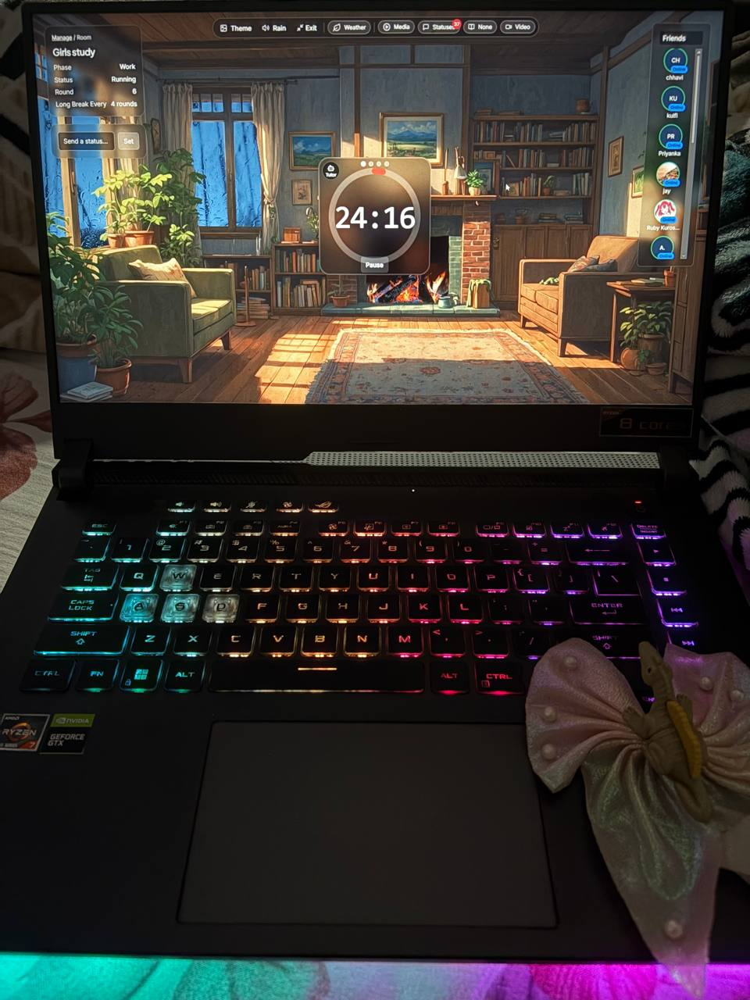
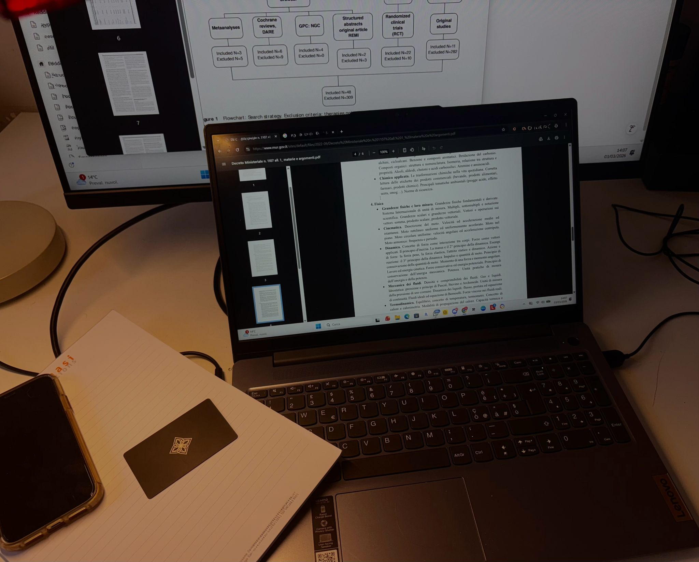
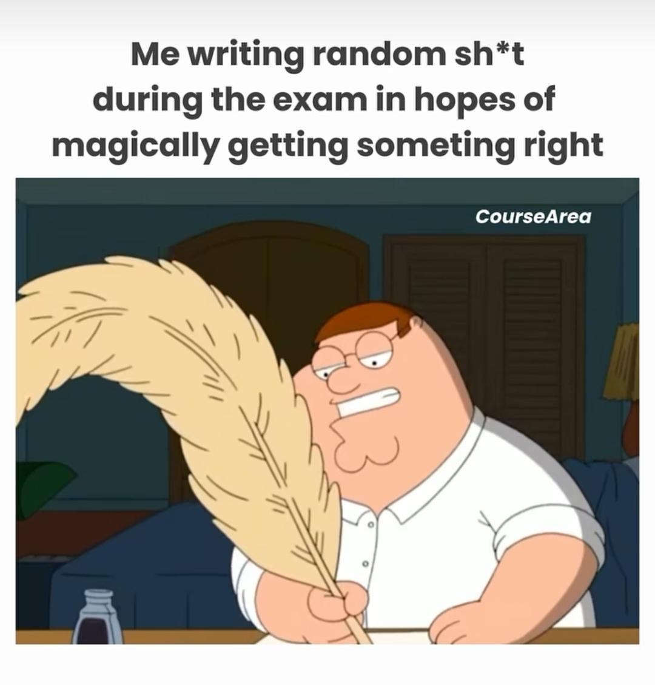
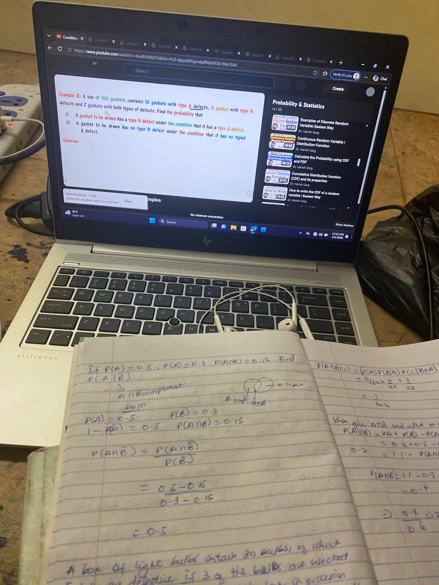

# Reddit Scout Report: Focus Timer Opportunities
**Date:** 2026-03-03

## Top Opportunities

### 1. [How to lock in](https://www.reddit.com/r/getdisciplined/comments/1rj6c54/how_to_lock_in/)
Subreddit: r/getdisciplined | Score: 11 | Comments: 12 | Upvote ratio: 92%
Posted: ~19 hours ago

**Summary:** I’m a 14 year old student in 8th grade. My grades are shit, I don’t study, I don’t exercise, I can’t focus, and I don’t eat healthy at all. I have ADHD, Autism, Anxiety, and Depression.

I have pretty

**Viral Score:** 5.5/10
- Raw score: 0/10
- Engagement: 3/10
- Upvote ratio: 9.2/10
- Relevance bonus: 2/3

**Media:**
None

### 2. [Do your systems fail because they’re bad or because stress changes how you operate?](https://www.reddit.com/r/productivity/comments/1rj8hzc/do_your_systems_fail_because_theyre_bad_or/)
Subreddit: r/productivity | Score: 32 | Comments: 39 | Upvote ratio: 98%
Posted: ~18 hours ago

**Summary:** Something I’ve been thinking about:

A lot of productivity advice assumes consistency happens in stable conditions. But real life isn’t stable.

Have you noticed whether your systems (time blocking, t

**Viral Score:** 5.3/10
- Raw score: 0.1/10
- Engagement: 3/10
- Upvote ratio: 9.8/10
- Relevance bonus: 1/3

**Media:**
None

### 3. [How do yall study?](https://www.reddit.com/r/studytips/comments/1rjqbt9/how_do_yall_study/)
Subreddit: r/studytips | Score: 9 | Comments: 8 | Upvote ratio: 100%
Posted: ~3 hours ago

**Summary:** just outta curiosity, I really wanna know how yall study and get good marks?

**Viral Score:** 5.2/10
- Raw score: 0/10
- Engagement: 2.4/10
- Upvote ratio: 10/10
- Relevance bonus: 1/3

**Media:**
None

### 4. [Day 2 : It’s around 1AM, Anyone up for a late night study session?](https://www.reddit.com/r/studytips/comments/1rj25lq/day_2_its_around_1am_anyone_up_for_a_late_night/)
Subreddit: r/studytips | Score: 41 | Comments: 15 | Upvote ratio: 96%
Posted: ~22 hours ago

**Summary:** I’m starting a 2-hour deep focus session RIGHT NOW.  

Rules:  
No phone.  
No scrolling.  
No excuses.  
Just study.

Comment your subject + focus time.  
I’ll check back in 2 hours.

Let’s see who 

**Viral Score:** 4.9/10
- Raw score: 0.1/10
- Engagement: 1.1/10
- Upvote ratio: 9.6/10
- Relevance bonus: 2/3

**Media:**

### 5. [I tracked 70+ hours of real focus and here’s what actually worked:](https://www.reddit.com/r/GetStudying/comments/1rjpmkt/i_tracked_70_hours_of_real_focus_and_heres_what/)
Subreddit: r/GetStudying | Score: 139 | Comments: 14 | Upvote ratio: 98%
Posted: ~3 hours ago

**Summary:** **1. Most “study time” is fake.**

Reading, highlighting, reorganizing notes feels productive but doesn’t stick. If you’re not retrieving information, you’re probably not learning much.

**2. 45 minut

**Viral Score:** 4.8/10
- Raw score: 0.3/10
- Engagement: 0.3/10
- Upvote ratio: 9.8/10
- Relevance bonus: 2/3

**Media:**

## Honorable Mentions

### 6. [How do y’all do it?](https://www.reddit.com/r/GetStudying/comments/1rja83r/how_do_yall_do_it/) (r/GetStudying | 72 upvotes) – I genuinely aspire to be like you lot that study continuously for 6-8 hours with minimal distraction.

### 7. [If you constantly check your phone while studying, try adding "friction" instead of hard blocking apps. (It saved my GPA).](https://www.reddit.com/r/studytips/comments/1rj8bsk/if_you_constantly_check_your_phone_while_studying/) (r/studytips | 13 upvotes) – every time I sat down to study, the cycle was exactly the same:  *  i'd promise myself to focus for .

### 8. [stopped trying to be productive 24/7 and somehow got more done??](https://www.reddit.com/r/productivity/comments/1rj9y4a/stopped_trying_to_be_productive_247_and_somehow/) (r/productivity | 74 upvotes) – ok so this is gonna sound backwards but hear me out  i spent like 2 years obsessing over productivit.

### 9. [What is wrong with me](https://www.reddit.com/r/getdisciplined/comments/1rjew5u/what_is_wrong_with_me/) (r/getdisciplined | 33 upvotes) – I feel ashamed as I write this down.  As it happens, I have a test tomorrow, or rather today in abou.

### 10. [I used to think something was wrong with me because I liked being alone.](https://www.reddit.com/r/DecidingToBeBetter/comments/1rjjmc8/i_used_to_think_something_was_wrong_with_me/) (r/DecidingToBeBetter | 14 upvotes) – For years, I thought my need for solitude meant I was socially broken. If I stayed home instead of g.

## Media Summary
Downloaded images (2026-03-03-media/):
- **GetStudying_139_0.png** (2295.0 KB)
  
- **GetStudying_249_0.png** (2429.4 KB)
  
- **GetStudying_277_0.jpeg** (306.4 KB)
  
- **GetStudying_72_0.jpeg** (2868.8 KB)
  
- **studytips_41_0.png** (1255.2 KB)
  

---
**View on GitHub:** https://github.com/ozlemsultan90-cmyk/reddit-scout-reports/blob/main/reports/2026-03-03.md
