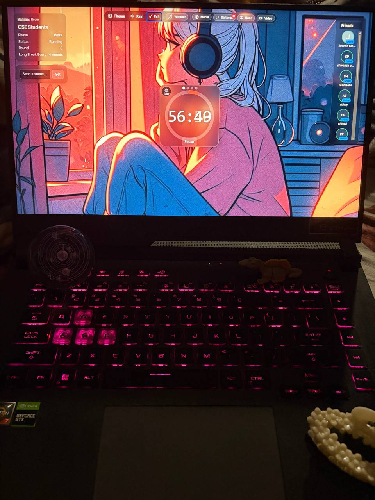
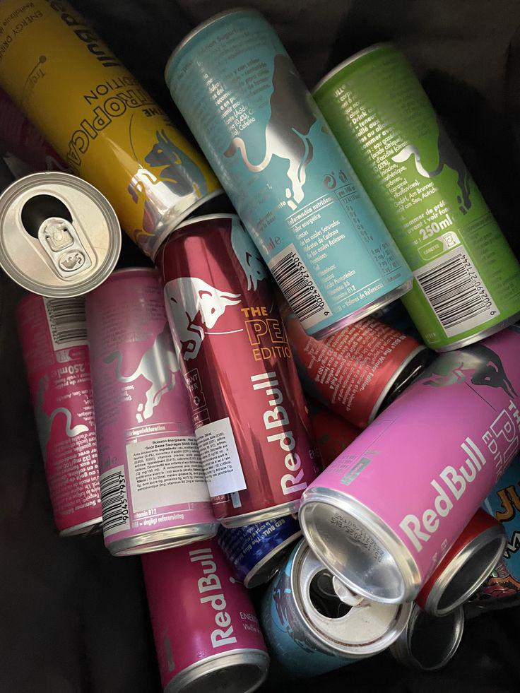

# Reddit Scout Report: Focus Timer Opportunities
**Date:** 2026-03-04

## Top Opportunities

### 1. [I stopped trying to manage my full task list and only let myself see 3 things at a time - it's the only system that's actually stuck](https://www.reddit.com/r/productivity/comments/1rjzcov/i_stopped_trying_to_manage_my_full_task_list_and/)
Subreddit: r/productivity | Score: 7 | Comments: 6 | Upvote ratio: 100%
Posted: ~17.6 hours ago

**Summary:** I've rebuilt my productivity systems more times than I can count. Notion databases, Todoist with priority flags, weekly review systems, time blocking... they all worked for a couple weeks and then fel...

**Viral Score:** 5.1/10
- Raw score: 0.0/10
- Engagement: 2.2/10
- Upvote ratio: 10.0/10
- Relevance bonus: 1/3

### 2. [Discipline Isn't Hard. You're Just Addicted to Comfort](https://www.reddit.com/r/getdisciplined/comments/1rkcukt/discipline_isnt_hard_youre_just_addicted_to/)
Subreddit: r/getdisciplined | Score: 39 | Comments: 21 | Upvote ratio: 83%
Posted: ~8.0 hours ago

**Summary:** I'm going to say this respectfully because I'm including myself in this. Most of us do not struggle with discipline. We struggle with discomfort. We say we want to wake up early, work out, build a bus...

**Viral Score:** 5.0/10
- Raw score: 0.1/10
- Engagement: 1.6/10
- Upvote ratio: 8.3/10
- Relevance bonus: 4/3

### 3. [Any advice on how to quit picking at the skin around your nails?](https://www.reddit.com/r/DecidingToBeBetter/comments/1rjx592/any_advice_on_how_to_quit_picking_at_the_skin/)
Subreddit: r/DecidingToBeBetter | Score: 16 | Comments: 52 | Upvote ratio: 100%
Posted: ~18.9 hours ago

**Summary:** Hey everyone, for my whole life I struggled with biting my nails and picking the skin around my nails...

**Viral Score:** 5.0/10
- Raw score: 0.0/10
- Engagement: 3.0/10
- Upvote ratio: 10.0/10
- Relevance bonus: 0/3

### 4. [Does anyone else hate the pomodoro technique](https://www.reddit.com/r/GetStudying/comments/1rkdpv7/does_anyone_else_hate_the_pomodoro_technique/)
Subreddit: r/GetStudying | Score: 43 | Comments: 20 | Upvote ratio: 94%
Posted: ~7.2 hours ago

**Summary:** Everyone swears by it but it seems so ineffective. Breaks feel too short and I never feel focused when I'm actually supposed to study...

**Viral Score:** 4.9/10
- Raw score: 0.1/10
- Engagement: 1.4/10
- Upvote ratio: 9.4/10
- Relevance bonus: 2/3

### 5. [Drug-free anxiety relief changed how I approach work and stress](https://www.reddit.com/r/productivity/comments/1rk07tf/drugfree_anxiety_relief_changed_how_i_approach/)
Subreddit: r/productivity | Score: 31 | Comments: 11 | Upvote ratio: 93%
Posted: ~17.0 hours ago

**Summary:** I always used to be exhausted and think being exhausted meant I needed better time management like a new planner, better task system and less distractions. But the real issue wasn't my schedule it was...

**Viral Score:** 4.8/10
- Raw score: 0.1/10
- Engagement: 1.0/10
- Upvote ratio: 9.3/10
- Relevance bonus: 2/3

## Honorable Mentions

### 6. [I kept a "what I actually did today" journal instead of a to-do list and it completely changed how I see myself](https://www.reddit.com/r/getdisciplined/comments/1rke9sq/i_kept_a_what_i_actually_did_today_journal/) (r/getdisciplined | 184 upvotes) – For years I've started every morning writing a to-do list. 10 to 15 items. By the end of the day I'd...
### 7. [Day 3: It's 1AM again | Consistency > Motivation](https://www.reddit.com/r/GetStudying/comments/1rjy3mk/day_3_its_1am_again_consistency_motivation/) (r/GetStudying | 67 upvotes) – Most people said they'd show up yesterday. Few actually did. I'm starting another 1-hour deep focus ...
### 8. [Day 3 : Anyone up for a late night study session?](https://www.reddit.com/r/studytips/comments/1rjy6ck/day_3_anyone_up_for_a_late_night_study_session/) (r/studytips | 12 upvotes) – Most people said they'd show up yesterday. Few actually did.  I'm starting a 1-hour deep focus sessi...
### 9. [how to memorize large amount of content effectively??](https://www.reddit.com/r/studytips/comments/1rkljua/how_to_memorize_large_amount_of_content/) (r/studytips | 11 upvotes) – i have a shit ton of notes and over 100 slides with really important information that I have to get ...
### 10. [I'm confused about when to fully self-regulate or eventually share with my partner my feelings](https://www.reddit.com/r/DecidingToBeBetter/comments/1rjxr6c/im_confused_about_when_to_fully_selfregulate_or/) (r/DecidingToBeBetter | 11 upvotes) – I'm in therapy and have been for a couple months but I've always felt uncertain about the topic of f...

## Media Summary
Downloaded images (2026-03-04-media/):
- **GetStudying_1rjv8ps_0.jpg** (503 KB)
  
- **GetStudying_1rjy3mk_0.png** (1391 KB)
  
- **GetStudying_1rkks8t_0.jpg** (121 KB)
  
- **studytips_1rjy6ck_0.jpg** (154 KB)
  

---
**View on GitHub:** https://github.com/ozlemsultan90-cmyk/reddit-scout-reports/blob/main/reports/2026-03-04.md