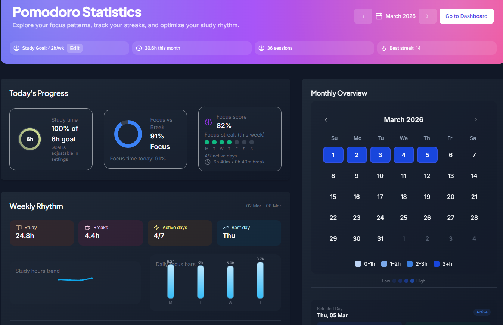
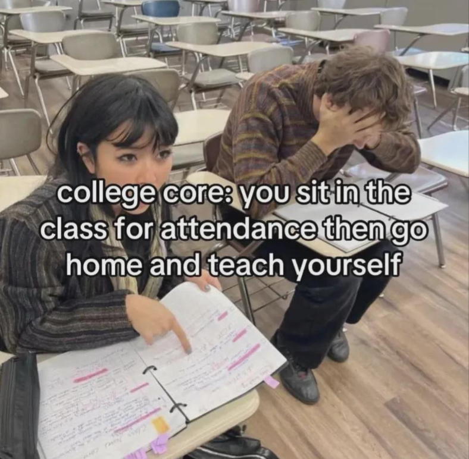
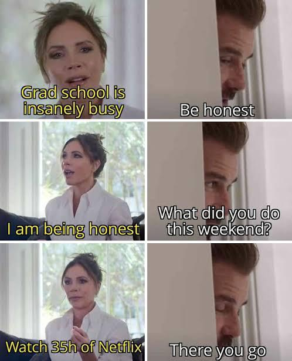
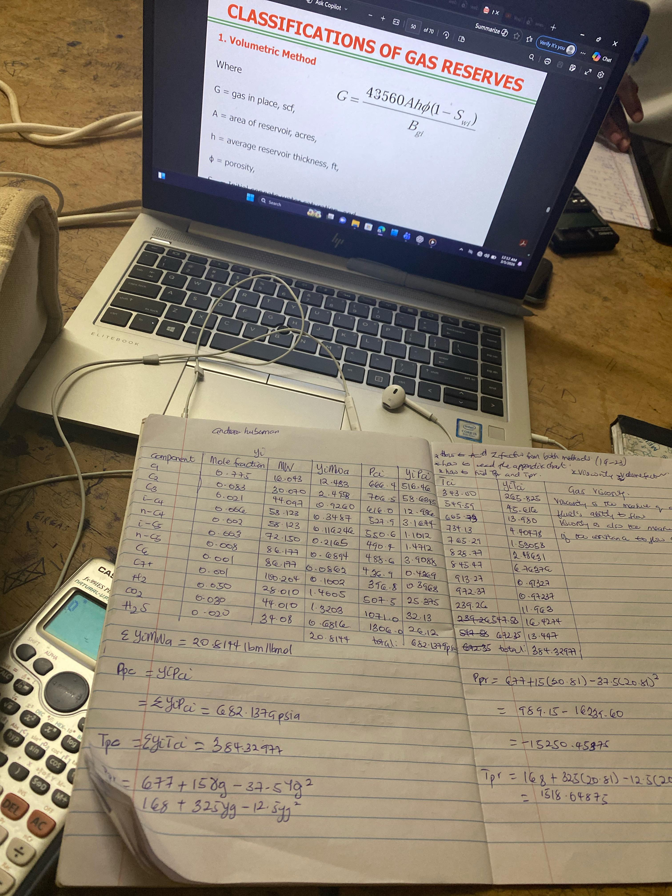

# Reddit Scout Report: Focus Timer Opportunities
**Date:** 2026-03-05

## Top Opportunities

### 1. [If you had to pick one habit that reliably makes your day/life better, what would it be?](https://www.reddit.com/r/DecidingToBeBetter/comments/1rkzs3c/if_you_had_to_pick_one_habit_that_reliably_makes/)
Subreddit: r/DecidingToBeBetter | Score: 18 | Comments: 27 | Upvote ratio: 1%
Posted: ~18 hours ago

**Summary:** A lot of habit advice online focuses on discipline and productivity, but I’m more curious about something else:  *Which habits actually make your life feel better?*    Not the ones that sound impressi

**Viral Score:** 6.0/10
- Raw score: 0.0/10
- Engagement: 3.0/10
- Upvote ratio: 9.5/10
- Relevance bonus: 3/3

### 2. [Day 5 of March 2026 : ~30 Hours so far | Achieved my study goal with a 93% focus](https://www.reddit.com/r/studytips/comments/1rlhxn5/day_5_of_march_2026_30_hours_so_far_achieved_my/)
Subreddit: r/StudyTips | Score: 8 | Comments: 2 | Upvote ratio: 1%
Posted: ~3 hours ago

**Summary:** **Here’s what my March stats look like:**  Study goal: 42h/week  Total study time: 30.6 hours this month  Best streak: 14 sessions   Focus score: 82%  Total sessions: 36    **Some interesting things I

**Viral Score:** 5.3/10
- Raw score: 0.0/10
- Engagement: 0.7/10
- Upvote ratio: 10.0/10
- Relevance bonus: 3/3

**Media:**

### 3. [Lack of motivation to do anything important to benefit me](https://www.reddit.com/r/productivity/comments/1rl0txt/lack_of_motivation_to_do_anything_important_to/)
Subreddit: r/productivity | Score: 21 | Comments: 16 | Upvote ratio: 1%
Posted: ~17 hours ago

**Summary:** I’m a 23 male. And lately, I’ve been so unmotivated and lazy, which is really easy for me. I have a gym membership but I don’t go to the gym. I have a pretty bad stutter and tried speech therapy but I

**Viral Score:** 5.0/10
- Raw score: 0.0/10
- Engagement: 2.2/10
- Upvote ratio: 9.7/10
- Relevance bonus: 1/3

### 4. [Best AI to study that makes you things like flashcards and practice tests? Need help ASAP](https://www.reddit.com/r/studytips/comments/1rl5ofu/best_ai_to_study_that_makes_you_things_like/)
Subreddit: r/StudyTips | Score: 6 | Comments: 13 | Upvote ratio: 1%
Posted: ~14 hours ago

**Summary:** I have an exam tommorow, and the presentation my teacher left is a mess. I need help with an AI to review the presentation and to get all of the information out of there any recommendations. 

**Viral Score:** 4.9/10
- Raw score: 0.0/10
- Engagement: 3.0/10
- Upvote ratio: 8.8/10
- Relevance bonus: 1/3

### 5. [Deleted every productivity app I had and switched to a single .txt file on my desktop, genuinely the most productive I've been in years](https://www.reddit.com/r/productivity/comments/1rl22yo/deleted_every_productivity_app_i_had_and_switched/)
Subreddit: r/productivity | Score: 466 | Comments: 43 | Upvote ratio: 1%
Posted: ~16 hours ago

**Summary:** At one point I had like 4 different apps all supposed to help me stay on top of things and I was spending more time organizing my tasks than actually doing them. The monthly subscriptions added up too

**Viral Score:** 4.6/10
- Raw score: 0.9/10
- Engagement: 0.3/10
- Upvote ratio: 9.8/10
- Relevance bonus: 1/3

### 6. [Are book summaries just a total waste of time?](https://www.reddit.com/r/productivity/comments/1rlhaq6/are_book_summaries_just_a_total_waste_of_time/) (r/productivity | 17 upvotes) – Last year I listened to 50+ books on Blinkist. Well, 50+ book summaries to be accurate. I’ve always 

### 7. [Attend class](https://www.reddit.com/r/GetStudying/comments/1rlh6dl/attend_class/) (r/GetStudying | 979 upvotes) – No selftext available.

### 8. [if you make terrible mistakes and hurt people do you still deserve love and good things if you have changed](https://www.reddit.com/r/DecidingToBeBetter/comments/1rl7qzz/if_you_make_terrible_mistakes_and_hurt_people_do/) (r/DecidingToBeBetter | 21 upvotes) – i want to be better but then i think i dont deserve it too cus of past mistakes i feel can’t accept 

### 9. [Rate My Study Setup](https://www.reddit.com/r/GetStudying/comments/1rl7o0u/rate_my_study_setup/) (r/GetStudying | 92 upvotes) – Here is my study setup. Let me know what you think. I’m a 22 year old husband and father to a 1 year

### 10. [Discipline gets a lot easier when there’s nothing left to debate](https://www.reddit.com/r/getdisciplined/comments/1rl6oid/discipline_gets_a_lot_easier_when_theres_nothing/) (r/getdisciplined | 17 upvotes) – I don’t think most discipline problems come from people being weak or lazy. Honestly it should be fa

## Media Summary
Downloaded images (2026-03-05-media/):
- **GetStudying_1rks7hg.png** (396.1 KB)
  
- **GetStudying_1rl2g6r.jpeg** (3222.3 KB)
  
- **GetStudying_1rl7o0u.jpeg** (5803.8 KB)
  
- **GetStudying_1rlh6dl.png** (819.3 KB)
  
- **StudyTips_1rkspiq_dgjp3vr6j2ng1.jpg** (0.0 KB)
  
- **StudyTips_1rlhxn5.png** (388.7 KB)
  

---
**View on GitHub:** https://github.com/ozlemsultan90-cmyk/reddit-scout-reports/blob/main/reports/2026-03-05.md
