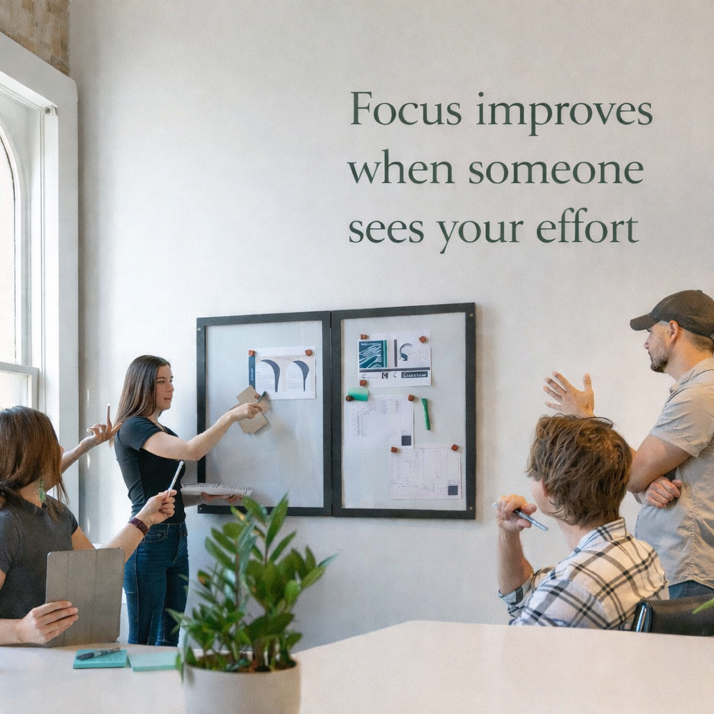
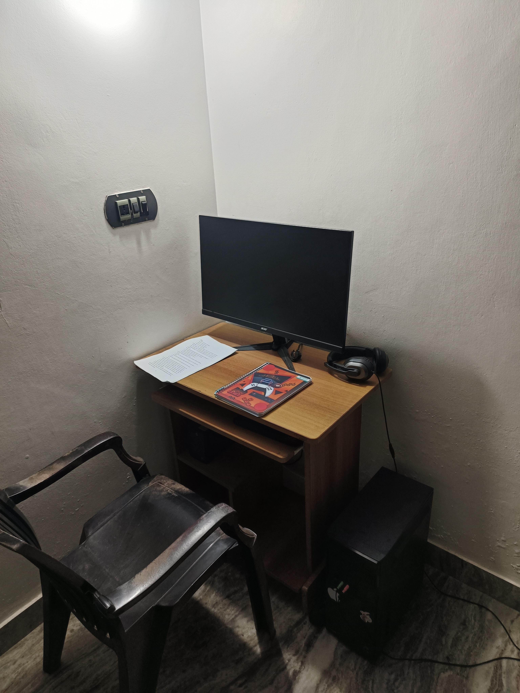
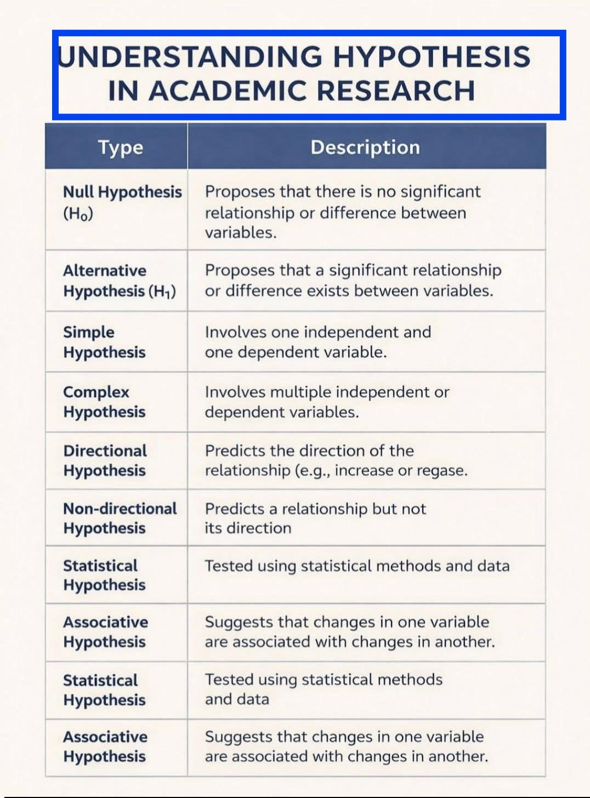
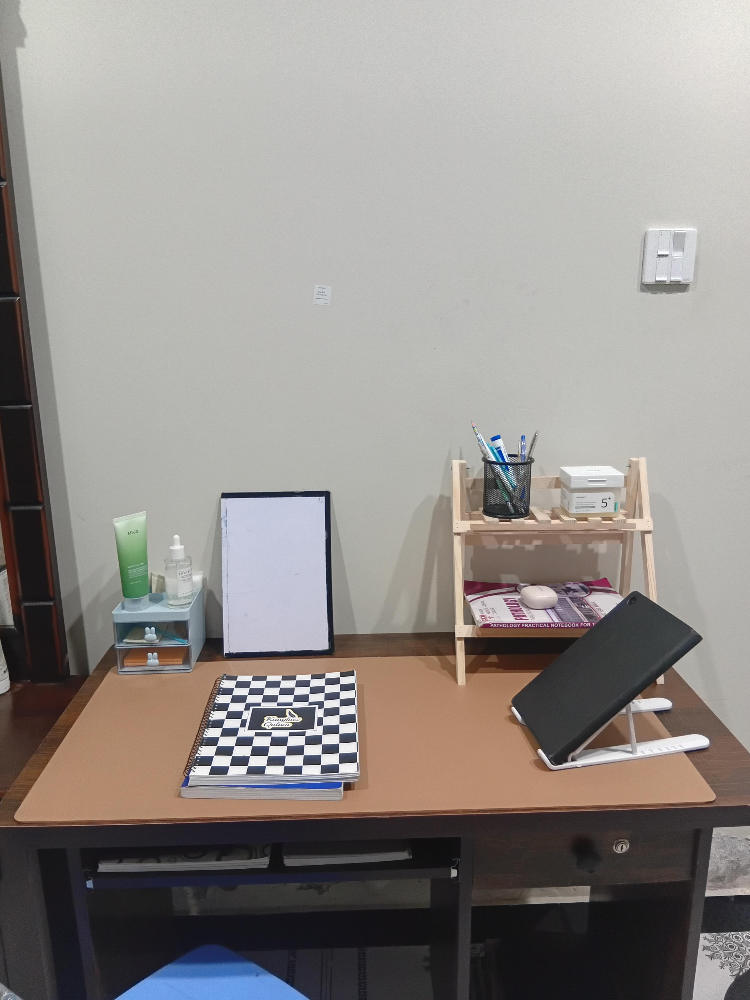
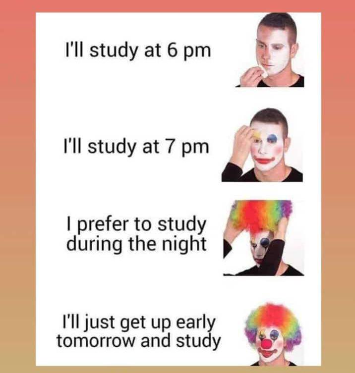

# Reddit Scout Report: Focus Timer Opportunities
**Date:** 2026-03-06

## Top Opportunities

### 1. [How many hours can a human learn in a day?](https://www.reddit.com/r/studytips/comments/1rmc0zz/how_many_hours_can_a_human_learn_in_a_day/)
Subreddit: r/studytips | Score: 10 | Comments: 8 | Upvote ratio: 0%
Posted: ~5 hours ago

**Summary:** Hello,

Everyone's brain is different.

I am learning coding and my method is to write in Notion with the Feynman's technique.

This has a huge advantage, especially now that I am in the theory phrase

**Viral Score:** 6/10
- Raw score: 0.02/10
- Engagement: 2.18/10
- Upvote ratio: 9.2/10
- Relevance bonus: 3/3

### 2. [I'm tired of being angry all the time after a breakup.](https://www.reddit.com/r/DecidingToBeBetter/comments/1rmevd0/im_tired_of_being_angry_all_the_time_after_a/)
Subreddit: r/DecidingToBeBetter | Score: 12 | Comments: 17 | Upvote ratio: 0%
Posted: ~3 hours ago

**Summary:** It's been almost 4 months since my ex broke up with me. I thought she was it. We treated each other great, showed up for each other, did all the right things. But we couldn't communicate how the other

**Viral Score:** 6/10
- Raw score: 0.02/10
- Engagement: 3/10
- Upvote ratio: 9.3/10
- Relevance bonus: 3/3

### 3. [Aiming to reduce meal prep time by 50-90%](https://www.reddit.com/r/productivity/comments/1rlxoac/aiming_to_reduce_meal_prep_time_by_5090/)
Subreddit: r/productivity | Score: 13 | Comments: 13 | Upvote ratio: 0%
Posted: ~17 hours ago

**Summary:** It takes me \~10 hours per week to cook and meal prep. I want to reduce this by 50-90%. 

I'm willing to pay good money, but hiring a personal chef seems a little much. Maybe a part-time meal prep che

**Viral Score:** 6/10
- Raw score: 0.03/10
- Engagement: 2.79/10
- Upvote ratio: 8.8/10
- Relevance bonus: 3/3

**Media:**

### 4. [Do my symptoms say I am burned out?](https://www.reddit.com/r/productivity/comments/1rlu762/do_my_symptoms_say_i_am_burned_out/)
Subreddit: r/productivity | Score: 15 | Comments: 8 | Upvote ratio: 1%
Posted: ~19 hours ago

**Summary:** I (F28) have been working as a nurse for 6 years in the hospital. I did a specialization to become a neurology nurse. Ever since this study I've had increasing tension headaches, dizziness, fatigue an

**Viral Score:** 6/10
- Raw score: 0.03/10
- Engagement: 1.5/10
- Upvote ratio: 10/10
- Relevance bonus: 3/3

**Media:**

### 5. [Rate my study setup](https://www.reddit.com/r/GetStudying/comments/1rmee5b/rate_my_study_setup/)
Subreddit: r/GetStudying | Score: 58 | Comments: 22 | Upvote ratio: 1%
Posted: ~3 hours ago

**Summary:** Guys rate my study setup.

**Viral Score:** 5/10
- Raw score: 0.12/10
- Engagement: 1.12/10
- Upvote ratio: 10/10
- Relevance bonus: 3/3

### 6. [How can I study for abstract concepts with a low intelligence?](https://www.reddit.com/r/GetStudying/comments/1rlqjdw/how_can_i_study_for_abstract_concepts_with_a_low/) (r/GetStudying | 60 upvotes) – Hi. I have a diagnosed IQ of 79, autism and ADHD. I struggle a lot with studying very abstract conce.
### 7. [Anyways to improve this setup?](https://www.reddit.com/r/GetStudying/comments/1rlzr5h/anyways_to_improve_this_setup/) (r/GetStudying | 95 upvotes) – .
### 8. [Every time l plan to study](https://www.reddit.com/r/GetStudying/comments/1rm6ra7/every_time_l_plan_to_study/) (r/GetStudying | 292 upvotes) – .
### 9. [Study dungeon](https://www.reddit.com/r/GetStudying/comments/1rmatj2/study_dungeon/) (r/GetStudying | 344 upvotes) – .
### 10. [Academic research](https://www.reddit.com/r/studytips/comments/1rm74ka/academic_research/) (r/studytips | 5 upvotes) – .

## Media Summary
Downloaded images (2026-03-06-media/):
- **studytips_2.png** (1708 KB)
  
- **GetStudying_2.jpeg** (3039 KB)
  
- **studytips_1772816488539322000.jpeg** (748 KB)
  
- **GetStudying_1772816489082196000.png** (379 KB)
  
- **GetStudying_4.jpeg** (2389 KB)
  
- **studytips_1772816488522907000.png** (1708 KB)
  
- **studytips_4.jpeg** (748 KB)
  
- **GetStudying_1772816489102340000.jpeg** (3039 KB)
  
- **GetStudying_0.png** (379 KB)
  
- **GetStudying_1.jpeg** (41 KB)
  
- **GetStudying_1772816489116661000.jpeg** (2389 KB)
  
- **GetStudying_1772816489093139000.jpeg** (41 KB)
  

---
**View on GitHub:** https://github.com/ozlemsultan90-cmyk/reddit-scout-reports/blob/main/reports/2026-03-06.md
