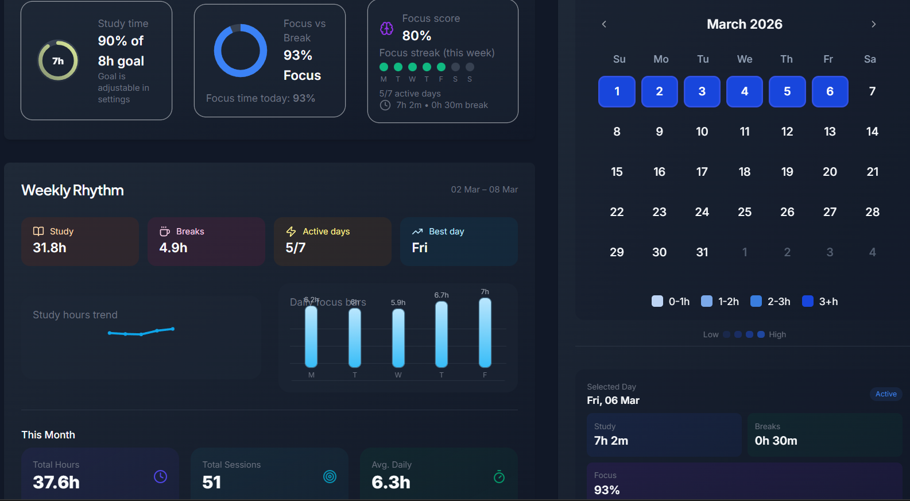
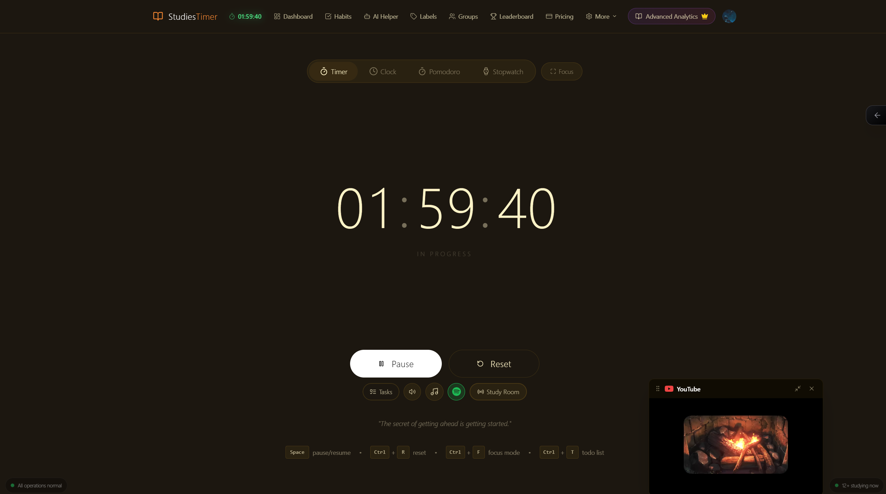
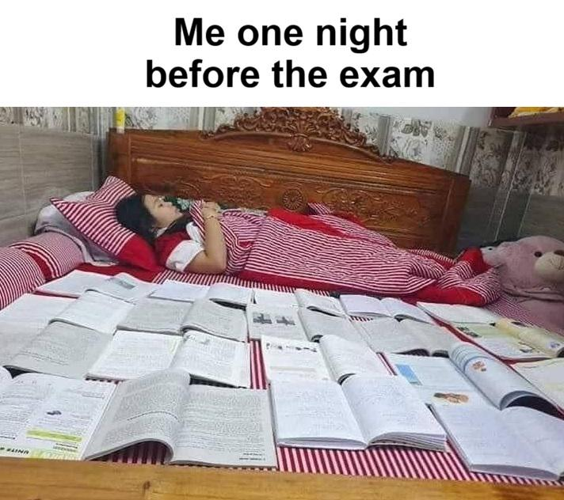
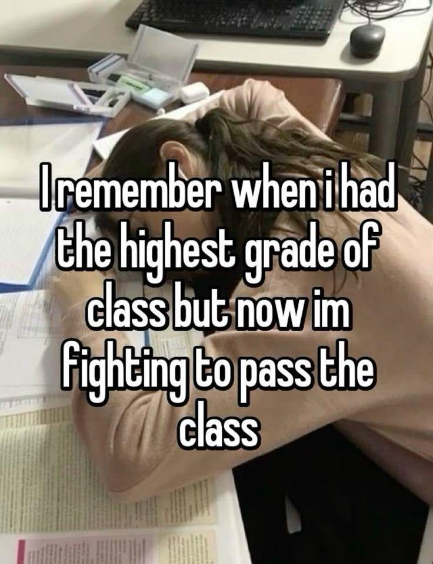

# Reddit Scout Report: Focus Timer Opportunities
**Date:** 2026-03-07

## Top Opportunities

### 1. [From topper to below average we grew up..](https://www.reddit.com/r/GetStudying/comments/1rmugot/from_topper_to_below_average_we_grew_up/)
Subreddit: r/GetStudying | Score: 1563 | Comments: 9 | Upvote ratio: 100%
Posted: ~17 hours ago

**Summary:** Hey I am a 12th grade who used to be topper before 10th grade but after 10 garde I got average marks in 10garde which makes me lose my confidence because of some bad habits like ph...

**Viral Score:** 5.8/10
- Raw score: 3.1/10
- Engagement: 0.0/10
- Upvote ratio: 10.0/10
- Relevance bonus: 2/3

**Media:**

### 2. [Day 6 of March 2026: ~37 hours studied so far | Didn’t expect to hit a 7-hour study day](https://www.reddit.com/r/studytips/comments/1rmjkrp/day_6_of_march_2026_37_hours_studied_so_far_didnt/)
Subreddit: r/studytips | Score: 16 | Comments: 9 | Upvote ratio: 100%
Posted: ~23 hours ago

**Summary:** FYI its my pomodoro stats and honestly, seeing the numbers made studying feel way less stressful.  **Here’s what the data showed:**  **Week stats**  • Total study time: 37.6 hours ...

**Viral Score:** 5.2/10
- Raw score: 0.0/10
- Engagement: 1.6/10
- Upvote ratio: 10.0/10
- Relevance bonus: 2/3

**Media:**

### 3. [People who overcame substance abuse (alcohol, cigarettes, sex addiction) how did you turn your life around?](https://www.reddit.com/r/DecidingToBeBetter/comments/1rn5fy3/people_who_overcame_substance_abuse_alcohol/)
Subreddit: r/DecidingToBeBetter | Score: 20 | Comments: 16 | Upvote ratio: 96%
Posted: ~7 hours ago

**Summary:** Looking back at the last few years, life has taken a very different direction for me. I wouldn’t say my life is completely wasted, but I do feel like certain habits have held me ba...

**Viral Score:** 5.0/10
- Raw score: 0.0/10
- Engagement: 2.3/10
- Upvote ratio: 9.6/10
- Relevance bonus: 1/3

### 4. [Top 8 productivity tips i'd love to know 2 years ago](https://www.reddit.com/r/productivity/comments/1rmrbao/top_8_productivity_tips_id_love_to_know_2_years/)
Subreddit: r/productivity | Score: 246 | Comments: 38 | Upvote ratio: 97%
Posted: ~19 hours ago

**Summary:** so most productivity advice is like "wake up early" "time block" "eat the frog" blah blah  here's some weird stuff i figured out that i never see mentioned:  **1. i do boring tasks...

**Viral Score:** 4.9/10
- Raw score: 0.5/10
- Engagement: 0.5/10
- Upvote ratio: 9.7/10
- Relevance bonus: 2/3

### 5. [How to deal with the fact that i am a loser?](https://www.reddit.com/r/DecidingToBeBetter/comments/1rmn3sn/how_to_deal_with_the_fact_that_i_am_a_loser/)
Subreddit: r/DecidingToBeBetter | Score: 9 | Comments: 15 | Upvote ratio: 91%
Posted: ~21 hours ago

**Summary:** I am 19M  You probably would say don't call yourself a loser etc, you're young etc but actually i am a loser. I have been stuck in this mindset since i was 13. If you know me, you ...

**Viral Score:** 4.7/10
- Raw score: 0.0/10
- Engagement: 3.0/10
- Upvote ratio: 9.1/10
- Relevance bonus: 0/3

## Honorable Mentions

### 6. [average post on this subreddit be like](https://www.reddit.com/r/studytips/comments/1rndnbr/average_post_on_this_subreddit_be_like/) (r/studytips | 6 upvotes) – I am a super genius and i discovered the secret to studying that nobody else knows  stop r....
### 7. [Is constant productivity actually reducing our ability to think deeply?](https://www.reddit.com/r/productivity/comments/1rn03vb/is_constant_productivity_actually_reducing_our/) (r/productivity | 34 upvotes) – Between emails, meetings, notifications, and constant tasks, many people stay busy all day....
### 8. [Best all in one study tool and productivity](https://www.reddit.com/r/studytips/comments/1rmp75g/best_all_in_one_study_tool_and_productivity/) (r/studytips | 7 upvotes) – MANY MANY FEATURES! I personally built this 4 months ago and now has over 3 THOUSAND users....
### 9. [One clear day can reset more than a perfect week](https://www.reddit.com/r/productivity/comments/1rmpbas/one_clear_day_can_reset_more_than_a_perfect_week/) (r/productivity | 4 upvotes) – A few months ago I noticed something strange  Whenever I tried to organize my life I would....
### 10. [Studying is like training a muscle](https://www.reddit.com/r/GetStudying/comments/1rmn466/studying_is_like_training_a_muscle/) (r/GetStudying | 178 upvotes) – I went from straight C's freshman year of high school then raised up to a 3.83 unweighted ....

## Media Summary
Downloaded images (2026-03-07-media/):
- **4gjktj0tjlng1.jpeg** (62 KB)
  
- **9jxxdgkhihng1.png** (231 KB)
  
- **hm3xywkqhgng1.png** (434 KB)
  
- **pw4wewzxjing1.jpeg** (116 KB)
  
- **sam1p8vk3ing1.jpeg** (167 KB)
  
- **wxl8s67jjing1.jpeg** (95 KB)
  

---
**View on GitHub:** https://github.com/ozlemsultan90-cmyk/reddit-scout-reports/blob/main/reports/2026-03-07.md