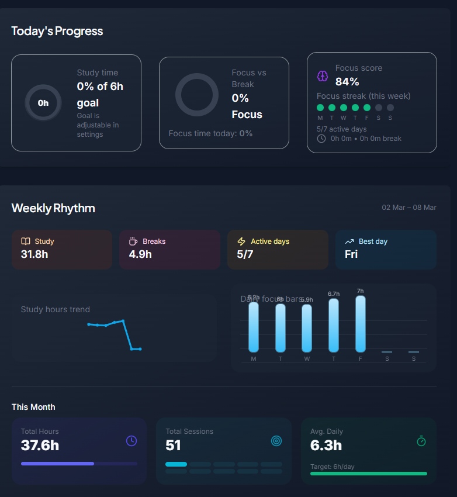
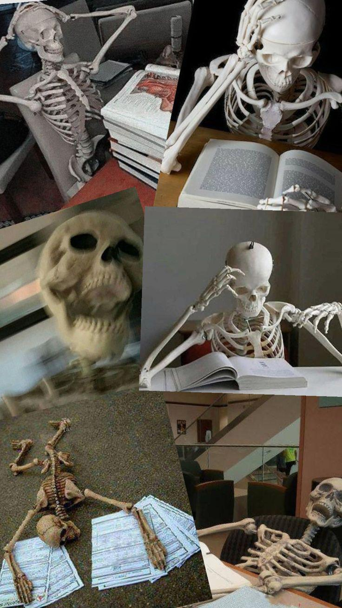
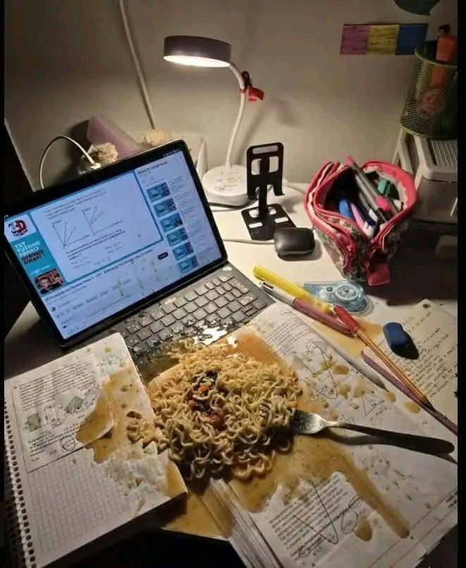
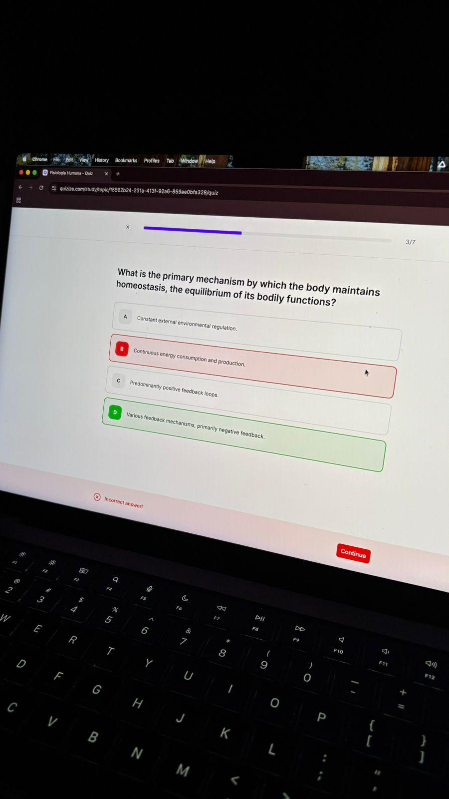
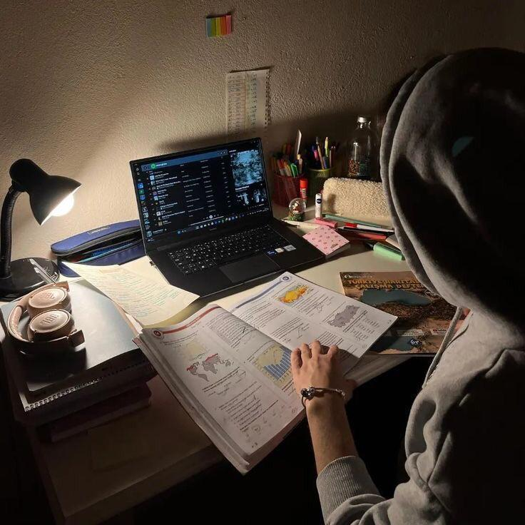

# Reddit Scout Report: Focus Timer Opportunities
**Date:** 2026-03-08

## Top Opportunities

### 1. [How to avoid being or coming off as creepy when talking to women as a 20-year-old guy?](https://www.reddit.com/r/DecidingToBeBetter/comments/1rnhbto/how_to_avoid_being_or_coming_off_as_creepy_when/)
Subreddit: r/DecidingToBeBetter | Score: 12 | Comments: 40 | Upvote ratio: 75%
Posted: ~22 hours ago

**Summary:** It's the reason why I don't approach  women, have long conversations with them, or make eye contact (Tbh, I struggle with making eye contact with everyone, but with women, I struggle 100x more) with t

**Viral Score:** 6.4/10
- Raw score: 0.0/10
- Engagement: 3.0/10
- Upvote ratio: 7.5/10
- Relevance bonus: 0/3

### 2. [I broke my 71-day study streak… and I don’t know how to feel about it](https://www.reddit.com/r/studytips/comments/1ro633u/i_broke_my_71day_study_streak_and_i_dont_know_how/)
Subreddit: r/studytips | Score: 7 | Comments: 14 | Upvote ratio: 82%
Posted: ~2 hours ago

**Summary:** Hey All,

If you don’t know me, I’ve been posting my daily study stats here every single day since the start of this year.

For the past 71 days, I studied every day without missing once. It became a 

**Viral Score:** 5.9/10
- Raw score: 0.0/10
- Engagement: 3.0/10
- Upvote ratio: 8.2/10
- Relevance bonus: 2/3

**Media:**

### 3. [My biggest problem isn’t planning — it’s the moment right before starting](https://www.reddit.com/r/productivity/comments/1ro4aw1/my_biggest_problem_isnt_planning_its_the_moment/)
Subreddit: r/productivity | Score: 13 | Comments: 15 | Upvote ratio: 100%
Posted: ~4 hours ago

**Summary:** I have my tasks. I have my priorities. I know exactly what I’m supposed to be working on. I lose hours in the gap between knowing what to do and actually doing it. That first minute of work feels heav

**Viral Score:** 5.1/10
- Raw score: 0.0/10
- Engagement: 3.0/10
- Upvote ratio: 10.0/10
- Relevance bonus: 0/3

### 4. [Does anyone else have 10s of tabs open of research or material and stuff at the same time?](https://www.reddit.com/r/studytips/comments/1rnje8y/does_anyone_else_have_10s_of_tabs_open_of/)
Subreddit: r/studytips | Score: 9 | Comments: 11 | Upvote ratio: 100%
Posted: ~21 hours ago

**Summary:** i have multiple tabs open at any given time. not because i'm disorganized, i just never trust myself to find something again if i close it.

spent the last few weeks building slynnk as a fix for this.

**Viral Score:** 5.1/10
- Raw score: 0.0/10
- Engagement: 3.0/10
- Upvote ratio: 10.0/10
- Relevance bonus: 0/3

### 5. [I stopped waiting for motivation and treated fitness like brushing my teeth](https://www.reddit.com/r/getdisciplined/comments/1rnos6j/i_stopped_waiting_for_motivation_and_treated/)
Subreddit: r/getdisciplined | Score: 60 | Comments: 15 | Upvote ratio: 96%
Posted: ~17 hours ago

**Summary:** For the longest time I thought people who were consistent with fitness were just built differently. I thought they had some special discipline gene or some secret level of motivation that I didn’t hav

**Viral Score:** 4.8/10
- Raw score: 0.1/10
- Engagement: 0.7/10
- Upvote ratio: 9.6/10
- Relevance bonus: 2/3

## Honorable Mentions

### 6. [I got through medical school without really studying. How did you manage with the avoidance for years?](https://www.reddit.com/r/getdisciplined/comments/1rnvzqp/i_got_through_medical_school_without_really/) (r/getdisciplined | 28 upvotes) – I’m posting this because I genuinely want to know if anyone else has experienced something similar.
...

### 7. [Discipline isn't the real secret](https://www.reddit.com/r/GetStudying/comments/1ro5p90/discipline_isnt_the_real_secret/) (r/GetStudying | 155 upvotes) – most people think smart students don’t procrastinate because they’re more disciplined.

but the trut...

### 8. [Weird study hack that work](https://www.reddit.com/r/GetStudying/comments/1rnplnw/weird_study_hack_that_work/) (r/GetStudying | 42 upvotes) – Hey their I am a 12 grade student and I have science stream 
I want to ask people their study tip ha...

### 9. [I moved to another continent to chase my ambitions… but now I spend my days scrolling and doing nothing. What’s wrong with me?](https://www.reddit.com/r/productivity/comments/1ro34xm/i_moved_to_another_continent_to_chase_my/) (r/productivity | 25 upvotes) – I’m struggling with something and I’d genuinely like honest advice.

I’ve always had big ambitions f...

### 10. [I'm trying to change myself, but I keep failing. I need guidance from those who have truly succeeded in changing. Please help!](https://www.reddit.com/r/getdisciplined/comments/1rnpm0y/im_trying_to_change_myself_but_i_keep_failing_i/) (r/getdisciplined | 25 upvotes) – I'm a student and I've been trying to change for 3 years, but no matter what I do, it doesn't work. ...

## Media Summary
Downloaded images (2026-03-08-media/):
- **275n0a0qppng1.jpeg** (158.9 KB)
  
- **48oq81k9aung1.jpeg** (349.8 KB)
  
- **4ugumvuwytng1.png** (212.0 KB)
  
- **8bq56onmjpng1.jpeg** (89.0 KB)
  
- **b408ch2shsng1.jpeg** (66.2 KB)
  
- **f4gahuexeqng1.jpeg** (9.9 KB)
  
- **rp9a0bbwvtng1.jpeg** (126.7 KB)
  

---
**View on GitHub:** https://github.com/ozlemsultan90-cmyk/reddit-scout-reports/blob/main/reports/2026-03-08.md
