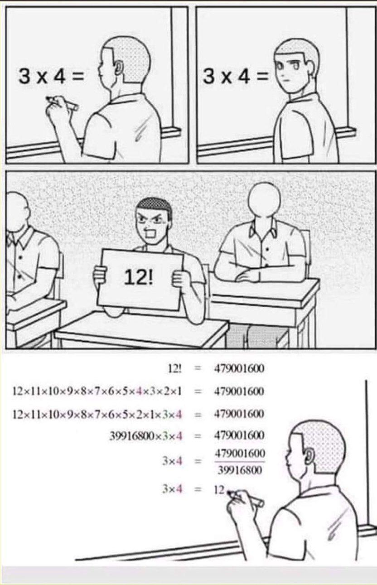
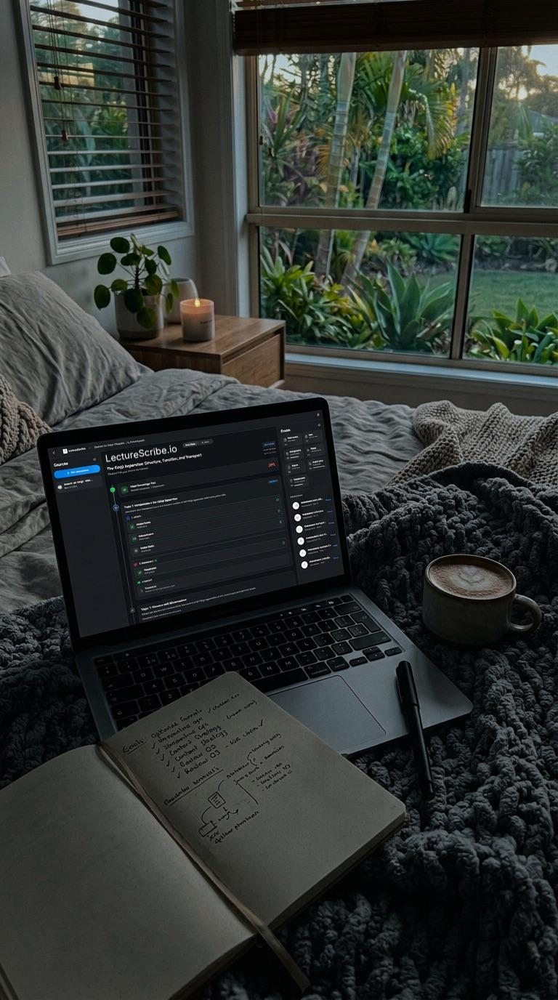
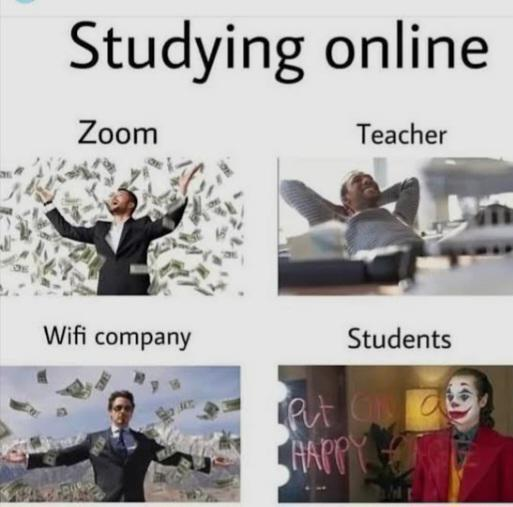
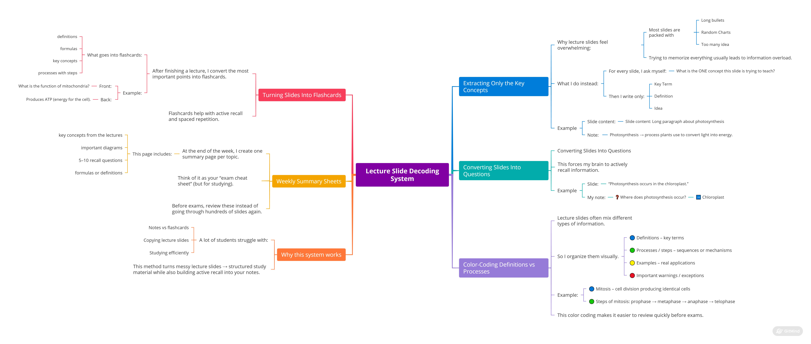
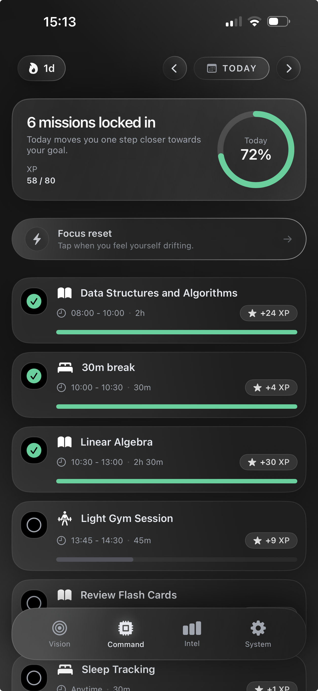

# Reddit Scout Report: Focus Timer Opportunities
**Date:** 2026-03-09

## Top Opportunities

### 1. [What’s the one desk item that improves your productivity the most?](https://www.reddit.com/r/productivity/comments/1rop66v/whats_the_one_desk_item_that_improves_your/)
Subreddit: r/productivity | Score: 21 | Comments: 24 | Upvote ratio: 93%
Posted: ~13 hours ago

**Summary:** I’ve been trying to optimize my desk setup lately... I think maybe a small tool can make a huge difference in focus and execution. 😭

Curious what works for everyone here — is there a specific desk i

**Viral Score:** 5.5/10
- Raw score: 0.0/10
- Engagement: 3.0/10
- Upvote ratio: 9.3/10
- Relevance bonus: 2/3

### 2. [How to study when I can’t?](https://www.reddit.com/r/studytips/comments/1rog2j1/how_to_study_when_i_cant/)
Subreddit: r/studytips | Score: 7 | Comments: 9 | Upvote ratio: 90%
Posted: ~20 hours ago

**Summary:** Ive always been the ambitious one For as long as I can remember studying was my sanctuary my escape I loved the thrill of learning and the deep focus where hours would pass like minutes I never settle

**Viral Score:** 5.4/10
- Raw score: 0.0/10
- Engagement: 3.0/10
- Upvote ratio: 9.0/10
- Relevance bonus: 2/3

### 3. [I need to get disciplined asap, I have tried a lot of things already](https://www.reddit.com/r/getdisciplined/comments/1rov2fb/i_need_to_get_disciplined_asap_i_have_tried_a_lot/)
Subreddit: r/getdisciplined | Score: 18 | Comments: 24 | Upvote ratio: 95%
Posted: ~8 hours ago

**Summary:** I'm in the phase of my life when it's now or never, 
if I don't learn self discipline asap, it's over for me 🥀

I have tried many things, 2 minute rule, pomodoro timer, getting a digital clock for ti

**Viral Score:** 5.2/10
- Raw score: 0.0/10
- Engagement: 3.0/10
- Upvote ratio: 9.5/10
- Relevance bonus: 1/3

### 4. [7 hour study still feel guilty!!](https://www.reddit.com/r/studytips/comments/1rouqnk/7_hour_study_still_feel_guilty/)
Subreddit: r/studytips | Score: 6 | Comments: 8 | Upvote ratio: 88%
Posted: ~8 hours ago

**Summary:** Hey i am studying for average 6-7 hour everyday but i still thinks that i can do more but after 9 pm i just give excuses or feel lethargic to do more. At last i start using phones and at least use pho

**Viral Score:** 4.9/10
- Raw score: 0.0/10
- Engagement: 3.0/10
- Upvote ratio: 8.8/10
- Relevance bonus: 1/3

### 5. [i can scroll for literal hours but studying for 15 minutes feels like physical pain](https://www.reddit.com/r/studytips/comments/1roiyvl/i_can_scroll_for_literal_hours_but_studying_for/)
Subreddit: r/studytips | Score: 133 | Comments: 7 | Upvote ratio: 100%
Posted: ~18 hours ago

**Summary:** okay so here's the thing nobody really talks about, your brain isn't lazy or broken or incapable of focus. it's just been completely hijacked by apps that were literally engineered by teams of neurosc

**Viral Score:** 4.8/10
- Raw score: 0.3/10
- Engagement: 0.2/10
- Upvote ratio: 10.0/10
- Relevance bonus: 2/3

## Honorable Mentions

### 6. [What do you do when you’re bored?](https://www.reddit.com/r/productivity/comments/1rokxxj/what_do_you_do_when_youre_bored/) (r/productivity | 17 upvotes) – I come here to ask, what do you guys do when you’re bored? 

Usually when I’m bored I play a video g
### 7. [I’ve been noticing a strange pattern with brain fog](https://www.reddit.com/r/productivity/comments/1roa5i8/ive_been_noticing_a_strange_pattern_with_brain_fog/) (r/productivity | 18 upvotes) – Over the last year I started experiencing something people usually describe as “brain fog.” Not conf
### 8. [Studying has two 2 types :](https://www.reddit.com/r/GetStudying/comments/1rodrq6/studying_has_two_2_types/) (r/GetStudying | 495 upvotes) – 
### 9. [how do you overcome the intense feeling of regret over the permanent decisions you’ve made in the past?](https://www.reddit.com/r/DecidingToBeBetter/comments/1rosiz0/how_do_you_overcome_the_intense_feeling_of_regret/) (r/DecidingToBeBetter | 35 upvotes) – 

Like tattoos for example, before I developed contamination OCD- I loved getting tattoos and I have
### 10. [Recommend podcasts / videos about healthy male roles and positive masculinity](https://www.reddit.com/r/DecidingToBeBetter/comments/1roboou/recommend_podcasts_videos_about_healthy_male/) (r/DecidingToBeBetter | 23 upvotes) – Early thirties male and I feel my brain needs some intel on being a better male role model. Emphasis

## Media Summary
Downloaded images (2026-03-09-media/):
- **GetStudying_134dcw4se0og1.jpeg** (129 KB)
  
- **GetStudying_3r58hjatb1og1.jpeg** (312 KB)
  
- **GetStudying_7hpjkowlb0og1.jpeg** (41 KB)
  
- **GetStudying_ak35rln2hvng1.jpeg** (71 KB)
  
- **GetStudying_hlxgk4ejgvng1.jpeg** (72 KB)
  
- **studytips_l0slr50h5zng1.jpeg** (2005 KB)
  
- **studytips_s125qeak81og1.png** (2429 KB)
  

---
**View on GitHub:** https://github.com/ozlemsultan90-cmyk/reddit-scout-reports/blob/main/reports/2026-03-09.md