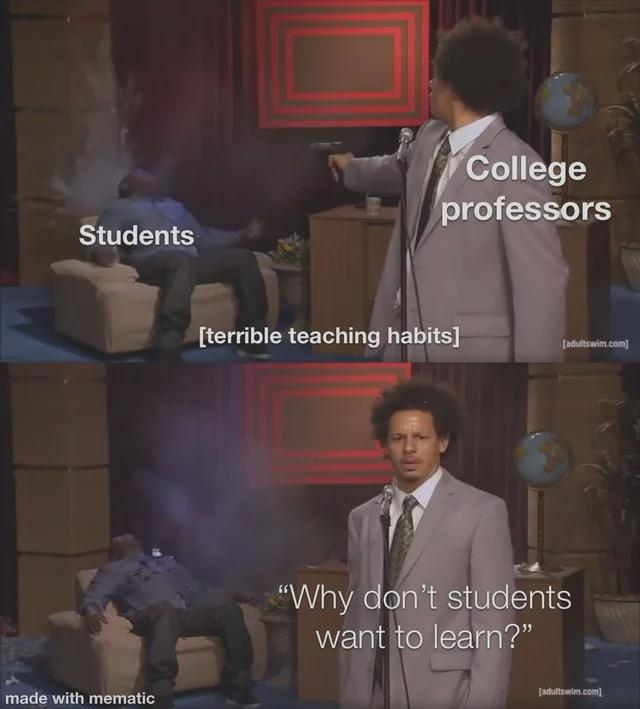
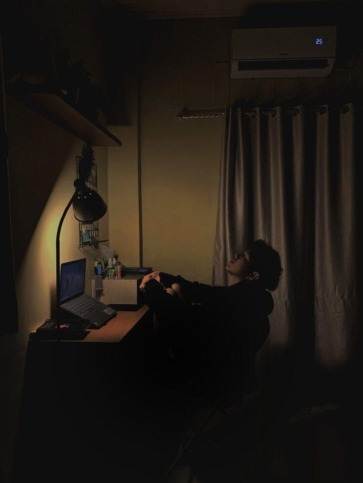
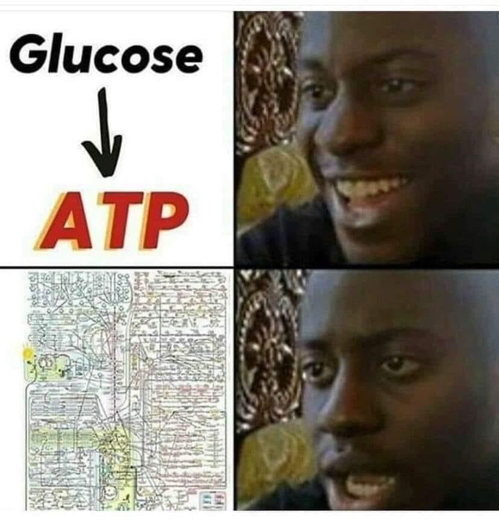
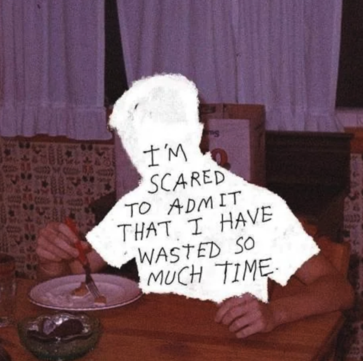
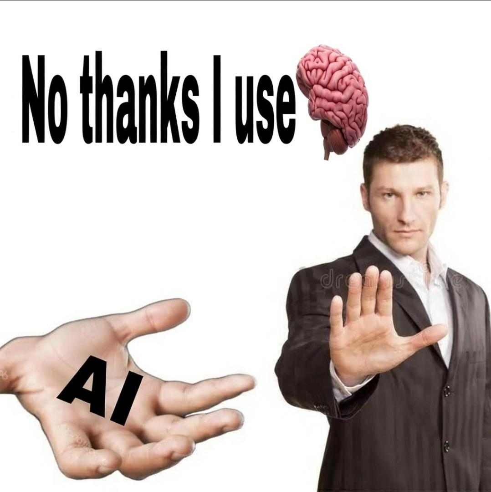
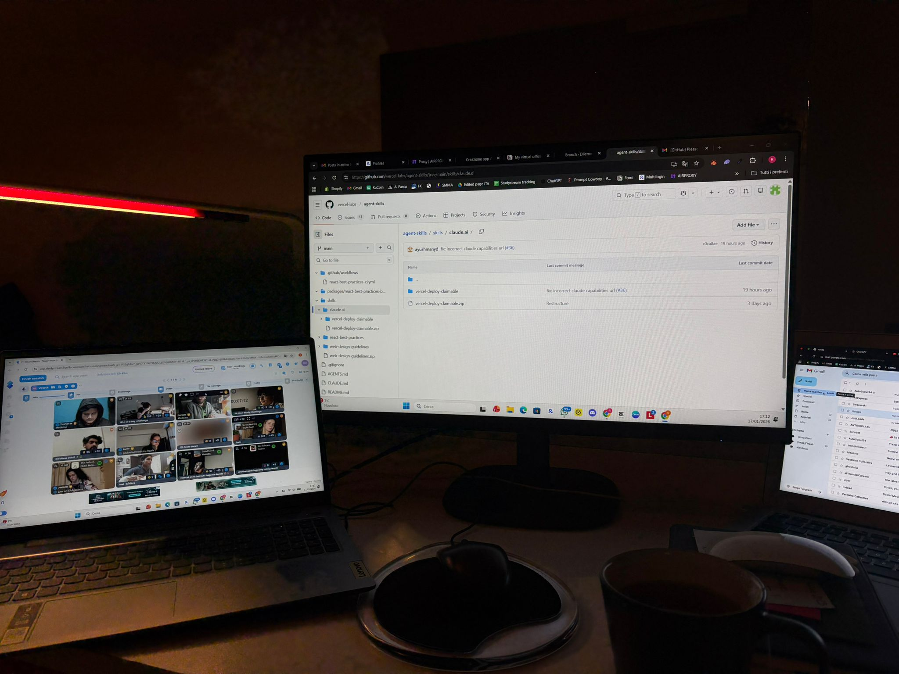

# Reddit Scout Report: Focus Timer Opportunities
**Date:** 2026-03-10

## Top Opportunities

### 1. [Do you use AI to study or just for answers?](https://www.reddit.com/r/studytips/comments/1rpoxmr/do_you_use_ai_to_study_or_just_for_answers/)
Subreddit: r/studytips | Score: 6 | Comments: 19 | Upvote ratio: 100%
Posted: ~11 hours ago

**Summary:** I keep hearing that students are using AI tools like ChatGPT for studying, but I’m curious how people actually use it.

**Viral Score:** 5.4/10
- Raw score: 0.0/10
- Engagement: 3.0/10
- Upvote ratio: 10.0/10
- Relevance bonus: 1/3

**Media:**
No media

### 2. [Any Tips for Studying/ Working Longer?](https://www.reddit.com/r/studytips/comments/1rps8fa/any_tips_for_studying_working_longer/)
Subreddit: r/studytips | Score: 6 | Comments: 8 | Upvote ratio: 100%
Posted: ~7 hours ago

**Summary:** I’ve never been very good at studying for long periods. It hard for me to start and stay motivated when studying. After 2 hours of studying (breaking it up into 30min blocks) I feel super tired and 

**Viral Score:** 5.4/10
- Raw score: 0.0/10
- Engagement: 3.0/10
- Upvote ratio: 10.0/10
- Relevance bonus: 1/3

**Media:**
No media

### 3. [Best Free AI Detection Tool in 2026: Which AI Detector Is Most Accurate?](https://www.reddit.com/r/studytips/comments/1rpr5b4/best_free_ai_detection_tool_in_2026_which_ai/)
Subreddit: r/studytips | Score: 6 | Comments: 6 | Upvote ratio: 100%
Posted: ~8 hours ago

**Summary:** I’m currently looking for the best free AI detection tool to check content for AI-generated text. There are so many websites claiming high accuracy, but it’s hard to know which ones are actually r

**Viral Score:** 4.8/10
- Raw score: 0.0/10
- Engagement: 2.6/10
- Upvote ratio: 10.0/10
- Relevance bonus: 0/3

**Media:**
No media

### 4. [Why am i productive with deadlines but useless with free time?](https://www.reddit.com/r/getdisciplined/comments/1rpsgcc/why_am_i_productive_with_deadlines_but_useless/)
Subreddit: r/getdisciplined | Score: 23 | Comments: 42 | Upvote ratio: 96%
Posted: ~7 hours ago

**Summary:** i have noticed this strange pattern in myself and i’m curious if other people experience it too. when my schedule is full of deadlines, meetings and expectations from other people, i suddenly become

**Viral Score:** 4.8/10
- Raw score: 0.0/10
- Engagement: 3.0/10
- Upvote ratio: 9.6/10
- Relevance bonus: 0/3

**Media:**
No media

### 5. [I stopped trying to "focus" and my grades went up](https://www.reddit.com/r/studytips/comments/1rpiap8/i_stopped_trying_to_focus_and_my_grades_went_up/)
Subreddit: r/studytips | Score: 20 | Comments: 2 | Upvote ratio: 100%
Posted: ~16 hours ago

**Summary:** This is going to sound backwards, but hear me out.

For years, I thought my problem was that I couldn't concentrate. I'd sit down to study, last maybe 20 minutes, then my brain would just... wander.

**Viral Score:** 4.7/10
- Raw score: 0.0/10
- Engagement: 0.3/10
- Upvote ratio: 10.0/10
- Relevance bonus: 2/3

**Media:**
No media

## Honorable Mentions
### 6. [Anyone noticed that sometimes it's easier to do things in the morning, before you ate or even drank water?](https://www.reddit.com/r/productivity/comments/1rpup4t/anyone_noticed_that_sometimes_its_easier_to_do/) (r/productivity | 20 upvotes) – A small question this time, but I found it quite bizarre. It's not even about overall hunger through...
### 7. [How do you stop being INSANELY lazy?](https://www.reddit.com/r/DecidingToBeBetter/comments/1rpx6gq/how_do_you_stop_being_insanely_lazy/) (r/DecidingToBeBetter | 10 upvotes) – I dont leave the house for weeks at a time anymore. I used to have it that it took me a day to "reco...
### 8. [The regret hits hard](https://www.reddit.com/r/GetStudying/comments/1rpt9bi/the_regret_hits_hard/) (r/GetStudying | 815 upvotes) – ...
### 9. [How can I upgrade myself?](https://www.reddit.com/r/DecidingToBeBetter/comments/1rp9jos/how_can_i_upgrade_myself/) (r/DecidingToBeBetter | 8 upvotes) – 19M and ik the only way I’ll gain confidence is by improving myself. I’d love to learn how to tho as...
### 10. [How do you study biology?](https://www.reddit.com/r/GetStudying/comments/1rpn0db/how_do_you_study_biology/) (r/GetStudying | 75 upvotes) – As a visual learner, study biology is very tiring btw 0.0 ...

## Media Summary
Downloaded images (2026-03-10-media/):
- **2yzwk8p0z3og1.png** (667.3 KB)
  
- **7rl3fe5u27og1.png** (734.3 KB)
  
- **GetStudying_20.jpeg** (41.0 KB)
  
- **GetStudying_21.jpeg** (128.6 KB)
  
- **GetStudying_22.jpeg** (57.3 KB)
  
- **GetStudying_24.png** (667.3 KB)
  
- **ljdprcg285og1.jpeg** (101.5 KB)
  
- **pukj01j037og1.png** (734.3 KB)
  
- **r2o2p8okb7og1.jpeg** (318.2 KB)
  
- **studytips_15.png** (2429.4 KB)
  
- **studytips_16.png** (2631.0 KB)
  
- **studytips_19.jpeg** (311.9 KB)
  

---
**View on GitHub:** https://github.com/ozlemsultan90-cmyk/reddit-scout-reports/blob/main/reports/2026-03-10.md
