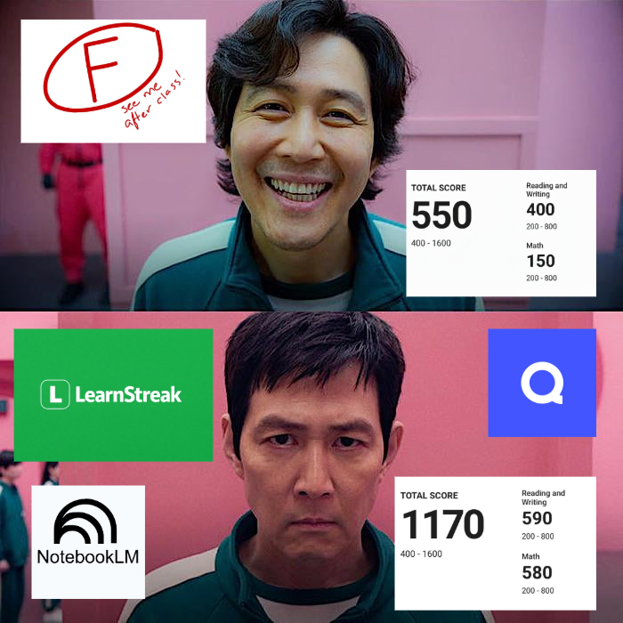
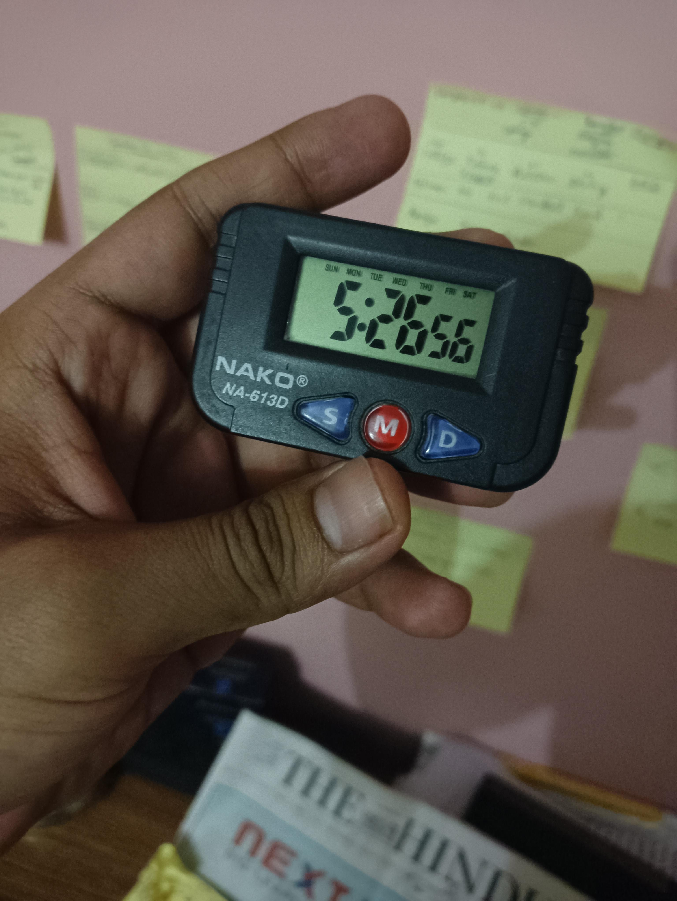

# Reddit Scout Report: Focus Timer Opportunities
**Date:** 2026-03-11

## Top Opportunities

### 1. [Advice on studying after a bad exam](https://www.reddit.com/r/GetStudying/comments/1rql5wm/advice_on_studying_after_a_bad_exam/)
Subreddit: r/GetStudying | Score: 15 | Comments: 17 | Upvote ratio: 0%
Posted: ~11 hours ago

**Summary:** Hi guys. I recently gave a really important exam, and I didn't do that well in it. I worked really hard for it the whole year, and everyone is expecting 90's, but I made a lot of stupid mistakes I cou

**Viral Score:** 6/10
- Raw score: 0.03/10
- Engagement: 3/10
- Upvote ratio: 9.5/10
- Relevance bonus: 3/3

### 2. [Struggling with consistency](https://www.reddit.com/r/GetStudying/comments/1rq649m/struggling_with_consistency/)
Subreddit: r/GetStudying | Score: 57 | Comments: 32 | Upvote ratio: 0%
Posted: ~21 hours ago

**Summary:** Sometimes I study for 7+ hours.. sometimes not even 6 
Any tips to improve consistency??

**Viral Score:** 6/10
- Raw score: 0.11/10
- Engagement: 1.66/10
- Upvote ratio: 9.8/10
- Relevance bonus: 3/3

### 3. [I keep self isolating and I can't stop](https://www.reddit.com/r/DecidingToBeBetter/comments/1rq7kfu/i_keep_self_isolating_and_i_cant_stop/)
Subreddit: r/DecidingToBeBetter | Score: 12 | Comments: 7 | Upvote ratio: 1%
Posted: ~21 hours ago

**Summary:** tldr: Used to be depressed, unemployed, and isolated. Turned life around with weight loss, a job, and a social life, but still relapse into NEET-style isolation when stressed. It is hurting progress a

**Viral Score:** 6/10
- Raw score: 0.02/10
- Engagement: 1.62/10
- Upvote ratio: 10/10
- Relevance bonus: 3/3

### 4. [70 days of breaking free from my addictions](https://www.reddit.com/r/DecidingToBeBetter/comments/1rqecoh/70_days_of_breaking_free_from_my_addictions/)
Subreddit: r/DecidingToBeBetter | Score: 17 | Comments: 16 | Upvote ratio: 0%
Posted: ~16 hours ago

**Summary:** My whole day was just bed, phone, scroll, repeat. School stuff kept piling up, I kept ignoring it, and every night I felt like crap without really knowing why. That was my life for years. December 31s

**Viral Score:** 6/10
- Raw score: 0.03/10
- Engagement: 2.67/10
- Upvote ratio: 9.5/10
- Relevance bonus: 3/3

### 5. [I achieved my dream… now what?](https://www.reddit.com/r/DecidingToBeBetter/comments/1rq9qsw/i_achieved_my_dream_now_what/)
Subreddit: r/DecidingToBeBetter | Score: 32 | Comments: 36 | Upvote ratio: 0%
Posted: ~19 hours ago

**Summary:** Hi everyone,

I’m in my early 30s and I’m facing a luxury problem I never thought I’d have.

I’ve basically achieved what I set out to do, since I was a kid. I have a good education, a well paying job

**Viral Score:** 6/10
- Raw score: 0.06/10
- Engagement: 3/10
- Upvote ratio: 8.5/10
- Relevance bonus: 3/3

### 6. [At my lowest and need some motivation](https://www.reddit.com/r/getdisciplined/comments/1rq5mvp/at_my_lowest_and_need_some_motivation/) (r/getdisciplined | 7 upvotes) – I currently am living out of an old Honda, laid off my job with no income coming in and I feel all i.
### 7. [Any small changes that unexpectedly boosted your productivity?](https://www.reddit.com/r/productivity/comments/1rqix6q/any_small_changes_that_unexpectedly_boosted_your/) (r/productivity | 7 upvotes) – Lately I feel like I’ve hit a bit of a plateau with my productivity.

I still do the usual things. I.
### 8. [How can I stay on top of emails?](https://www.reddit.com/r/productivity/comments/1rqjnsc/how_can_i_stay_on_top_of_emails/) (r/productivity | 9 upvotes) – Today I called out because I missed two tasks I'd been assigned at work. They came in via email and .
### 9. [I have so many things I can do but always end up doing nothing](https://www.reddit.com/r/productivity/comments/1rqn8lk/i_have_so_many_things_i_can_do_but_always_end_up/) (r/productivity | 56 upvotes) – Everyday for me is the same. I have so much stuff I can do but I just end up scrolling, playing game.
### 10. [Never been so proud of myself.](https://www.reddit.com/r/GetStudying/comments/1rq4zvj/never_been_so_proud_of_myself/) (r/GetStudying | 31 upvotes) – In recent exams, one of the hardest papers I have to do every 2 weeks, I usually score around a 3, w.

## Media Summary
Downloaded images (2026-03-11-media/):
- **studytips_0.jpeg** (63 KB)
  
- **GetStudying_0.png** (587 KB)
  
- **GetStudying_1.jpeg** (3206 KB)
  

---
**View on GitHub:** https://github.com/ozlemsultan90-cmyk/reddit-scout-reports/blob/main/reports/2026-03-11.md
