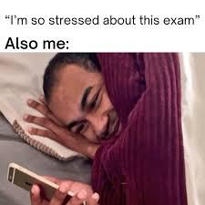
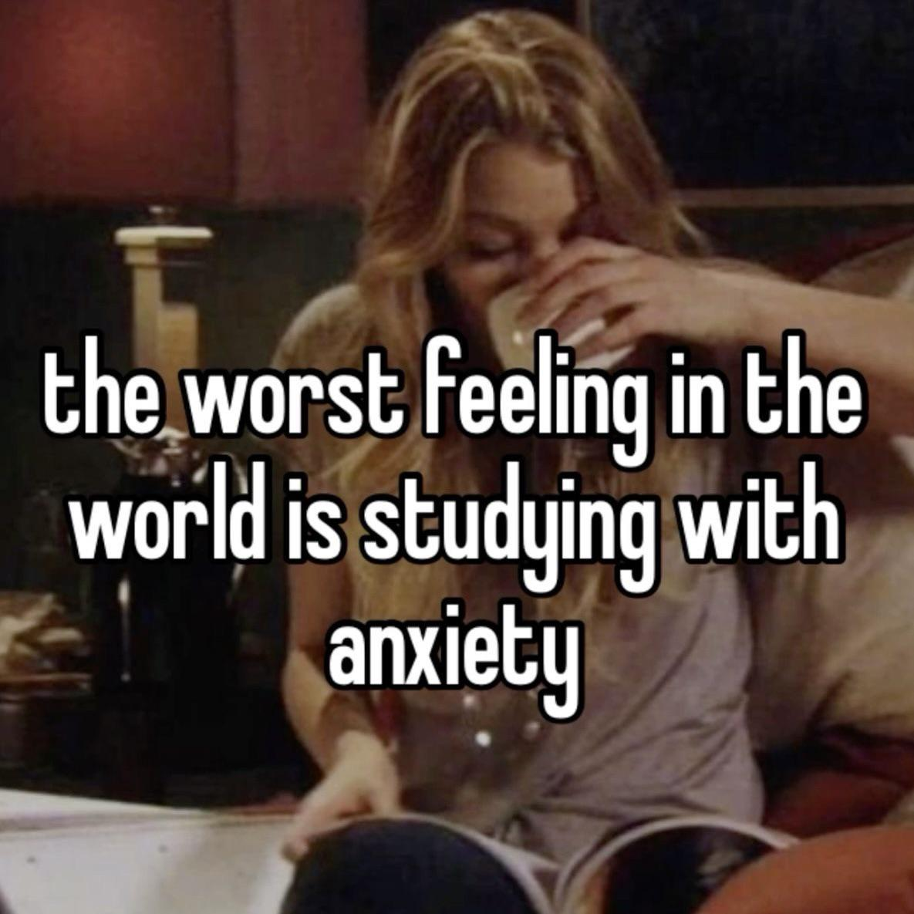
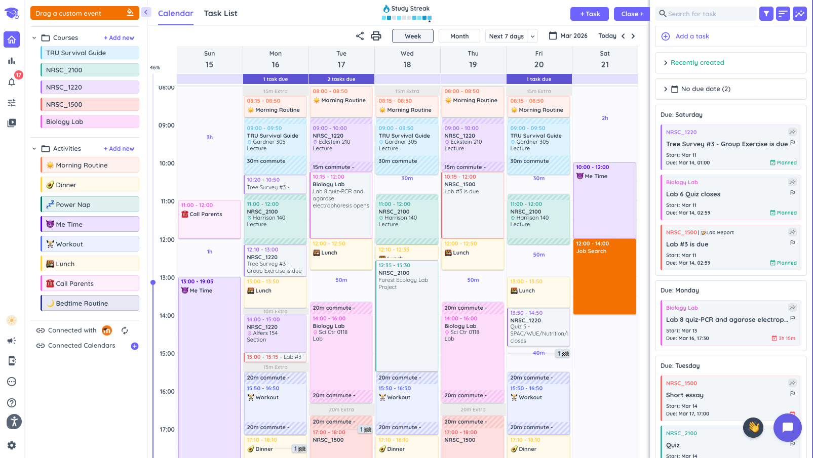
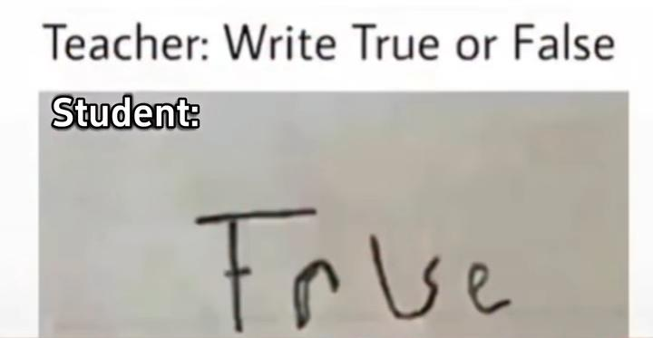

# Reddit Scout Report: Focus Timer Opportunities
**Date:** 2026-03-13

## Top Opportunities

### 1. [Something surprising happened when I stopped trying to be productive all the time](https://www.reddit.com/r/DecidingToBeBetter/comments/1rs0upu/something_surprising_happened_when_i_stopped/)
Subreddit: r/DecidingToBeBetter | Score: 42 | Comments: 20 | Upvote ratio: 93%
Posted: ~21 hours ago

**Summary:** For years I thought the key to improving my focus was becoming more disciplined.

Better routines.  
More productivity systems.  
Trying harder.

But recently I noticed something strange.

The moments

**Viral Score:** 5.3/10
- Raw score: 0.1/10
- Engagement: 1.4/10
- Upvote ratio: 9.3/10
- Relevance bonus: 3/3

### 2. [How Do You Force Yourself to Study?](https://www.reddit.com/r/GetStudying/comments/1rsms4p/how_do_you_force_yourself_to_study/)
Subreddit: r/GetStudying | Score: 65 | Comments: 38 | Upvote ratio: 100%
Posted: ~4 hours ago

**Summary:** I need advice from people who struggle with getting up to study or even when I do I have a hard time staying focused while studying. I’m trying to find a method that actually works or a small device (

**Viral Score:** 5.3/10
- Raw score: 0.1/10
- Engagement: 1.7/10
- Upvote ratio: 10.0/10
- Relevance bonus: 2/3

**Media:**

### 3. [How do you break out of long periods of unproductivity and actually start again?](https://www.reddit.com/r/productivity/comments/1rsm4gl/how_do_you_break_out_of_long_periods_of/)
Subreddit: r/productivity | Score: 18 | Comments: 16 | Upvote ratio: 100%
Posted: ~4 hours ago

**Summary:** 
Hi everyone,

I’m a 23F student and I genuinely need some advice regarding academics and productivity. I feel quite stuck and I’m hoping someone here might have practical suggestions.

Firstly, I hav

**Viral Score:** 5.2/10
- Raw score: 0.0/10
- Engagement: 2.5/10
- Upvote ratio: 10.0/10
- Relevance bonus: 1/3

### 4. [How do you break out of long periods of unproductivity and actually start again?](https://www.reddit.com/r/getdisciplined/comments/1rsm6mu/how_do_you_break_out_of_long_periods_of/)
Subreddit: r/getdisciplined | Score: 13 | Comments: 10 | Upvote ratio: 100%
Posted: ~4 hours ago

**Summary:** Hi everyone,

I’m a 23F student and I genuinely need some advice regarding academics and productivity. I feel quite stuck and I’m hoping someone here might have practical suggestions.

Firstly, I have

**Viral Score:** 5.1/10
- Raw score: 0.0/10
- Engagement: 2.1/10
- Upvote ratio: 10.0/10
- Relevance bonus: 1/3

### 5. [i am always achieving nothing despite not doing the typical time-wasting activities](https://www.reddit.com/r/productivity/comments/1rshqxb/i_am_always_achieving_nothing_despite_not_doing/)
Subreddit: r/productivity | Score: 14 | Comments: 17 | Upvote ratio: 100%
Posted: ~9 hours ago

**Summary:** i always manage to do nothing in front of the computer even though i want to do work. it's not even like i'm on you tube, scrolling social media, or playing games. i just switch between random google 

**Viral Score:** 5.0/10
- Raw score: 0.0/10
- Engagement: 3.0/10
- Upvote ratio: 10.0/10
- Relevance bonus: 0/3

### Honorable Mentions

- ### 6. [What productivity tools actually stuck with you long term?](https://www.reddit.com/r/productivity/comments/1rsm5qj/what_productivity_tools_actually_stuck_with_you/) (r/productivity | 7 upvotes) – Hi, I'm just wondering what productivity tool you've just tried but actually stuck with you until no.
- ### 7. [Perfectionism makes me procrastinate more than laziness does](https://www.reddit.com/r/productivity/comments/1rs5tak/perfectionism_makes_me_procrastinate_more_than/) (r/productivity | 14 upvotes) – I used to think my procrastination was about discipline.

But I’m realizing it’s often perfectionism.
- ### 8. [Finally sober, but I bedrot every day and can't do anything... need help](https://www.reddit.com/r/DecidingToBeBetter/comments/1rs6b07/finally_sober_but_i_bedrot_every_day_and_cant_do/) (r/DecidingToBeBetter | 97 upvotes) – Hey all, 31F with ADHD and struggling to get out of bed lately. It takes so much energy just to surv.
- ### 9. [How do I stop wanting to just do nothing all the time?](https://www.reddit.com/r/DecidingToBeBetter/comments/1rs1x8h/how_do_i_stop_wanting_to_just_do_nothing_all_the/) (r/DecidingToBeBetter | 11 upvotes) – Ive always been quite a lazy person, I don't like doing much in a day. Recently however this has got.
- ### 10. [I deleted Notion, Anki, and Quizlet and my grades actually went up. The "study community" is lying to you.](https://www.reddit.com/r/studytips/comments/1rsd9ux/i_deleted_notion_anki_and_quizlet_and_my_grades/) (r/StudyTips | 296 upvotes) – I'm about to make a lot of people mad but I don't care because this needs to be said.

The studytok/.

## Media Summary
Downloaded images (2026-03-13-media/):
- **2026-03-13_img15_523nqprd7tog1.jpeg** (9.4 KB)
  
- **2026-03-13_img17_t5nqrjg1jsog1.jpeg** (196.8 KB)
  
- **2026-03-13_img19_4ql9syhxboog1.png** (319.9 KB)
  
- **2026-03-13_img1_l13nf71q9tog1.jpeg** (382.0 KB)
  
- **2026-03-13_img21_x62ois1g3oog1.jpeg** (73.3 KB)
  

---
**View on GitHub:** https://github.com/ozlemsultan90-cmyk/reddit-scout-reports/blob/main/reports/2026-03-13.md