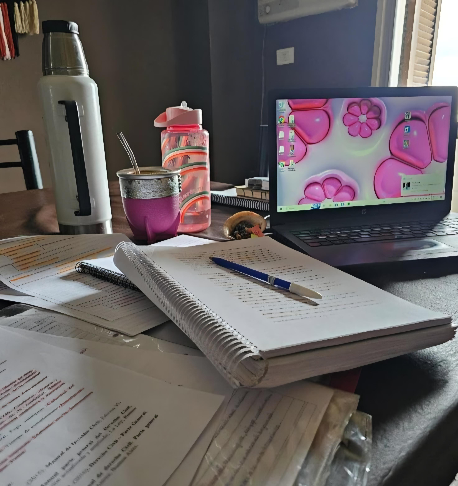
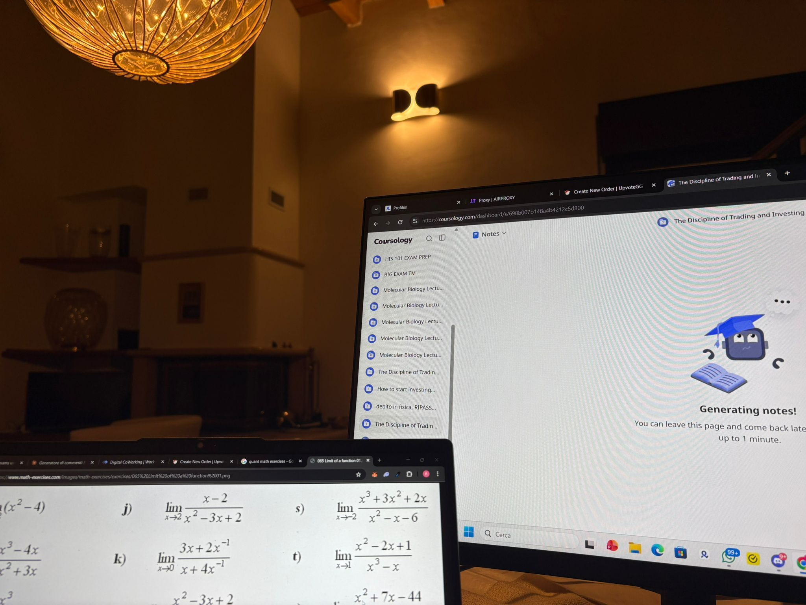
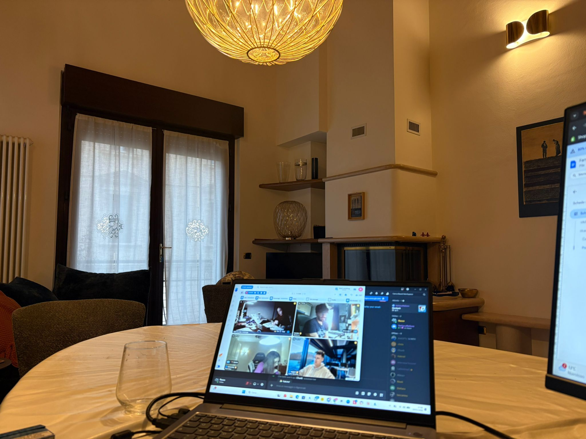

# Reddit Scout Report

**Scout:** Reddit Scout
**Date:** 2026-03-14 (Europe/Istanbul)
**Subreddits fetched:** 5
**Total posts collected:** 25
**Top 5 viral threshold score:** 114.7

## Top 5 Viral Posts

| Rank | Thumbnail | Title/Author | Stats | Link |
|------|-----------|--------------|-------|------|
| 1 |  | **This Harvard paper told you how to improve concentration** by u/No-Swordfish7597 | Upvotes: 1309\nComments: 42\nRatio: 99% | [view](https://www.reddit.com/r/GetStudying/comments/1rstluh/this_harvard_paper_told_you_how_to_improve/) |
| 2 |  | **Reflection on this subreddit** by u/Coballo_violento | Upvotes: 279\nComments: 20\nRatio: 99% | [view](https://www.reddit.com/r/GetStudying/comments/1rt0mzr/reflection_on_this_subreddit/) |
| 3 |  | **Revising for exams using this is a game changer** by u/BillTechnical7291 | Upvotes: 132\nComments: 26\nRatio: 85% | [view](https://www.reddit.com/r/GetStudying/comments/1rsxh2j/revising_for_exams_using_this_is_a_game_changer/) |
| 4 |  | **Body doubling actually changed how I work** by u/Hungry-Yogurt-9007 | Upvotes: 102\nComments: 21\nRatio: 91% | [view](https://www.reddit.com/r/GetStudying/comments/1rtnl5i/body_doubling_actually_changed_how_i_work/) |
| 5 |  | **People who prefer staying home, what do you do all day?** by u/the_bookworm17 | Upvotes: 45\nComments: 36\nRatio: 98% | [view](https://www.reddit.com/r/productivity/comments/1rtk406/people_who_prefer_staying_home_what_do_you_do_all/) |

## Topics, Themes, Patterns

### study hacks
- **This Harvard paper told you how to improve concentration** by u/No-Swordfish7597 (r/GetStudying, Score: 1309)
- **Reflection on this subreddit** by u/Coballo_violento (r/GetStudying, Score: 279)
- **Revising for exams using this is a game changer** by u/BillTechnical7291 (r/GetStudying, Score: 132)
- **Body doubling actually changed how I work** by u/Hungry-Yogurt-9007 (r/GetStudying, Score: 102)
- **The one habit that changed my physique more than any workout** by u/Powerful_Oil_1421 (r/getdisciplined, Score: 83)
- **I'm 35 and finally cracked the discipline code after failing for 10+ years. Here's the system that changed everything.** by u/mimaomg (r/getdisciplined, Score: 51)
- **Why does self improvement feel clear in theory but messy in real life** by u/Fair-Option-8534 (r/getdisciplined, Score: 12)
- **I stopped trying to be productive and my grades went up. Yeah, seriously.** by u/Plus-Horse892 (r/StudyTips, Score: 19)

### mental health
- **How do I control my anger and my lack of patience in my relationship?** by u/lyssterineal (r/DecidingToBeBetter, Score: 61)
- **I am losing my mind** by u/weird_intp (r/GetStudying, Score: 66)
- **Friends/Coworkers joke about my Sobriety** by u/wuhvme (r/DecidingToBeBetter, Score: 28)
- **Taking a break from dating has been massively helpful** by u/_dividedbyzr0_ (r/DecidingToBeBetter, Score: 16)

### tools
- **Looking for an AI letter generator for government documents.** by u/ImportantJury9015 (r/productivity, Score: 55)

### exams
- **It took me till 31, but I’m so glad I’m finally awake.** by u/thatgingerfella (r/DecidingToBeBetter, Score: 26)

## All Posts Sorted by Viral Score (top 20)

| Rank | Title | Author | Subreddit | Score | Comments | Viral |
|------|-------|--------|-----------|-------|----------|-------|
| 1 | This Harvard paper told you how to improve concentration | u/No-Swordfish7597 | r/GetStudying | 1309 | 42 | 1379.1 |
| 2 | Reflection on this subreddit | u/Coballo_violento | r/GetStudying | 279 | 20 | 315.8 |
| 3 | Revising for exams using this is a game changer | u/BillTechnical7291 | r/GetStudying | 132 | 26 | 156.4 |
| 4 | Body doubling actually changed how I work | u/Hungry-Yogurt-9007 | r/GetStudying | 102 | 21 | 131.0 |
| 5 | People who prefer staying home, what do you do all day? | u/the_bookworm17 | r/productivity | 45 | 36 | 114.7 |
| 6 | How do I control my anger and my lack of patience in my relationship? | u/lyssterineal | r/DecidingToBeBetter | 61 | 27 | 105.8 |
| 7 | The one habit that changed my physique more than any workout | u/Powerful_Oil_1421 | r/getdisciplined | 83 | 18 | 104.7 |
| 8 | I wish somebody could wake me up in the morning | u/ElegantDetective5248 | r/productivity | 40 | 42 | 83.1 |
| 9 | I am losing my mind | u/weird_intp | r/GetStudying | 66 | 8 | 81.2 |
| 10 | Looking for an AI letter generator for government documents. | u/ImportantJury9015 | r/productivity | 55 | 14 | 72.2 |
| 11 | Short gurl struggles | u/Ok_Month9162 | r/getdisciplined | 23 | 37 | 71.8 |
| 12 | Friends/Coworkers joke about my Sobriety | u/wuhvme | r/DecidingToBeBetter | 28 | 25 | 71.8 |
| 13 | I'm 35 and finally cracked the discipline code after failing for 10+ years. Here's the system that changed everything. | u/mimaomg | r/getdisciplined | 51 | 8 | 56.9 |
| 14 | Life is going well but it gets boring… | u/Odd-Satisfaction4456 | r/DecidingToBeBetter | 22 | 14 | 46.5 |
| 15 | How do you manage your time, working 12hrs + a pt job? | u/whale-fartz | r/productivity | 6 | 17 | 40.0 |
| 16 | It took me till 31, but I’m so glad I’m finally awake. | u/thatgingerfella | r/DecidingToBeBetter | 26 | 4 | 31.6 |
| 17 | Why does self improvement feel clear in theory but messy in real life | u/Fair-Option-8534 | r/getdisciplined | 12 | 9 | 30.0 |
| 18 | I stopped trying to be productive and my grades went up. Yeah, seriously. | u/Plus-Horse892 | r/StudyTips | 19 | 2 | 23.0 |
| 19 | Taking a break from dating has been massively helpful | u/_dividedbyzr0_ | r/DecidingToBeBetter | 16 | 4 | 22.6 |
| 20 | I know what I need to do in life… but I still can’t stick to anything 😅 | u/Rathish_itachiz | r/getdisciplined | 8 | 5 | 16.4 |
