# Reddit Scout Report: Focus Timer Opportunities
**Date:** 2026-03-16

## Top Opportunities

### 1. [Most people think lack of focus is a motivation problem. I’m starting to think it’s actually a system problem.](https://www.reddit.com/r/productivity/comments/1rusw3w/most_people_think_lack_of_focus_is_a_motivation/)
Subreddit: r/productivity | Score: 19 | Comments: 30 | Upvote ratio: 100%
Posted: ~14 hours ago

**Summary:**
Most people think their lack of focus is a motivation problem.

But lately I’ve been realizing it’s more of an environment and system problem.

If your workspace is chaotic, notifications are constant

**Viral Score:** 5.8/10
- Raw score: 0.0/10
- Engagement: 3.0/10
- Upvote ratio: 10.0/10
- Relevance bonus: 2/3

### 2. [The moment I realised nobody was coming to fix my life](https://www.reddit.com/r/getdisciplined/comments/1rurjnh/the_moment_i_realised_nobody_was_coming_to_fix_my/)
Subreddit: r/getdisciplined | Score: 23 | Comments: 23 | Upvote ratio: 96%
Posted: ~15 hours ago

**Summary:**
For a long time I kept waiting for the right moment to change my life.
The right opportunity.
The right circumstances.
The right motivation.
I told myself that once things settled down, once I had mor

**Viral Score:** 5.2/10
- Raw score: 0.0/10
- Engagement: 2.9/10
- Upvote ratio: 9.6/10
- Relevance bonus: 1/3

### 3. [Help i dont k how to studyyyy](https://www.reddit.com/r/studytips/comments/1ruytsh/help_i_dont_k_how_to_studyyyy/)
Subreddit: r/studytips | Score: 7 | Comments: 5 | Upvote ratio: 100%
Posted: ~10 hours ago

**Summary:**
im a first year doing a bachelor of arts and im honestly so lost 😭 like idk what im even supposed to be doing

how do people take notes from lectures without wasting so much time? and how do u actuall

**Viral Score:** 5.0/10
- Raw score: 0.0/10
- Engagement: 1.9/10
- Upvote ratio: 10.0/10
- Relevance bonus: 1/3

### 4. [I am scared](https://www.reddit.com/r/studytips/comments/1ruznk9/i_am_scared/)
Subreddit: r/studytips | Score: 6 | Comments: 21 | Upvote ratio: 88%
Posted: ~9 hours ago

**Summary:**
So I did post about not being able to study but now I can't even sit on my chair . My heart is beating fast and I feel like crying every 2 mins . I have my exam in 45 days I should be studying hard fo

**Viral Score:** 4.9/10
- Raw score: 0.0/10
- Engagement: 3.0/10
- Upvote ratio: 8.8/10
- Relevance bonus: 1/3

### 5. [Stop trying to be a productivity machine?](https://www.reddit.com/r/productivity/comments/1runi0v/stop_trying_to_be_a_productivity_machine/)
Subreddit: r/productivity | Score: 18 | Comments: 13 | Upvote ratio: 88%
Posted: ~18 hours ago

**Summary:**
i've been thinking lately about how most productivity advice is honestly just stressful. like all the stuff about waking up at 5am or time blocking every second of your life just makes me feel like a 

**Viral Score:** 4.6/10
- Raw score: 0.0/10
- Engagement: 2.1/10
- Upvote ratio: 8.8/10
- Relevance bonus: 1/3

## Honorable Mentions

### 6. [in the end what matters is consistency.](https://www.reddit.com/r/studytips/comments/1ruvoe7/in_the_end_what_matters_is_consistency/) (r/studytips | 7 upvotes) – .
### 7. [Your productivity is directly dependent on your relationship.](https://www.reddit.com/r/productivity/comments/1rv8ftj/your_productivity_is_directly_dependent_on_your/) (r/productivity | 22 upvotes) – A biggest productivity gain I saw for myself is fixing my relationship. 

Relationships take up a lo.
### 8. [My friend group found the dumbest way to actually stick to habits and it's working](https://www.reddit.com/r/getdisciplined/comments/1rv2qz9/my_friend_group_found_the_dumbest_way_to_actually/) (r/getdisciplined | 82 upvotes) – ok so this is gonna sound ridiculous but hear me out

me and 3 friends kept failing at building ha.
### 9. [How I Study for Top Grades](https://www.reddit.com/r/GetStudying/comments/1rv13u0/how_i_study_for_top_grades/) (r/GetStudying | 394 upvotes) – I’ve been thinking about this lately, but I’ve actually become a student I never thought I could be .
### 10. [That random night when studying finally clicked?](https://www.reddit.com/r/GetStudying/comments/1rujpqo/that_random_night_when_studying_finally_clicked/) (r/GetStudying | 362 upvotes) – I’ve heard a lot of stories about people making academic comebacks after a big downfall. But I'm tal.
## Media Summary
Downloaded images (2026-03-16-media/):
- **110v3jgoccpg1.png** (146 KB)
  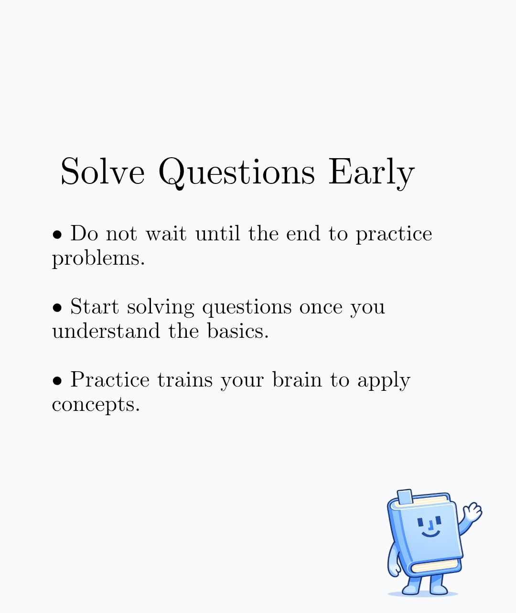
- **1jcotuj8s8pg1.jpeg** (34 KB)
  
- **245tjnsoccpg1.png** (122 KB)
  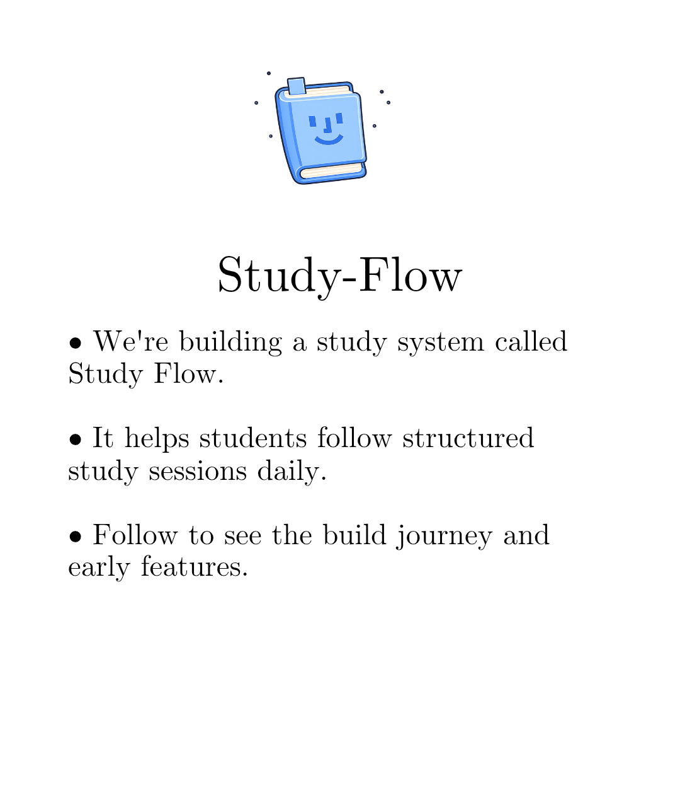
- **4dp8tpwnccpg1.png** (780 KB)
  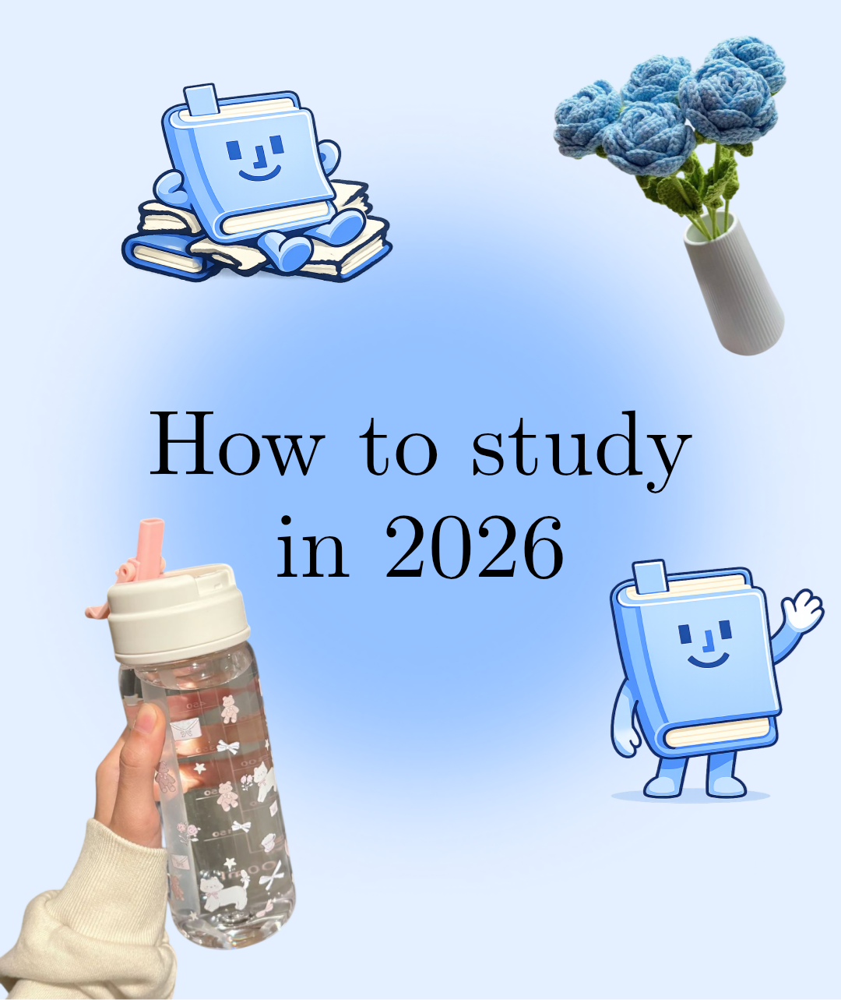
- **4ijq4dzz4bpg1.jpeg** (207 KB)
  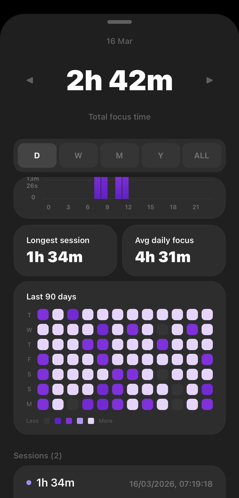
- **j2xd88bkgdpg1.png** (3062 KB)
  
- **jgvhibloccpg1.png** (147 KB)
  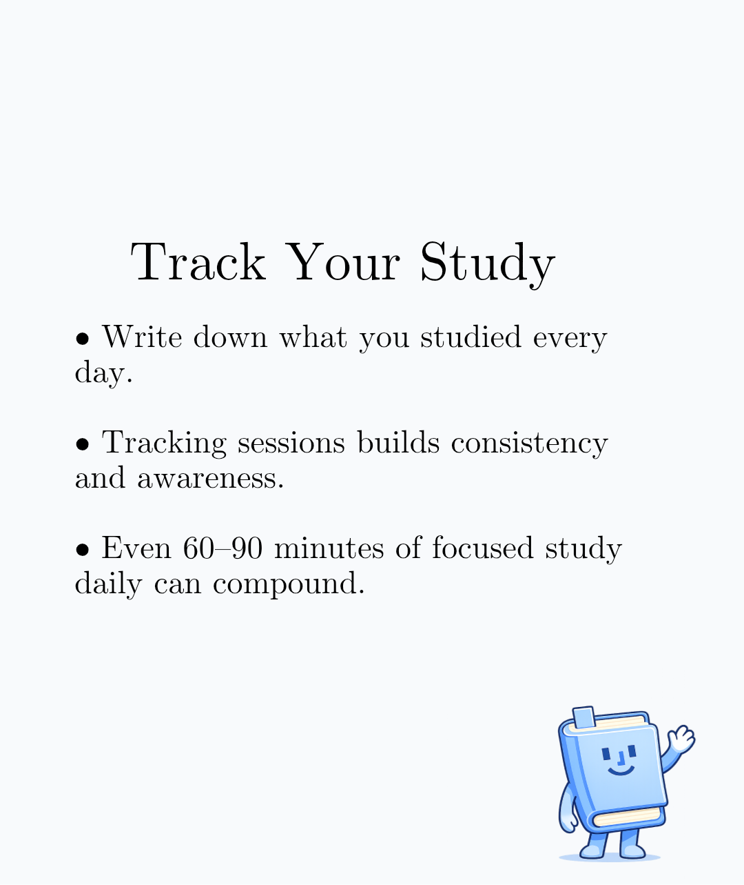
- **mdv10zgci9pg1.jpeg** (43 KB)
  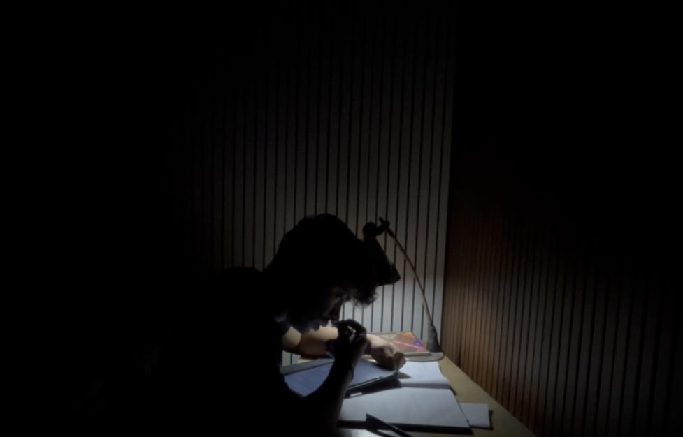
- **myzvr16occpg1.png** (153 KB)
  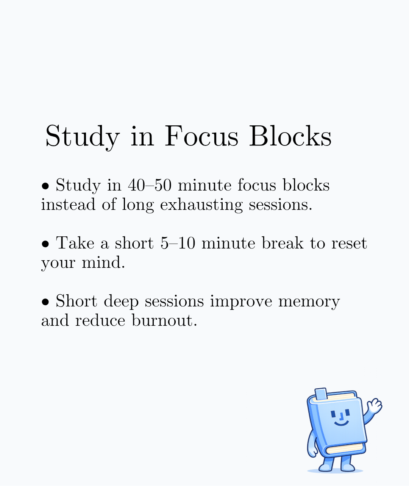
- **qc9rhqwd2epg1.jpeg** (40 KB)
  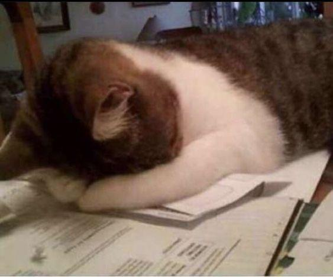
- **tgprlfboccpg1.png** (150 KB)
  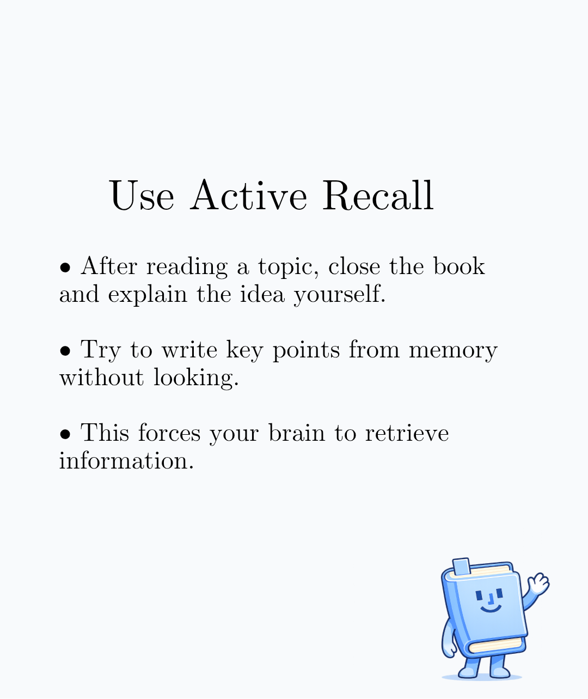
- **u7aie4poccpg1.png** (158 KB)
  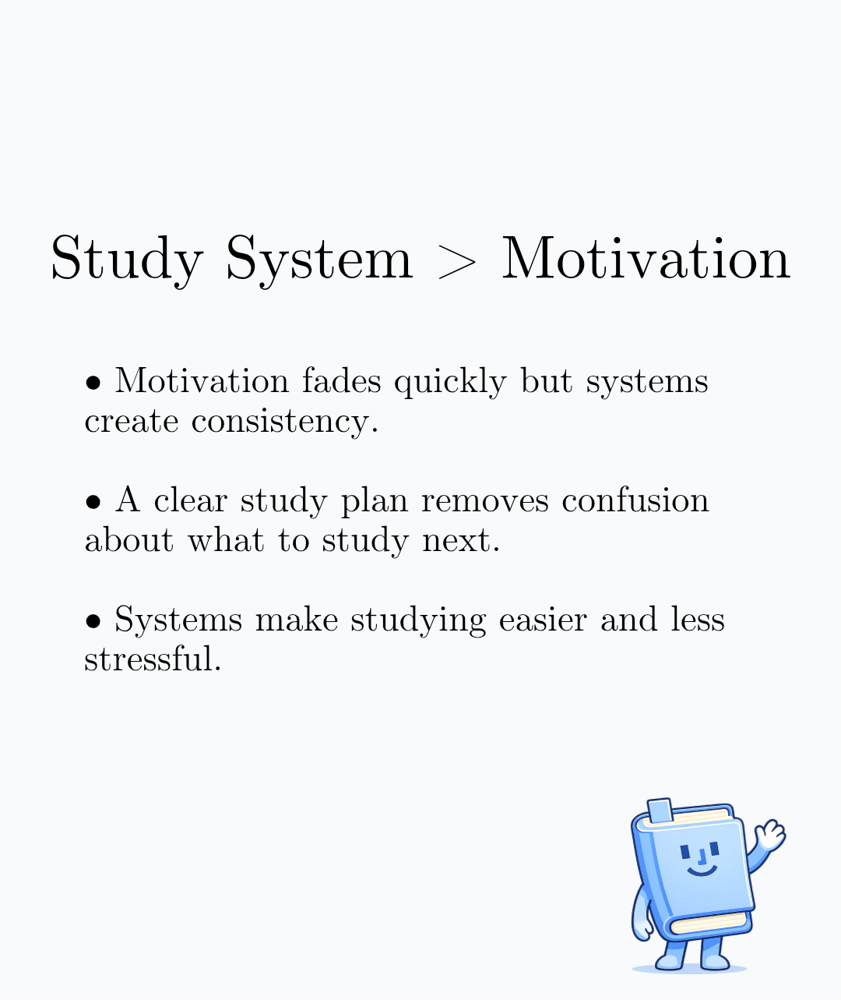
- **xldv7sx7hcpg1.jpeg** (97 KB)
  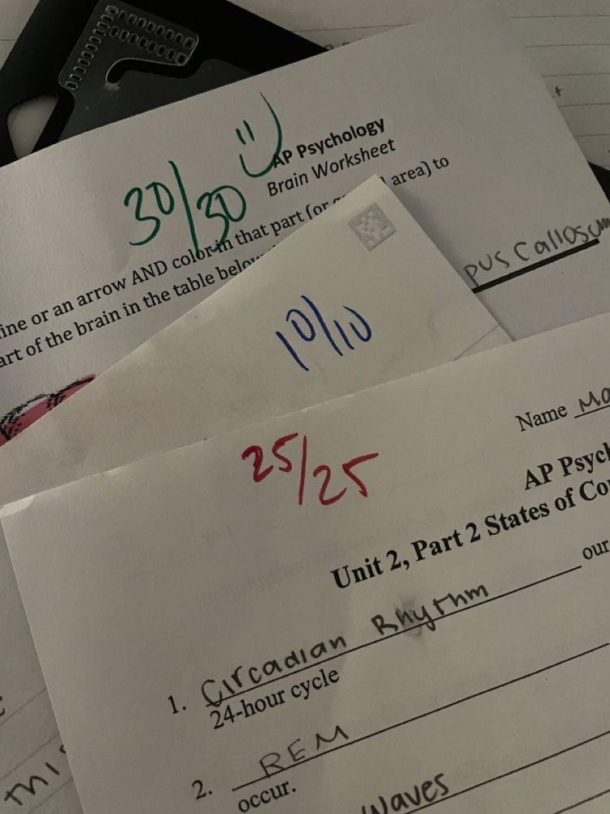
---
**View on GitHub:** https://github.com/ozlemsultan90-cmyk/reddit-scout-reports/blob/main/reports/2026-03-16.md