# Reddit Scout Report: Focus Timer Opportunities
**Date:** 2026-03-18

## Top Opportunities

### 1. [Is there an alternative to therapy?](https://www.reddit.com/r/DecidingToBeBetter/comments/1rwq1ia/is_there_an_alternative_to_therapy/)
Subreddit: r/DecidingToBeBetter | Score: 17 | Comments: 93 | Upvote ratio: 90%
Posted: ~15 hours ago

**Summary:** I really do think I need help from someone but I’m so scared to talk to someone about it 

**Viral Score:** 9.4/10
- Raw score: 0.0/10
- Engagement: 15.5/10
- Upvote ratio: 9.0/10
- Relevance bonus: 0/3

**Media:**
None

### 2. [How I improved my essay grades without writing more](https://www.reddit.com/r/studytips/comments/1rwyeyh/how_i_improved_my_essay_grades_without_writing/)
Subreddit: r/studytips | Score: 4 | Comments: 10 | Upvote ratio: 75%
Posted: ~8 hours ago

**Summary:** One thing that helped me improve my essays fast:

Instead of trying to sound “smart,” I focused on:
• clear arguments
• simple structure
• strong sources

Most professors care more about clarity than 

**Viral Score:** 5.6/10
- Raw score: 0.0/10
- Engagement: 6.0/10
- Upvote ratio: 7.5/10
- Relevance bonus: 1/3

**Media:**
None

### 3. [the missing piece in most peoples productivity stack](https://www.reddit.com/r/productivity/comments/1rwmb7y/the_missing_piece_in_most_peoples_productivity/)
Subreddit: r/productivity | Score: 15 | Comments: 15 | Upvote ratio: 100%
Posted: ~18 hours ago

**Summary:** we have systems for everything. calendars for time. task managers for work. notes apps for ideas but for the people in our lives?

 most of us have literally nothing. just vibes and hoping we remember

**Viral Score:** 5.3/10
- Raw score: 0.0/10
- Engagement: 2.8/10
- Upvote ratio: 10.0/10
- Relevance bonus: 1/3

**Media:**
None

### 4. [I am a female loser and I want to change. Don't be nice to me](https://www.reddit.com/r/getdisciplined/comments/1rwcwid/i_am_a_female_loser_and_i_want_to_change_dont_be/)
Subreddit: r/getdisciplined | Score: 424 | Comments: 215 | Upvote ratio: 91%
Posted: ~23 hours ago

**Summary:** Hello all, I am a F26 female loser. I just finished grad school (yayy), and now I am temporarily living with my parents while I study for my certification exam. I have no motivation. All I do all day 

**Viral Score:** 5.2/10
- Raw score: 0.8/10
- Engagement: 1.5/10
- Upvote ratio: 9.1/10
- Relevance bonus: 2/3

**Media:**
None

### 5. [I want to read, but I get tired at night](https://www.reddit.com/r/productivity/comments/1rx4ifn/i_want_to_read_but_i_get_tired_at_night/)
Subreddit: r/productivity | Score: 18 | Comments: 18 | Upvote ratio: 100%
Posted: ~3 hours ago

**Summary:** My day  job is very heavy in data analysis. I read the news and different type of data all day. At night, I want to read my fiction books and other books. I'm avoiding any type of financial book at ni

**Viral Score:** 5.0/10
- Raw score: 0.0/10
- Engagement: 2.8/10
- Upvote ratio: 10.0/10
- Relevance bonus: 0/3

**Media:**
None

## Honorable Mentions

### 6. [My productivity doubled when I stopped writing my notes and started vocalizing them.](https://www.reddit.com/r/productivity/comments/1rwq3iz/my_productivity_doubled_when_i_stopped_writing_my/) (r/productivity | 9 upvotes) – My productivity doubled when I stopped writing my notes and started vocalizing them. The friction of.
### 7. [I think I have destroyed my life and I am still at it](https://www.reddit.com/r/getdisciplined/comments/1rwyoln/i_think_i_have_destroyed_my_life_and_i_am_still/) (r/getdisciplined | 13 upvotes) – I think I have destroyed my life and I am still at it I am 23M and I have completed the last year of.
### 8. [I realized most of my bad decisions happen in the same exact moment](https://www.reddit.com/r/DecidingToBeBetter/comments/1rwrtdm/i_realized_most_of_my_bad_decisions_happen_in_the/) (r/DecidingToBeBetter | 9 upvotes) – I realized most of my bad decisions happen in the same exact moment I’ve been paying attention to my.
### 9. [76 Day Study Streak, Averaging 6 Hours a Day](https://www.reddit.com/r/GetStudying/comments/1rwt2p8/76_day_study_streak_averaging_6_hours_a_day/) (r/GetStudying | 30 upvotes) – 76 Day Study Streak, Averaging 6 Hours a Day.
### 10. [Your phone addiction is a symptom. Here's what the actual problem is.](https://www.reddit.com/r/getdisciplined/comments/1rwxxza/your_phone_addiction_is_a_symptom_heres_what_the/) (r/getdisciplined | 172 upvotes) – Your phone addiction is a symptom. Here's what the actual problem is. I see a lot of posts here are.

## Media Summary
Downloaded images (2026-03-18-media/):
- **aebcpnpefqpg1.jpeg** (3112.9 KB)
  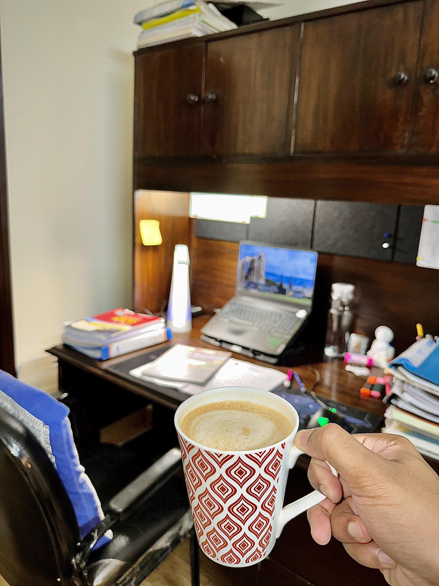
- **fk82wxxd5qpg1.png** (321.0 KB)
  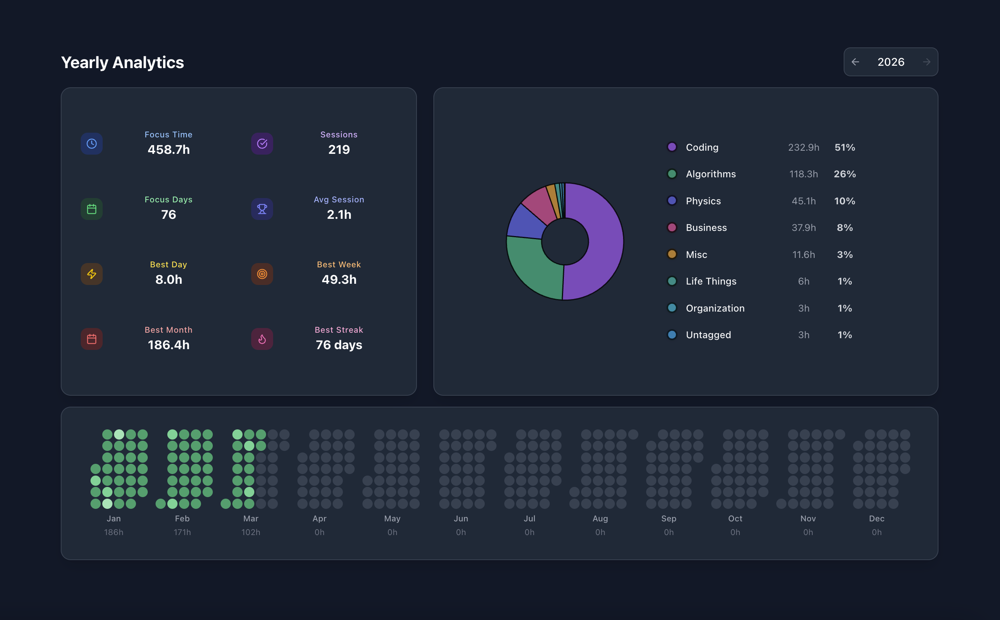
- **h1yr77liqnpg1.jpeg** (2863.1 KB)
  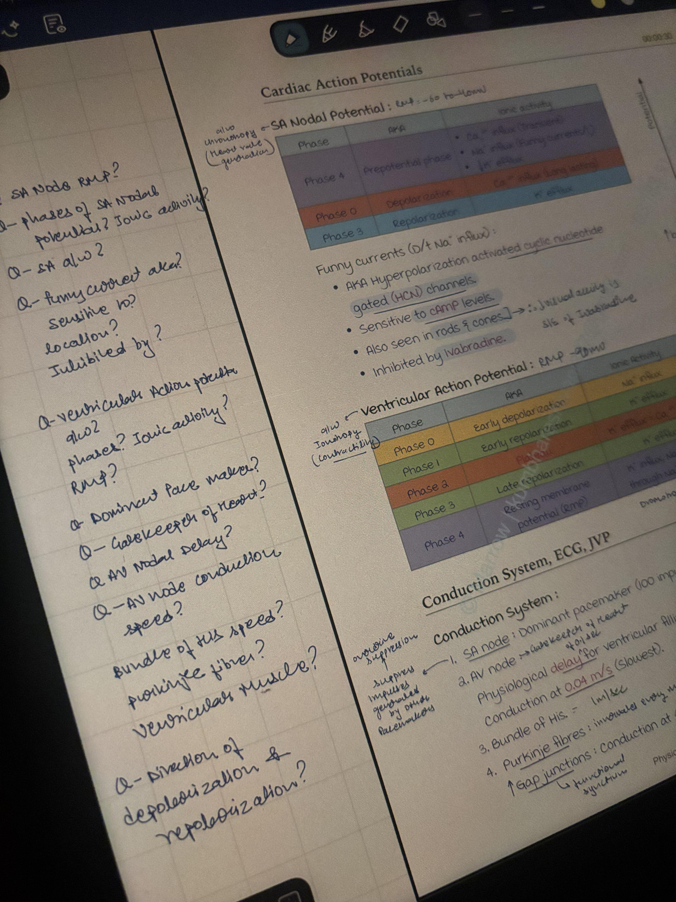
- **smr33gaycspg1.jpeg** (6607.4 KB)
  
- **tu3fh71dbopg1.jpeg** (2249.2 KB)
  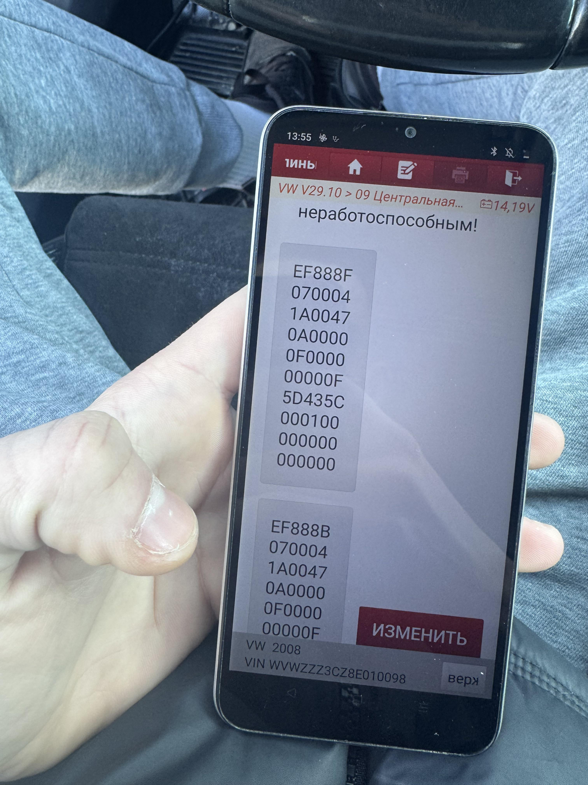
- **undefined_0.png** (143.3 KB)
  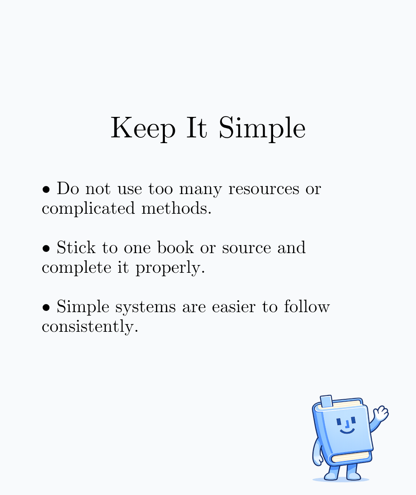
- **undefined_1.png** (154.8 KB)
  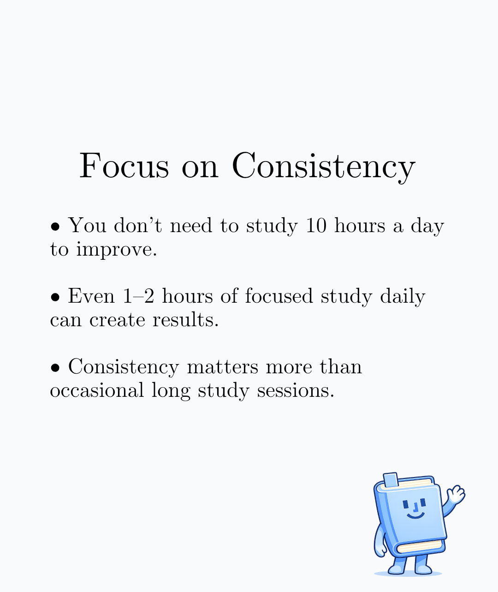
- **undefined_2.png** (156.2 KB)
  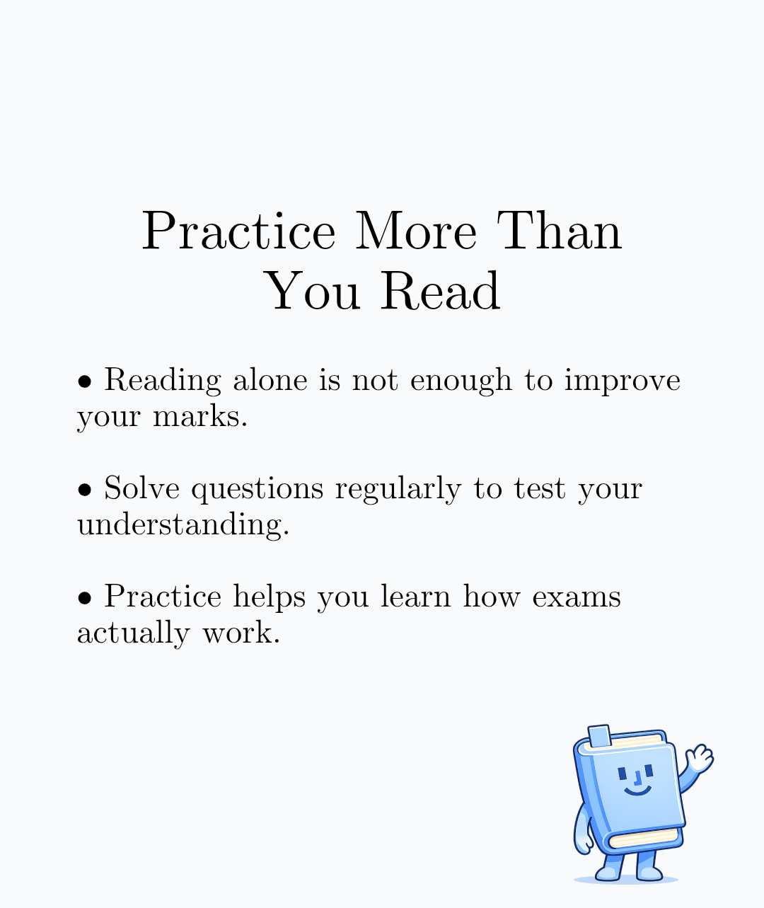
- **undefined_3.png** (147.3 KB)
  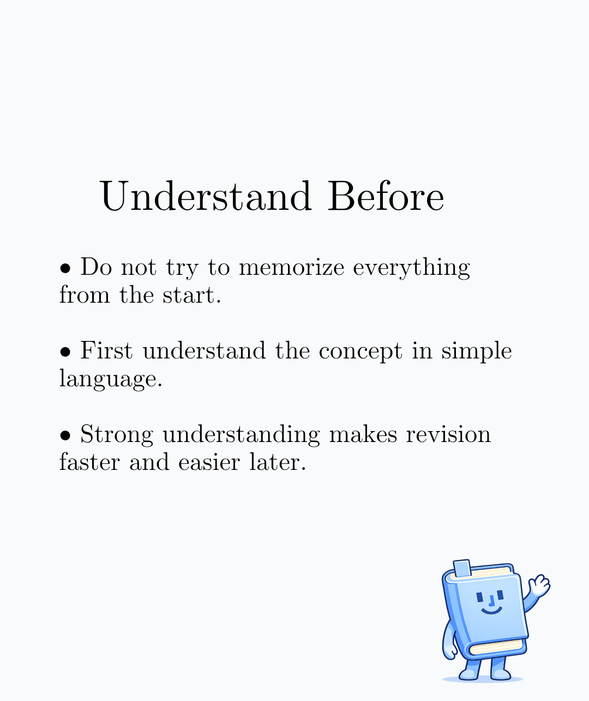
- **undefined_4.png** (147.0 KB)
  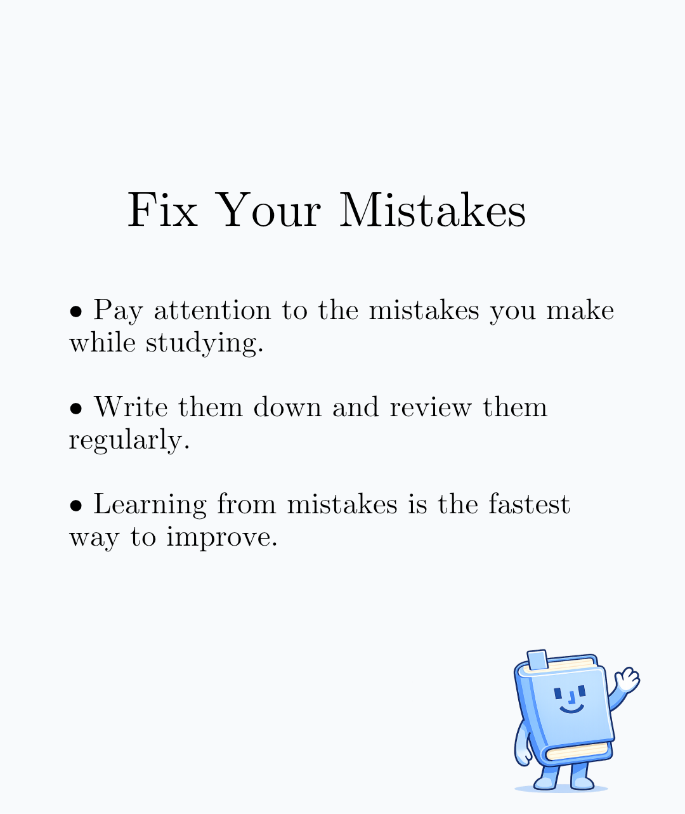
- **undefined_5.png** (859.0 KB)
  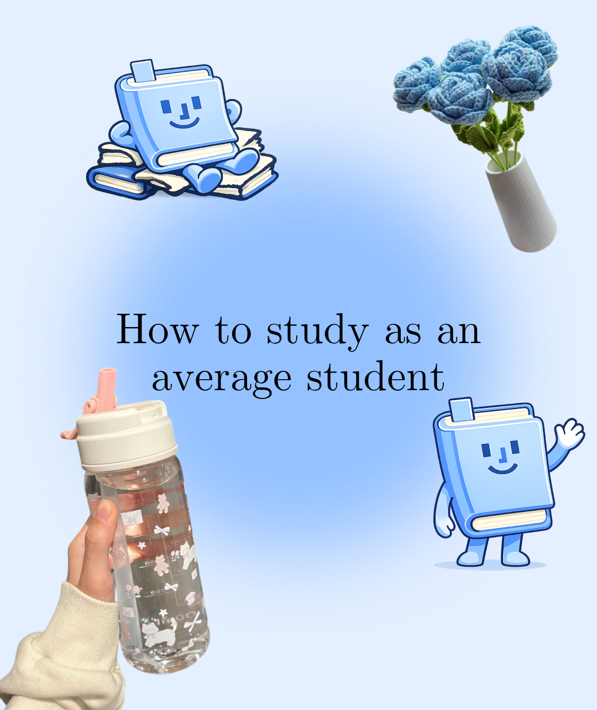
- **undefined_6.png** (122.3 KB)
  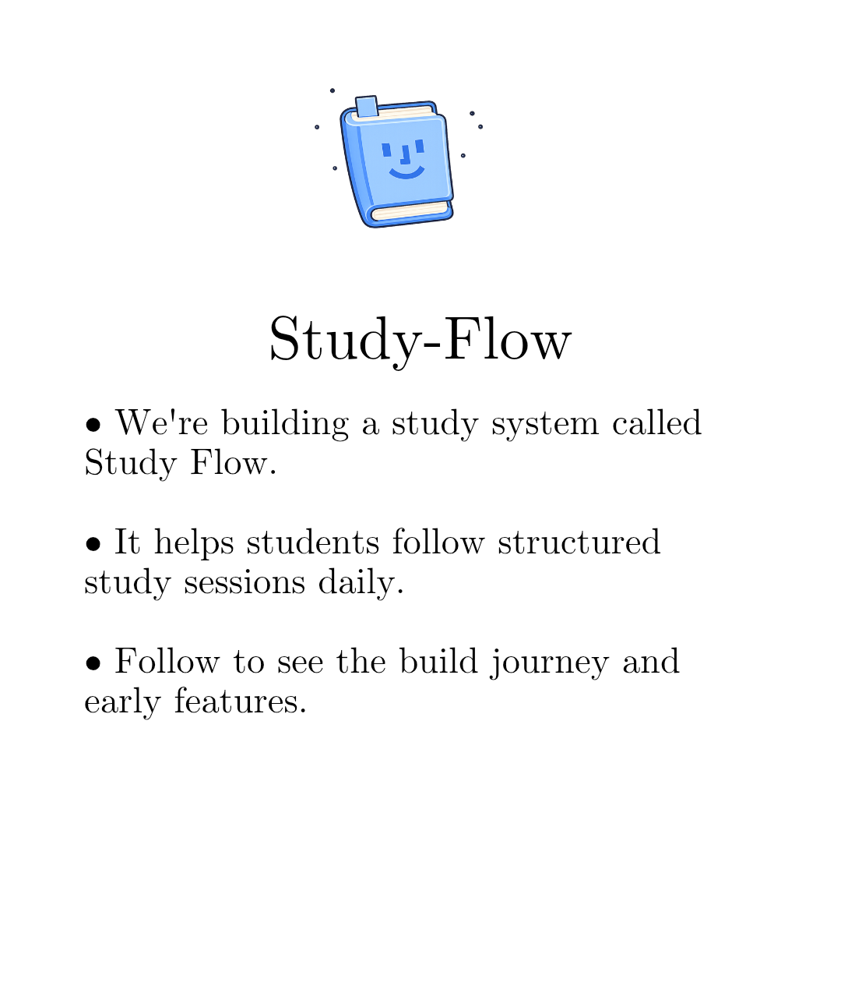
- **xbl2txg1qnpg1.jpeg** (37.9 KB)
  

---
**View on GitHub:** https://github.com/ozlemsultan90-cmyk/reddit-scout-reports/blob/main/reports/2026-03-18.md
