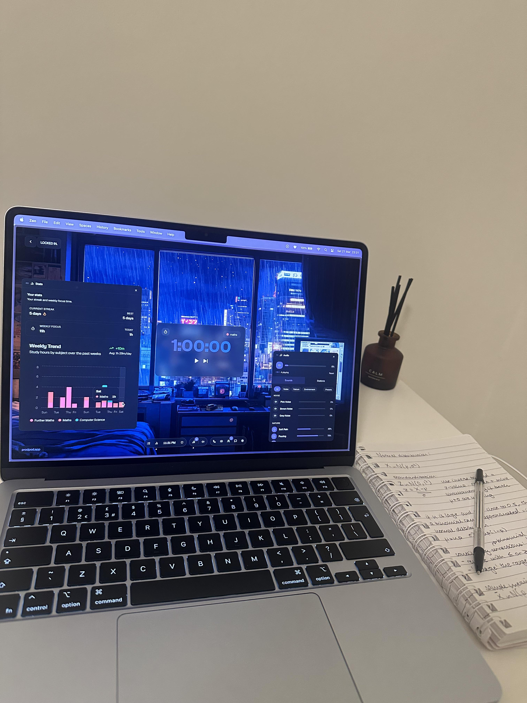
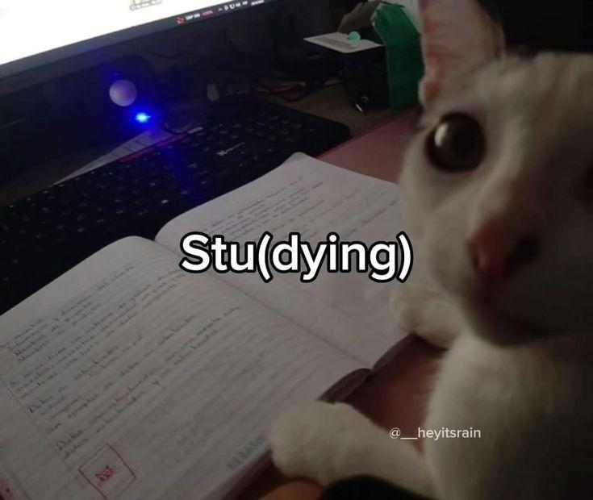
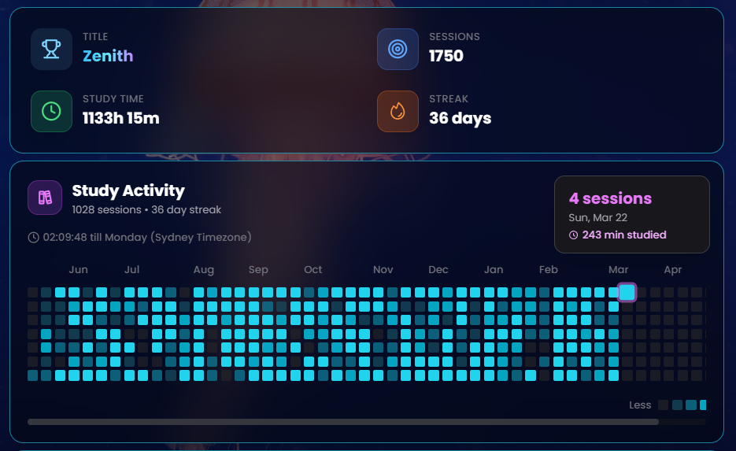

# Reddit Scout Report: Focus Timer Opportunities
**Date:** 2026-03-22

## Top Opportunities

### 1. [Productivity at night hits different](https://www.reddit.com/r/productivity/comments/1s04out/productivity_at_night_hits_different/)
Subreddit: r/productivity | Score: 25 | Comments: 17 | Upvote ratio: 97%
Posted: ~17.0 hours ago

**Summary:** As a university student I find that studying at night, personally midnight, is the time I get most of my work done. I am glad to have my lessons start anywhere between 10 am or 2pm which allows me...

**Viral Score:** 5.7/10
- Raw score: 0.1/10
- Engagement: 2.0/10
- Upvote ratio: 9.7/10
- Relevance bonus: 3/3

### 2. [Can yall tell me the most unhinged way i could get rid of my phone addiction?](https://www.reddit.com/r/productivity/comments/1s03xl3/can_yall_tell_me_the_most_unhinged_way_i_could/)
Subreddit: r/productivity | Score: 63 | Comments: 90 | Upvote ratio: 93%
Posted: ~17.5 hours ago

**Summary:** I just checked my screen time and found 9 hoirs a day per average, not just social media, i play games and read books too on my phone, but its too much, i can't do basic stuff like i used to before.

**Viral Score:** 5.5/10
- Raw score: 0.1/10
- Engagement: 3/10
- Upvote ratio: 9.3/10
- Relevance bonus: 2/3

### 3. [i zone out way too much when studying and i dont know how to fix it. please help](https://www.reddit.com/r/studytips/comments/1s0b3li/i_zone_out_way_too_much_when_studying_and_i_dont/)
Subreddit: r/StudyTips | Score: 9 | Comments: 3 | Upvote ratio: 100%
Posted: ~12.0 hours ago

**Summary:** im a freshman in college and im pre-med, so i've always got a lot of reading/studying on my plate. i like the subject matter, its not boring or anything, but i always find myself spacing out no mat...

**Viral Score:** 5.4/10
- Raw score: 0.0/10
- Engagement: 0.9/10
- Upvote ratio: 10.0/10
- Relevance bonus: 3/3

### 4. [What actually gets you moving in the morning?](https://www.reddit.com/r/productivity/comments/1rzznnf/what_actually_gets_you_moving_in_the_morning/)
Subreddit: r/productivity | Score: 33 | Comments: 50 | Upvote ratio: 95%
Posted: ~20.5 hours ago

**Summary:** I’m trying to understand *morning inertia* (that “I know what to do but I don’t start” feeling). Which one most often breaks the freeze for you?

1. A tiny physical action (wash face, make bed, etc...

**Viral Score:** 5.2/10
- Raw score: 0.1/10
- Engagement: 3/10
- Upvote ratio: 9.5/10
- Relevance bonus: 1/3

### 5. [How do you study when you're heart broken ?](https://www.reddit.com/r/productivity/comments/1s0ni22/how_do_you_study_when_youre_heart_broken/)
Subreddit: r/productivity | Score: 14 | Comments: 13 | Upvote ratio: 100%
Posted: ~0.7 hours ago

**Summary:** How do y'all study when you feel hurt and not okay ? I need to study I have no other choice but at the same time I feel so bad I just can't.

**Viral Score:** 5.2/10
- Raw score: 0.0/10
- Engagement: 2.6/10
- Upvote ratio: 10.0/10
- Relevance bonus: 1/3

## Honorable Mentions

### 6. [Do you have tips to stay focus and efficient for someone who never studyed and is 24 ?](https://www.reddit.com/r/studytips/comments/1s054x2/do_you_have_tips_to_stay_focus_and_efficient_for/) (r/StudyTips | 8 upvotes) – Pardon my English, it's not my first language.

Do you have tips to stay focused and efficient fo....

### 7. [the only hack to keep my life together](https://www.reddit.com/r/productivity/comments/1s0i527/the_only_hack_to_keep_my_life_together/) (r/productivity | 46 upvotes) – i think i figured what makes 80% of the day for me

1. having a slow fixed morning routine

2. ha....

### 8. [Is it possible to study 12hrs everyday?](https://www.reddit.com/r/studytips/comments/1s05cqx/is_it_possible_to_study_12hrs_everyday/) (r/StudyTips | 45 upvotes) – I already average around 6-7hrs everyday but I want to increase it to 10-12hrs cus I got an exam....

### 9. [Anyone else feel low energy even after sleeping enough?](https://www.reddit.com/r/DecidingToBeBetter/comments/1s0e13b/anyone_else_feel_low_energy_even_after_sleeping/) (r/DecidingToBeBetter | 20 upvotes) – Lately I’ve been noticing this weird pattern…

I sleep 7–8 hours, wake up thinking I should feel....

### 10. [Burnout hit me hard and I don't know how to deal with it](https://www.reddit.com/r/studytips/comments/1s0ke0i/burnout_hit_me_hard_and_i_dont_know_how_to_deal/) (r/StudyTips | 54 upvotes) – So basically I'm a nursing student and I really need some advice because I genuinely don't know w....

## Media Summary

Downloaded images (2026-03-22-media/):
- **79nh4vg72mqg1.jpeg** (5663.4 KB)
  
- **7jcmyim2elqg1.png** (697.5 KB)
  
- **j9hxcwfhhhqg1.jpeg** (2312.1 KB)
  
- **p1ruef4mblqg1.jpeg** (38.7 KB)
  
- **trkg3e9tyiqg1.jpeg** (4357.5 KB)
  
- **zfgtdgw0ukqg1.png** (163.5 KB)
  

---
**View on GitHub:** https://api.github.com/repos/ozlemsultan90-cmyk/reddit-scout-reports/contents/reports/2026-03-22.md
