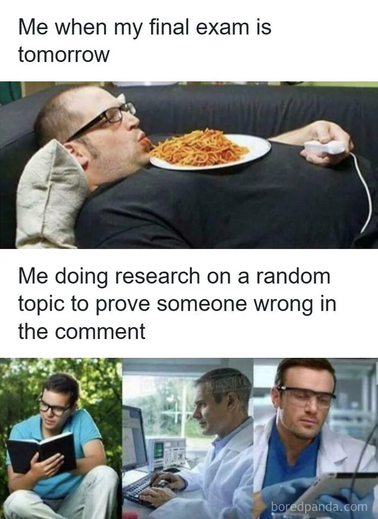

# Reddit Scout Report: Focus Timer Opportunities
**Date:** 2026-03-10

## Top Opportunities

### 1. [What’s the one desk item that improves your productivity the most?](https://www.reddit.com/r/productivity/comments/1rop66v/whats_the_one_desk_item_that_improves_your/)
Subreddit: r/productivity | Score: 35 | Comments: 34 | Upvote ratio: 95%
Posted: ~23 hours ago

**Summary:** I’ve been trying to optimize my desk setup lately... I think maybe a small tool can make a huge difference in focus and execution. 😭

Curious what works for everyone here — is there a specific desk it

**Viral Score:** 5.5/10
- Raw score: 0.1/10
- Engagement: 2.8/10
- Upvote ratio: 9.5/10
- Relevance bonus: 2/3

### 2. [Free daily study planner PDF for finals season—drop a comment and I'll send it over](https://www.reddit.com/r/studytips/comments/1rp0dab/free_daily_study_planner_pdf_for_finals/)
Subreddit: r/studytips | Score: 14 | Comments: 61 | Upvote ratio: 100%
Posted: ~13 hours ago

**Summary:** Finals season is coming, and if you don't have a study system, you're already behind. I made a free daily study planner PDF that helped me stay organised and actually hit my study goals. Drop a commen

**Viral Score:** 5.4/10
- Raw score: 0.0/10
- Engagement: 3.0/10
- Upvote ratio: 10.0/10
- Relevance bonus: 1/3

### 3. [I need to get disciplined asap, I have tried a lot of things already](https://www.reddit.com/r/getdisciplined/comments/1rov2fb/i_need_to_get_disciplined_asap_i_have_tried_a_lot/)
Subreddit: r/getdisciplined | Score: 35 | Comments: 33 | Upvote ratio: 96%
Posted: ~17 hours ago

**Summary:** I'm in the phase of my life when it's now or never, 
if I don't learn self discipline asap, it's over for me 🥀

I have tried many things, 2 minute rule, pomodoro timer, getting a digital clock for tim

**Viral Score:** 5.2/10
- Raw score: 0.1/10
- Engagement: 2.8/10
- Upvote ratio: 9.6/10
- Relevance bonus: 1/3

### 4. [HOW DO I STOP PROCRASTINATION?](https://www.reddit.com/r/GetStudying/comments/1rp0yuj/how_do_i_stop_procrastination/)
Subreddit: r/GetStudying | Score: 28 | Comments: 18 | Upvote ratio: 100%
Posted: ~12 hours ago

**Summary:** Whenever I think of studying, something gets in my way, going to the washroom,or the phrases in my head saying "Ill do it at this time" bro how

**Viral Score:** 5.0/10
- Raw score: 0.1/10
- Engagement: 1.9/10
- Upvote ratio: 10.0/10
- Relevance bonus: 1/3

### 5. [me and my friends accidentally found the only thing that actually keeps us consistent](https://www.reddit.com/r/getdisciplined/comments/1rozgjo/me_and_my_friends_accidentally_found_the_only/)
Subreddit: r/getdisciplined | Score: 37 | Comments: 14 | Upvote ratio: 95%
Posted: ~13 hours ago

**Summary:** so we've all been the person who downloads a habit app, 
uses it for 11 days and then forgets it exists.

habitica, streaks, i even paid for one of those fancy 
ones. same result every time. miss a da

**Viral Score:** 4.5/10
- Raw score: 0.1/10
- Engagement: 1.1/10
- Upvote ratio: 9.5/10
- Relevance bonus: 1/3

### 6. [My failed dopamine detox showed me the real discipline problem](https://www.reddit.com/r/getdisciplined/comments/1roym28/my_failed_dopamine_detox_showed_me_the_real/) (r/getdisciplined | 60 upvotes) – A few weeks ago I tried doing a dopamine detox because my focus had been getting worse. I kept catch.

### 7. [how do you overcome the intense feeling of regret over the permanent decisions you’ve made in the past?](https://www.reddit.com/r/DecidingToBeBetter/comments/1rosiz0/how_do_you_overcome_the_intense_feeling_of_regret/) (r/DecidingToBeBetter | 43 upvotes) – Like tattoos for example, before I developed contamination OCD- I loved getting tattoos and I have a.

### 8. [My study setup at home to beat WFH isolation](https://www.reddit.com/r/studytips/comments/1rpbe1r/my_study_setup_at_home_to_beat_wfh_isolation/) (r/studytips | 70 upvotes) – WFH isolation is rough. I'm studying as a SE. I'm doing a master degree online so I’m fully remote (.

### 9. [I thought I was lazy. Turns out I was just burned out.](https://www.reddit.com/r/GetStudying/comments/1rp2a1i/i_thought_i_was_lazy_turns_out_i_was_just_burned/) (r/GetStudying | 142 upvotes) – For months I couldn't study anymore.

I would sit down at my desk and feel exhausted before even sta.

### 10. [tired constantly, can’t get anything done 22f](https://www.reddit.com/r/productivity/comments/1rp6ybo/tired_constantly_cant_get_anything_done_22f/) (r/productivity | 42 upvotes) – i’m 22 years old and i wake up tired no matter how much sleep i get the night before. i could sleep .

## Media Summary
Downloaded images (2026-03-10-media/):
- **GetStudying_20.jpeg** (40 KB)
  
- **GetStudying_21.jpeg** (128 KB)
  
- **studytips_16.png** (2630 KB)
  
- **GetStudying_24.png** (667 KB)
  
- **studytips_19.jpeg** (311 KB)
  
- **studytips_15.png** (2429 KB)
  
- **GetStudying_22.jpeg** (57 KB)
  
---
**View on GitHub:** https://github.com/ozlemsultan90-cmyk/reddit-scout-reports/blob/main/reports/2026-03-10.md