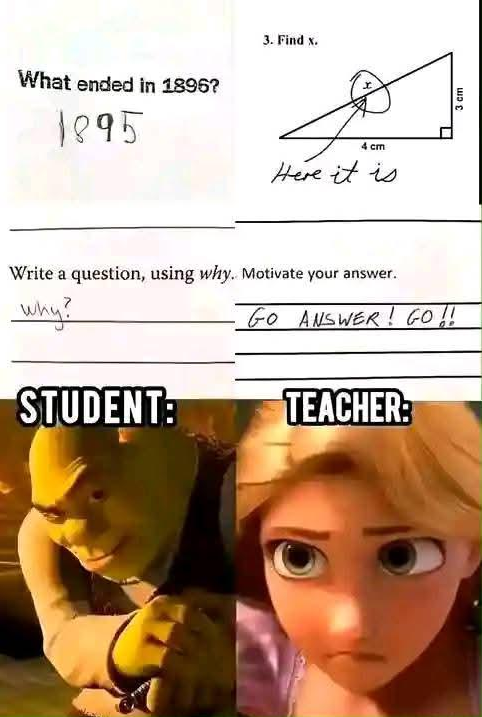
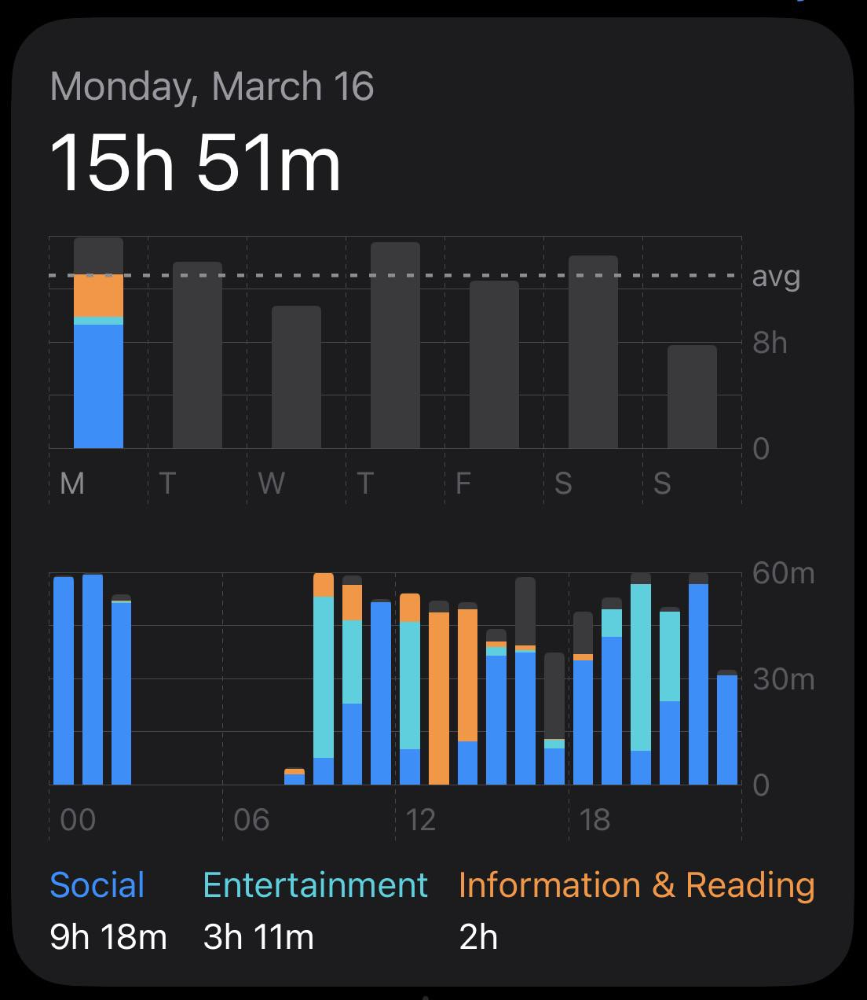

# Reddit Scout Report: Focus Timer Opportunities
**Date:** 2026-03-23

## Top Opportunities

### 1. [I need help to get back to studying](https://www.reddit.com/r/studytips/comments/1s0zz9p/i_need_help_to_get_back_to_studying/)
Subreddit: r/studytips | Score: 12 | Comments: 19 | Upvote ratio: 1%
Posted: ~18 hours ago

**Summary:** Hi! So I really need some advice on how to go back to studying! I actually used to be a really smart kid and i studied alot. I used to be top of my class in every school year and in the last year i go

**Viral Score:** 6/10
- Raw score: 0.02/10
- Engagement: 3/10
- Upvote ratio: 10/10
- Relevance bonus: 3/3

### 2. [Any free productivity apps for studying?](https://www.reddit.com/r/studytips/comments/1s1aq5p/any_free_productivity_apps_for_studying/)
Subreddit: r/studytips | Score: 16 | Comments: 14 | Upvote ratio: 1%
Posted: ~9 hours ago

**Summary:** Notion is too complex for my stupid brain TvT

Any alternatives? Self promotion is allowed

**Viral Score:** 6/10
- Raw score: 0.03/10
- Engagement: 2.47/10
- Upvote ratio: 10/10
- Relevance bonus: 3/3

### 3. [What small decision you made years ago ended up dramatically changing your life later on?](https://www.reddit.com/r/DecidingToBeBetter/comments/1s17nuo/what_small_decision_you_made_years_ago_ended_up/)
Subreddit: r/DecidingToBeBetter | Score: 39 | Comments: 24 | Upvote ratio: 0%
Posted: ~12 hours ago

**Summary:** Boxing for me 🥊. It's the one thing that actually makes my stress disappear.

**Viral Score:** 6/10
- Raw score: 0.08/10
- Engagement: 1.8/10
- Upvote ratio: 9.5/10
- Relevance bonus: 3/3

### 4. [I wasn’t lazy — I was just making things too hard](https://www.reddit.com/r/getdisciplined/comments/1s1hawk/i_wasnt_lazy_i_was_just_making_things_too_hard/)
Subreddit: r/getdisciplined | Score: 16 | Comments: 11 | Upvote ratio: 1%
Posted: ~3 hours ago

**Summary:** For a long time, I kept calling myself lazy.
I couldn’t stay consistent, I’d quit things halfway, and I kept starting over.
It felt like a discipline problem.
But looking back, the real issue was that

**Viral Score:** 6/10
- Raw score: 0.03/10
- Engagement: 1.94/10
- Upvote ratio: 10/10
- Relevance bonus: 3/3

### 5. [I realized I don’t lack discipline, I just expect too much from myself all at once](https://www.reddit.com/r/productivity/comments/1s1kaep/i_realized_i_dont_lack_discipline_i_just_expect/)
Subreddit: r/productivity | Score: 15 | Comments: 8 | Upvote ratio: 1%
Posted: ~1 hours ago

**Summary:** When I actually lowered the bar and just focused on showing up, things got way easier to stick to.

**Viral Score:** 6/10
- Raw score: 0.03/10
- Engagement: 1.5/10
- Upvote ratio: 10/10
- Relevance bonus: 3/3

### 6. [Anyone else sit down to work and instantly feel mentally tired?](https://www.reddit.com/r/productivity/comments/1s0wgfi/anyone_else_sit_down_to_work_and_instantly_feel/) (r/productivity | 40 upvotes) – Lately I notice something weird

I know exactly what I need to do

time is available

everything is .
### 7. [I keep waiting for the ‘right moment’ to do things and it never comes. How do you break this](https://www.reddit.com/r/productivity/comments/1s192aq/i_keep_waiting_for_the_right_moment_to_do_things/) (r/productivity | 61 upvotes) – I think I have been stuck in a perfectionism loop for years and I am only now starting to notice it..
### 8. [I’m watching myself waste time and I can’t stop](https://www.reddit.com/r/GetStudying/comments/1s1b5jj/im_watching_myself_waste_time_and_i_cant_stop/) (r/GetStudying | 30 upvotes) – 
40 days left for my exam and I’m stuck in a loop of doing nothing.

Not because I don’t care... I a.
### 9. [That wasn't the answer they wanted](https://www.reddit.com/r/GetStudying/comments/1s1fh92/that_wasnt_the_answer_they_wanted/) (r/GetStudying | 65 upvotes) – .
### 10. [Romantic life: nonexistent.  Academic life: thriving](https://www.reddit.com/r/GetStudying/comments/1s1eqpo/romantic_life_nonexistent_academic_life_thriving/) (r/GetStudying | 363 upvotes) – .

## Media Summary
Downloaded images (2026-03-23-media/):
- **GetStudying_2.png** (2429 KB)
  
- **GetStudying_1.jpeg** (7917 KB)
  
- **GetStudying_3.png** (345 KB)
  
- **GetStudying_0.jpeg** (141 KB)
  

---
**View on GitHub:** https://github.com/ozlemsultan90-cmyk/reddit-scout-reports/blob/main/reports/2026-03-23.md
