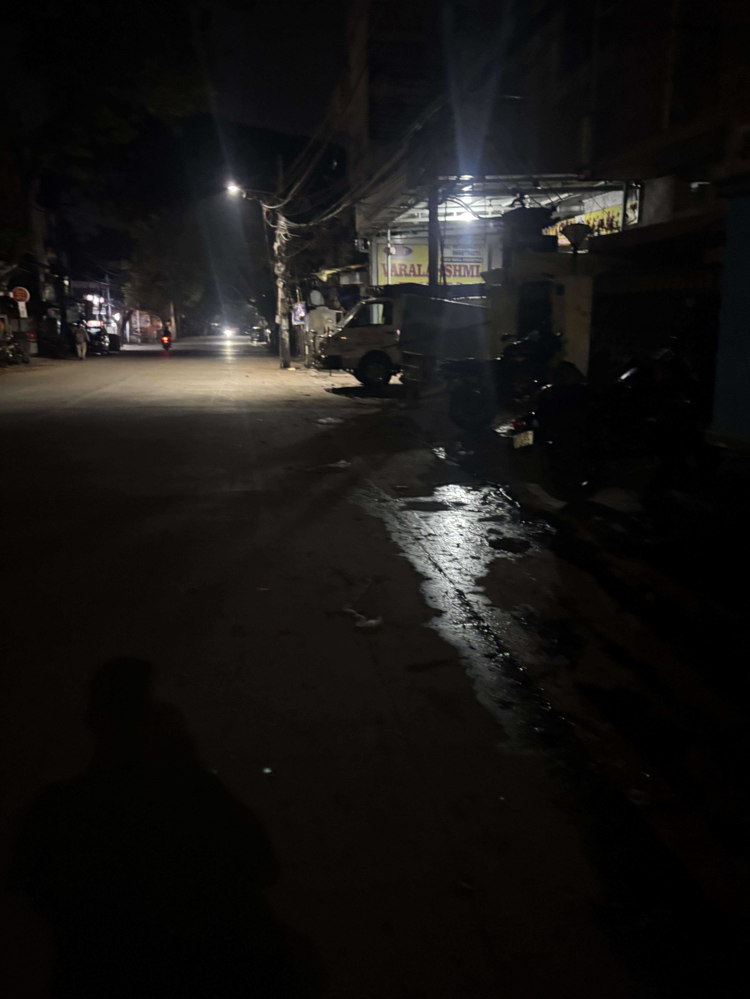
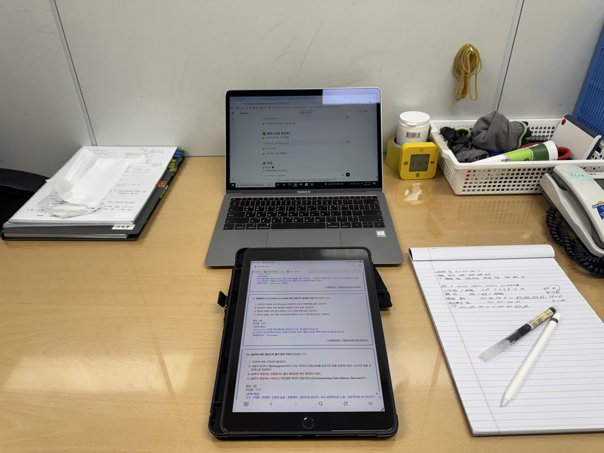
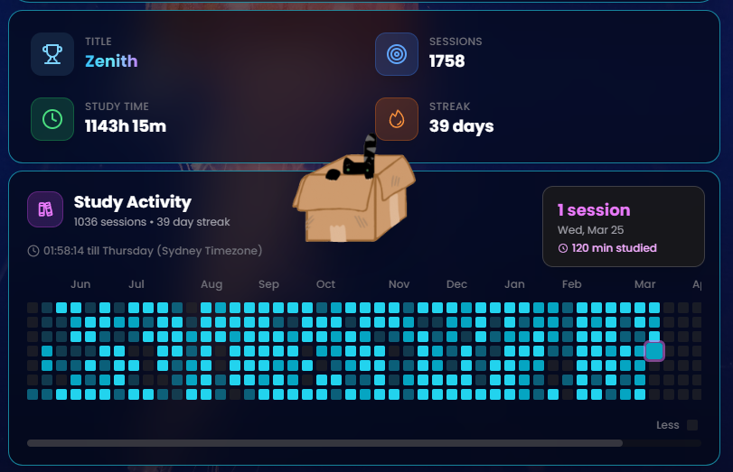
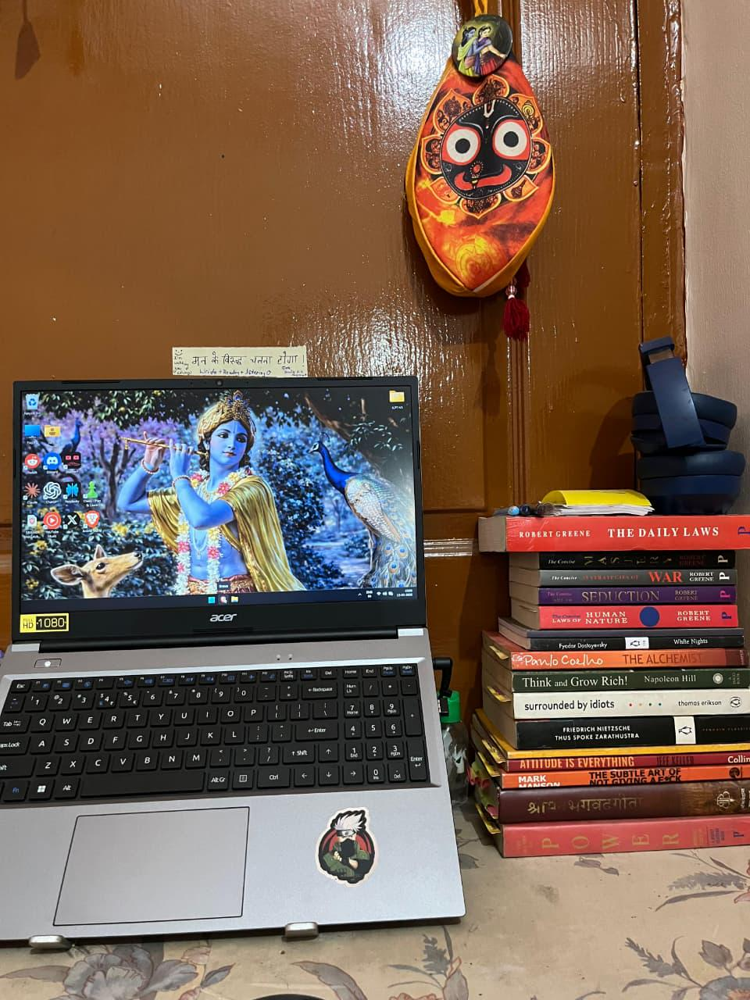

# Reddit Scout Report: Focus Timer Opportunities
**Date:** 2026-03-25

## Top Opportunities

### 1. [I can't stop scrolling and it's ruining my studies and mental health 🥀](https://www.reddit.com/r/productivity/comments/1s2n3sg/i_cant_stop_scrolling_and_its_ruining_my_studies/)
Subreddit: r/productivity | Score: 55 | Comments: 42 | Upvote ratio: 96%
Posted: ~22 hours ago

**Summary:** &amp;#x200B;

I don’t know if anyone else deals with this, but I feel completely stuck in this loop and I hate myself for it.

I try to study, but I can only focus for like 15–20 minutes. Then I pick...

**Viral Score:** 5.8/10
- Raw score: 0.1/10
- Engagement: 2.3/10
- Upvote ratio: 9.6/10
- Relevance bonus: 3/3

### 2. [I can't stop scrolling and it's ruining my studies and mental health 🥀](https://www.reddit.com/r/studytips/comments/1s2n1ho/i_cant_stop_scrolling_and_its_ruining_my_studies/)
Subreddit: r/studytips | Score: 612 | Comments: 111 | Upvote ratio: 100%
Posted: ~22 hours ago

**Summary:** i don’t know if anyone else deals with this, but I feel completely stuck in this loop and I hate myself for it.

I try to study, but I can only focus for like 15–20 minutes. Then I pick up my phone “j...

**Viral Score:** 5.7/10
- Raw score: 1.2/10
- Engagement: 0.5/10
- Upvote ratio: 10.0/10
- Relevance bonus: 3/3

**Media:**

### 3. [I stopped trying to "feel ready" before starting, and it fixed half of my discipline issues](https://www.reddit.com/r/getdisciplined/comments/1s2nz6u/i_stopped_trying_to_feel_ready_before_starting/)
Subreddit: r/getdisciplined | Score: 12 | Comments: 8 | Upvote ratio: 94%
Posted: ~21 hours ago

**Summary:** So for a long time I thought my problem was purely discipline. I'd sit down for work and wait until it felt focused, clear and ready to go. If I didn't feel that "rush" to get things done, I'd delay,...

**Viral Score:** 5.5/10
- Raw score: 0.0/10
- Engagement: 2.0/10
- Upvote ratio: 9.4/10
- Relevance bonus: 3/3

### 4. [It’s been almost a month since I started waking up at 4AM consistently.](https://www.reddit.com/r/GetStudying/comments/1s2v4ee/its_been_almost_a_month_since_i_started_waking_up/)
Subreddit: r/GetStudying | Score: 356 | Comments: 64 | Upvote ratio: 97%
Posted: ~16 hours ago

**Summary:** No motivation, no perfect routine, no excuses — just showing up every single day. Some days I feel focused, some days I don’t, but I still get up.

I’ve got responsibilities on my shoulders, and I kno...

**Viral Score:** 5.4/10
- Raw score: 0.7/10
- Engagement: 0.5/10
- Upvote ratio: 9.7/10
- Relevance bonus: 3/3

**Media:**

### 5. [unpopular opinion: your study "system" is why you're failing](https://www.reddit.com/r/GetStudying/comments/1s2ulv0/unpopular_opinion_your_study_system_is_why_youre/)
Subreddit: r/GetStudying | Score: 30 | Comments: 7 | Upvote ratio: 95%
Posted: ~17 hours ago

**Summary:** okay so hear me out before you get defensive. I spent the first semester of junior year convinced I just needed the right setup. Downloaded four apps. Bought a new planner. Spent a whole Sunday making...

**Viral Score:** 5.1/10
- Raw score: 0.1/10
- Engagement: 0.7/10
- Upvote ratio: 9.5/10
- Relevance bonus: 3/3

## Honorable Mentions
### 6. [Studied more in 3 days than the entire previous month. Here's the only thing I changed.](https://www.reddit.com/r/studytips/comments/1s2t4bd/studied_more_in_3_days_than_the_entire_previous/) (r/studytips | 41 upvotes) – Stopped studying alone. That's it. That's the whole change.

I started showing up to the library eve....
### 7. [It took me 27 years to become disciplined, here are the books the helped me out the most.](https://www.reddit.com/r/getdisciplined/comments/1s2kb4o/it_took_me_27_years_to_become_disciplined_here/) (r/getdisciplined | 79 upvotes) – You want to know the problem with most books on self-control? It’s as if they were written for peopl....
### 8. [How do I become more confident speaking spontaneously without relying on scripts?](https://www.reddit.com/r/DecidingToBeBetter/comments/1s338bg/how_do_i_become_more_confident_speaking/) (r/DecidingToBeBetter | 10 upvotes) – Hi everyone,

I’m trying to improve my ability to communicate more confidently in real-time situatio....
### 9. [I spend $80/month on learning apps, is it worth it?](https://www.reddit.com/r/studytips/comments/1s2o3w4/i_spend_80month_on_learning_apps_is_it_worth_it/) (r/studytips | 43 upvotes) – just wanted to share this and see how much you guys are spending on learning and productivity apps t....
### 10. [I think I’m a female narcissist and it’s ruining my relationship](https://www.reddit.com/r/DecidingToBeBetter/comments/1s38jgj/i_think_im_a_female_narcissist_and_its_ruining_my/) (r/DecidingToBeBetter | 42 upvotes) – I’m a 29 year old female and I think I’m a covert narcissist. It’s ruining my relationship with my p....

## Media Summary
Downloaded images (2026-03-25-media/):
- **dahxwf9ls3rg1.jpeg** (1546.2 KB)
  
- **s8q61ba2b6rg1.png** (152.4 KB)
  
- **i4bvuw9lj1rg1.jpeg** (23.5 KB)
  
- **nldlyetec1rg1.jpeg** (180.9 KB)
  
- **88t9qd4l13rg1.jpeg** (3537.3 KB)
  

---
**View on GitHub:** https://github.com/ozlemsultan90-cmyk/reddit-scout-reports/blob/main/reports/2026-03-25.md